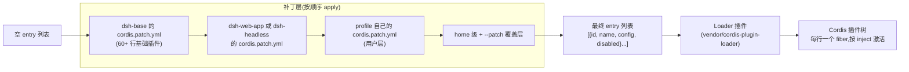
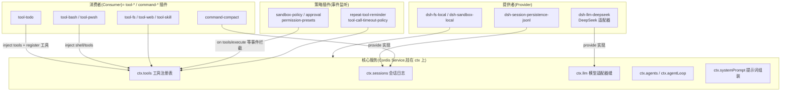
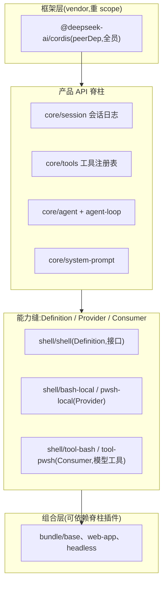
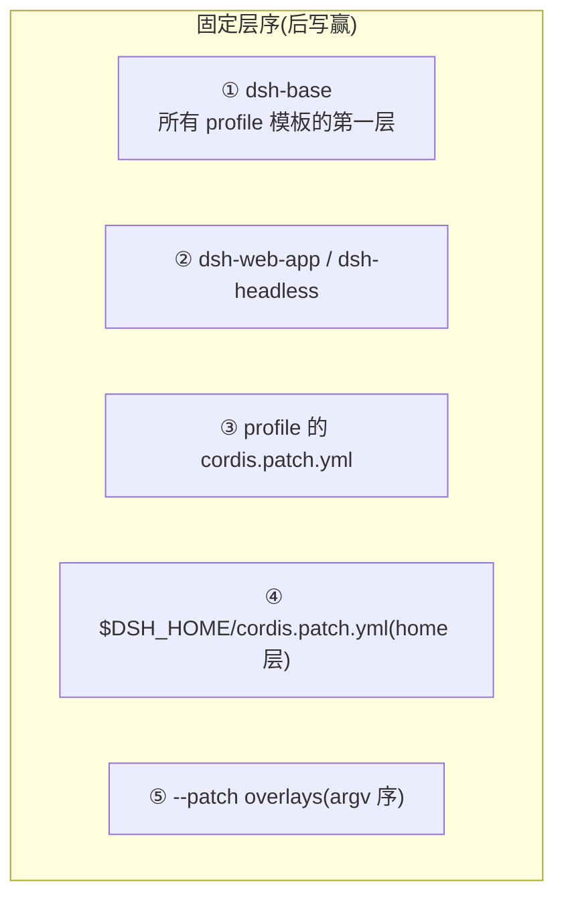
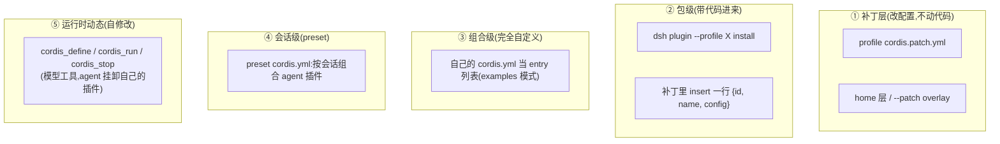

# Cordis 业务层使用地图:harness 如何用 Cordis

> 承接 [core-model.md](core-model.md)(框架机制)。本笔记回答业务层问题:插件树怎么拼出来、业务插件长什么样、模块间的依赖设计与接入设计。依据:`packages/bundle/*`、`packages/boot/app-boot/src/profile.ts`、`packages/todo/tool-todo/src/index.ts`。

## 一、组合管线:从空树到运行的插件树



- 补丁语义:**按 id 整块替换 config**(不合并),后写赢;`insert` 插新行
- 每行 `name` 是 npm 包名或相对路径,`config` 过该插件的 Schema 校验,`disabled` 与 `!!js` 每次挂载决策时求值
- 行的排列顺序无加载语义——激活顺序由 inject 依赖推导
- 两个启动入口:`dsh --profile <name>`(空树 + bundle 层叠 + 用户补丁)与 `examples/*/cordis.yml`(直接一份 entry 列表)

## 二、业务插件长什么样(以 tool-todo 为解剖样本)

模块导出的四个命名导出 = 与 loader 的接口契约:

```ts
export const name = 'tool-todo'                    // 诊断标识
export const inject = ['tools']                     // 依赖声明:等 ctx.tools 就绪
export const Config = z.object({                    // Schemastery schema:config 校验
  allowParallelInProgress: z.boolean().required(),
})
export function apply(ctx, config) { ... }          // 激活体:做登记
```

`apply` 里的两种典型注册:

```ts
// ① 可选能力:等 sessionProjections 这个"缝"被组合进来才激活这段
ctx.inject(['sessionProjections'], (projectionCtx) => {
  projectionCtx.sessionProjections.register({ key: 'todos', ... })
})

// ② 主注册:把 todo_write 工具登记进 ctx.tools
ctx.tools.register(defineTool({
  name: 'todo_write',
  parameters: { ... },        // 模型可见的入参 schema
  execute(args, exec) {
    exec.agent.session.append('todo/write', { todos })   // 写持久化会话事件
  },
  render: ...                 // 渲染意图:generic/terminal/diff
}))
```

## 三、业务层的关键服务与挂载关系



关键观察:

1. 消费者从不 inject 提供者——tool-todo 只 inject `tools`;要写会话时从 `exec.agent.session` 拿(工具执行管线传下来),是能力缝三段式的直接体现
2. 可选能力用嵌套 inject:`ctx.inject(['sessionProjections'], sub => ...)` 在 apply 内部挂子插件——缝在就激活,不在就跳过
3. 策略全是事件:sandbox-policy、approval、超时、重复提醒都监听 `tools/execute` 之类的分发点,不直接调实现
4. 「休眠挂载」模式:`dsh-llm-pi-ai` 挂载时零路由,settings 文档出现配置才 live 注册 provider,清空即摘——provider 的存在是组合问题,跑不跑是用户设置问题

## 四、模块间的依赖设计



规则:

1. **扩展插件依赖 Definition,绝不依赖具体 Provider**——`tool-bash` import `dsh-shell` 的接口,从不 import `bash-local`;换 Provider(bash→pwsh→E2B)不动 Consumer
2. **能力缝三段式是完整的**:Definition(接口 + 注册表)/ Provider(实现,provide 进缝)/ Consumer(模型工具,从缝取);只 split 成更多包,从不缺角色
3. **peerDependency 承载跨包共享身份**:`cordis` 是所有包的 peerDep(+dev),保证全树共享同一个 ctx 体系、无重复实例(profile 的 node_modules 平铺 fallback 也为此服务)
4. **bundle 是唯一允许依赖脊柱插件的层**——它是组合配置,不是扩展代码
5. 依赖图由生成器维护(`docs/module-graph.md`,`pnpm run gen-module-graph`,CI 门禁保鲜)

## 五、接入设计:新插件怎么上车

| 步骤 | 做什么 | 依据 |
|---|---|---|
| 1. 放对位置 | `packages/<group>/<pkg>/`,npm 名 `@deepseek-ai/dsh-<pkg>` | packages/README.md 分组表 |
| 2. 导出模块契约 | `name` / `inject` / `Config`(Schemastery)/ `apply(ctx, config)` | 命名导出保留 loader 注入元数据 |
| 3. 只走登记口 | `ctx.effect` / `ctx.on` / `ctx.provide` / 缝的 `register()` | 注册是副作用,卸载自动撤销 |
| 4. 依赖只认缝 | inject Definition 服务或缝,不 import Provider | 能力缝规则 |
| 5. 进组合 | 某个 bundle 的 cordis.patch.yml 加一行 `{id, name, config}` | 补丁层按 id 可被用户覆盖 |
| 6. 配齐文档与门禁 | 包 README(含 Model Experience)、Agent Note、snapshot/测试 | 仓库约定 |

典型接入路径分两种:

- **加一个模型工具**:inject `tools` + `ctx.tools.register(defineTool(...))`(cookbook:adding-a-tool)
- **加一个能力**:Definition / Provider / Consumer 三包 + 事件契约(cookbook:adding-a-package、capability-seams)

## 六、固定插件 / 顺序插件 / 三方接入入口

框架本身没有「优先级」概念;「固定 / 顺序 / 入口」要在三个层面分别回答。

### 6.1 固定与优先

**组合层的固定:bundle 层序有语义(后写赢)**



- dsh-base 是唯一真正的「固定插件集」:60+ 行,每行有稳定 id,任何 profile 都从它开始
- 行序本身无加载语义(激活由 inject 推导),但补丁层序有语义:同一个 id,后层整块替换 config

**树内的固定:脊梁服务(fail-loud)**

缺了树就起不来:ctx.sessions / ctx.tools / ctx.llm / ctx.agent+agentLoop / ctx.systemPrompt。它们不是「优先」,而是被几十个插件 inject,依赖推导使其天然先行;少挂一个启动即报错(仓库规则:misconfiguration fails loud)。

**平台门控的固定**:base 里 bash-sandbox/tool-bash 在 win32 上 `disabled`,pwsh 反之——组合固定,平台切换自动。

**真正的「优先」只在事件层**:`on(..., { prepend: true })` 插队,是框架唯一的显式优先级机制。

### 6.2 顺序敏感点全部清单

| 顺序在哪 | 语义 | 例子 |
|---|---|---|
| 补丁层应用序 | 后写赢,id 级覆盖 | base → mode bundle → 用户 → home → --patch |
| 事件注册序 | 同批分发按注册先后 | 同事件多监听器 |
| prepend | 插到队头(逆注册序) | 策略守卫 |
| waterfall 洋葱序 | 外层先包、内层后包 | system/prompt 段组装、tools/execute 拦截链 |
| serial / bail 序 | 先注册先答,先 bail 赢 | 按优先级找处理者 |
| `systemPrompt.section` 的 `order` 字段 | 业务自带排序参数,不靠注册序 | tool-cordis 的 `order: 115` |
| entry 行序 | **无语义,不要依赖** | base 注释明说 |

要点:凡是有顺序语义的地方都有显式机制(补丁层序、prepend、order 字段);没机制的地方(行序)就是无语义。

### 6.3 三方接入入口:五个层面



- ① 组合栈在 `apps/cli/src/profile-boot.ts`(bundle → profile → home → overlays)
- ② out-of-tree 插件装进 profile 的 node_modules,两锚点解析(安装优先、profile 次之);模块 fallback 保证共享同一个 cordis 实例
- ③ examples 模式:直接一份 entry 列表跑 loader
- ④ `packages/preset/agent-presets`:per-session agent composition
- ⑤ `packages/extensions/tool-cordis`:定义/运行/停止/移除插件暴露成模型工具,运行时自挂自卸

两个容易混淆的非 cordis 入口(别的扩展面,不是挂 cordis 插件):

| 机制 | 是什么 |
|---|---|
| skill registry | 技能包(提示词级扩展),`ctx.skill` 注册 |
| hooks | Claude Code/Codex hook 桥(进程协议级) |

**总结**:**固定** = dsh-base 层 + 脊梁服务(inject 推导的天然先行);**顺序** = 只存在于补丁层、事件链、和业务自带的 order 参数,entry 行序无语义;**三方入口** = 补丁层(改配置)→ 包级(带代码)→ 自定义组合 → preset(会话级)→ 运行时动态(自修改),逐级深入。

## 七、相关源码锚点

| 概念 | 位置 |
|---|---|
| 基础 bundle 行清单 | `packages/bundle/base/cordis.patch.yml` |
| profile 组合与补丁层叠 | `packages/boot/app-boot/src/profile.ts`、`apps/cli/src/profile-boot.ts` |
| 业务插件契约样本 | `packages/todo/tool-todo/src/index.ts` |
| 能力缝样例 | `packages/shell/`(Definition)+ `bash-local`(Provider)+ `tool-bash`(Consumer) |
| 运行时自修改 | `packages/extensions/tool-cordis/src/index.ts` |
| 会话级组合 | `packages/preset/agent-presets/src/` |
| 包分组与依赖规则 | `packages/README.md` |
