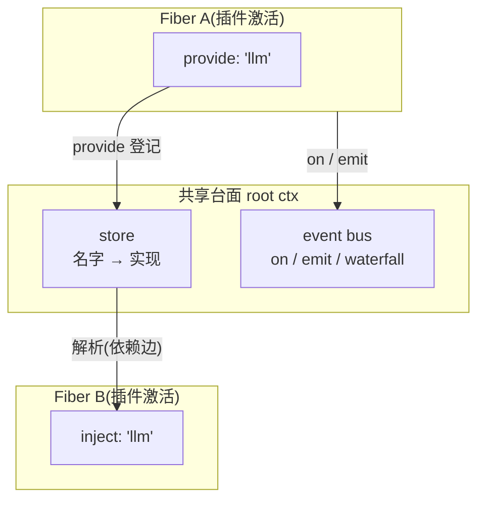
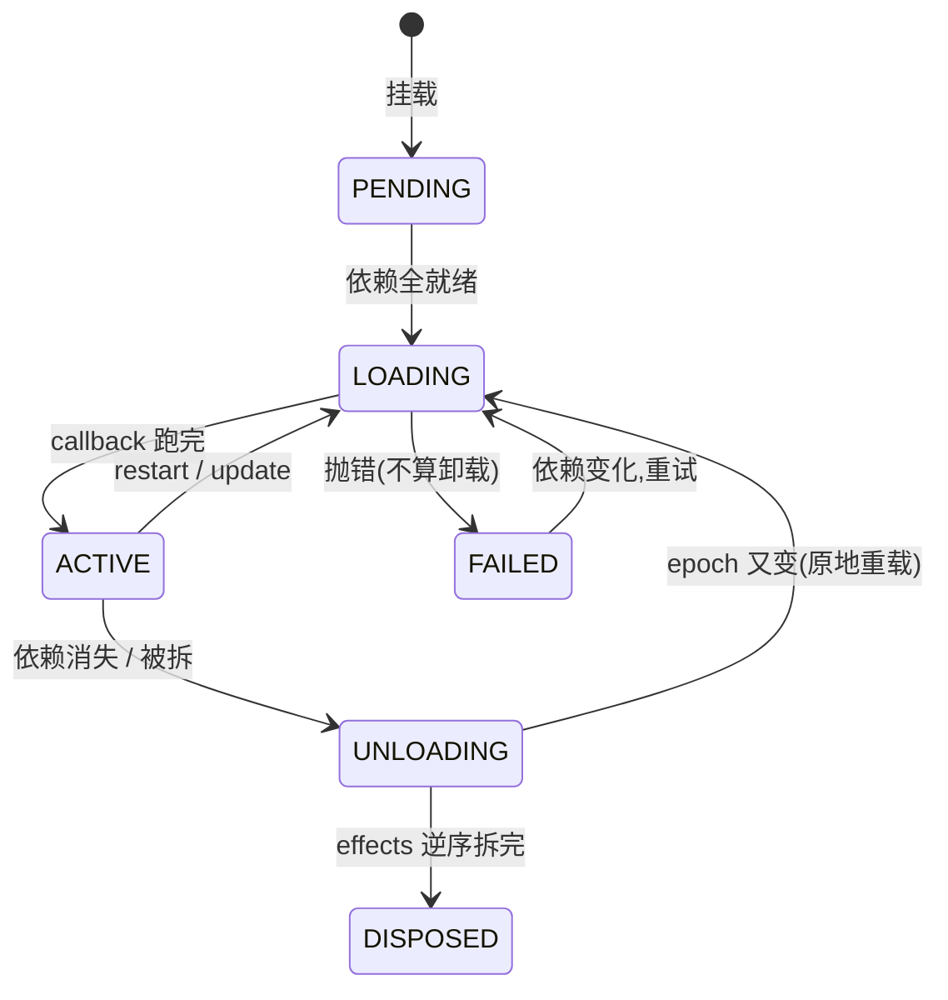
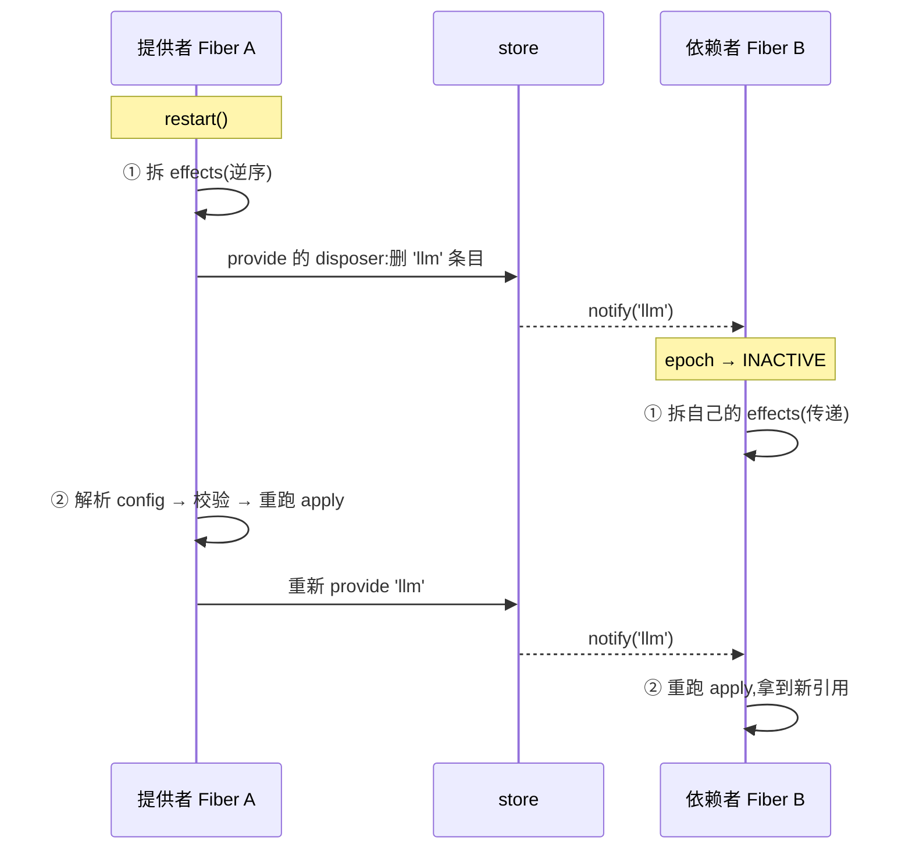

# Cordis 核心模型:一页架构

> 面向初学者的心智模型笔记。围绕五个问题:ctx 是什么、里面有什么、生命周期怎么走、重载规则是什么、框架的边界在哪。源码依据:`vendor/cordis/src/`。

## 图 1:全景

插件之间没有直接连线,全部通过台面;唯一的线是 inject 声明的依赖边。

## 图 2:Fiber 生命周期

## 图 3:一次 restart 到底发生了什么

## 表 1:三种交互方式——按耦合强度选路

| 你的需求 | 用什么 | 框架替你管 | 你必须自己管 | 限制 |
|---|---|---|---|---|
| **强耦合**(必须有对方) | `inject` + `ctx.llm` | 启动排序、卸载级联、重载唤醒 | 无 | **不能成环** |
| **弱耦合**(广播/拦截) | `ctx.on` / `emit` / `waterfall` | 分发、卸载自动摘监听器 | 无 | 约定事件名 |
| **机会式**(有就用没有拉倒) | `ctx.get` | 无 | **每次用前重取,禁止缓存** | 提供者死了你不知情 |

## 表 2:重载规则——什么变化触发什么

| 变化 | 触发入口 | 波及范围 |
|---|---|---|
| 改配置 | `fiber.update()` | 同一 fiber restart,重跑 apply |
| 改代码(HMR) | 文件监听 → 新 callback | 旧 fiber 销毁 + 新 fiber 从零注册 |
| 提供者卸载/重启 | store 条目删/加 | **传递依赖子树**全体卸载/重载 |
| `set()` 换服务对象 | 无 | **无**(依赖者继续用旧引用) |

## 边界清单

**框架保证:**

- ✅ 你登记的一切(provide / on / 子插件 / 工具),卸载时**逆序精确还原**
- ✅ 提供者先激活,消费者后激活(inject 排序)
- ✅ 提供者卸载 → 传递依赖者全体卸载;替代者出现 → 全体重载
- ✅ 没声明 inject 就读取 → 直接报错

**框架不保证:**

- ❌ `set()` 换对象不会通知任何人
- ❌ 持有旧引用越过提供者卸载 → 调用**能跑但无保障**
- ❌ 绕过框架的耦合(直接 import、共享单例、互相持引用)→ **零感知、零保护**
- ❌ 循环依赖 → 双方**静默永远不启动**(不报错)

## 五种分发模式

定义在 `vendor/cordis/src/events.ts`。分发模式是事件的公开契约,声明(类型 + `@mode`)必须与实际分发一致。

| 模式 | 同步/异步 | 等待? | 监听器返回值 | 何时停止 |
|---|---|---|---|---|
| `emit` | 同步 | 否 | 忽略(返回 Promise 也不等) | 全部跑完 |
| `parallel` | 异步 | 是,并发 | 忽略,报错聚合成 `AggregateError` | 全部 settle 后 |
| `serial` | 异步 | 是,按序 | bail 值停止分发 | 第一个非 null/false/undefined 返回值 |
| `bail` | 同步 | — | 同上 | 同上,同步返回 |
| `waterfall` | 同步 | — | 每层包装结果 | 某监听器不调 `next()` |

- `emit`:群发通知,不等回话(日志、遥测、状态广播)
- `parallel`:并发问卷,失败收集后抛 `AggregateError`
- `serial`:排队面试,第一个返回 bail 值的生效(按优先级找处理者)
- `bail`:serial 的同步版(框架内部用,如 `internal/listener` 拦截监听器注册)
- `waterfall`:洋葱中间件,最后参数是内建行为的 `next`;调用 `next()` 委托,不调用即否决。协作式改共享对象后必须委托

细节:

- `on()` 支持 `prepend`(插到队头;默认 push 到队尾)。注册顺序取决于插件激活顺序,只有确有先后需求才用,如策略守卫要先于默认行为
- `global` 绕过作用域过滤:服务通知等分发会挂 `Context.filter` 按隔离作用域筛监听器;`global: true` 的监听器不受筛选,核心服务自身需要全局可见性
- `once()` 是跑一次自动摘除的 `on`:包装函数先 `dispose()` 再执行原监听器,用于等一次性信号
- 非 internal 事件每次分发前先发 `internal/dispatch(type, name, args, thisArg)`,可单点观察所有分发(遥测/调试);internal 前缀短路避免自触发
- 在 harness 里分发模式是事件公开契约:声明合并定义事件签名 + `@mode` 标签,生成目录与 CI 交叉校验声明模式与实际分发调用点一致

## 源码位置

| 代码 | 位置 |
|---|---|
| 本仓库实际使用的 Cordis 源码 | `vendor/cordis/` 等 9 个 vendored 目录(改名 `@deepseek-ai/*` scope,带本地补丁) |
| 上游工作区(现行版,全 9 包) | `~/repos/cordis-workspace`(克隆自 https://github.com/cordiverse/cordis) |
| core + loader 的快照 commit | `56b3d4f7` — 存在于 cordiverse/cordis 历史中 ✅ |
| include/group/timer/hmr/logger-console 的快照 commit | `abb0a307` — 原 fork `deepseek-harness/cordis` **已删除(404)**,该 commit 不在 cordiverse 历史中;仅存于本地 vendor 副本 ❌ |
| 本地补丁清单 | `vendor/README.md`(18 条本地修改 + 同步流程) |

vendoring 使仓库**不依赖任何上游**:上游 fork 失传不影响构建与测试,只影响从那 5 个包的旧上游同步新代码(未来同步可改用 cordiverse/cordis 现行版)。

## 关键源码锚点

| 概念 | 位置 |
|---|---|
| Context 构造与 Proxy | `vendor/cordis/src/context.ts` |
| 服务解析(get/set 陷阱、provide/store) | `vendor/cordis/src/reflect.ts` |
| 事件总线与五种分发 | `vendor/cordis/src/events.ts` |
| 插件挂载与 inject 解析 | `vendor/cordis/src/registry.ts` |
| Fiber 生命周期、effect 账本、epoch | `vendor/cordis/src/fiber.ts` |
| 跨 ctx 值追踪(traceable proxy) | `vendor/cordis/src/utils.ts` |
