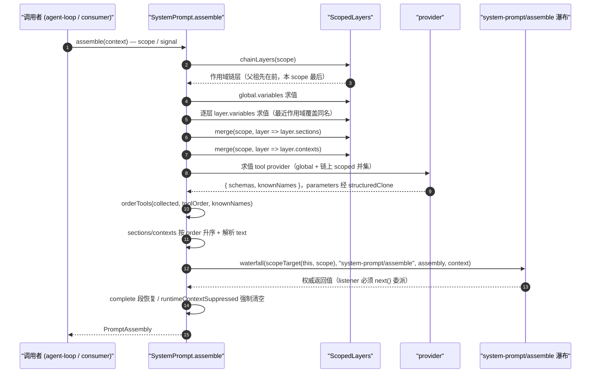
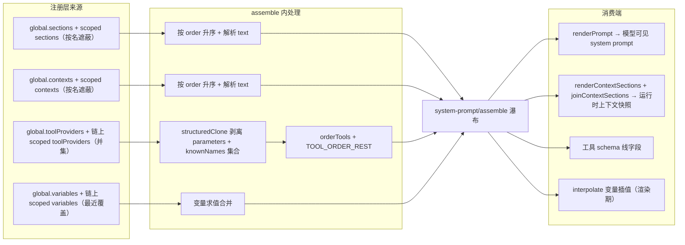

# System Prompt 注册表（core/system-prompt）

本页记录 [`@deepseek-ai/dsh-system-prompt`](../../../packages/core/system-prompt) 包的模型上下文拼装机制。源码入口是 [`index.ts`](../../../packages/core/system-prompt/src/index.ts)，作用域原语来自 [`@deepseek-ai/dsh-scope`](../../../packages/core/scope/src/index.ts) 与 [`store.ts`](../../../packages/core/scope/src/store.ts)。

## 总览

`SystemPrompt` 是一个 Cordis `Service`（ctx key `systemPrompt`，[`index.ts`](../../../packages/core/system-prompt/src/index.ts#L338)）：插件通过五种注册 API 贡献输入——`section`、`context`、`tools`、`variable`、`suppressRuntimeContext`；调用者每次模型步骤执行 `assemble(context)` 得到 `PromptAssembly`，再渲染为模型可见文本。

每条注册都落在 `ScopedLayers` 的某一层上（[`store.ts`](../../../packages/core/scope/src/store.ts#L159)）：层由注册时所在 context 的作用域决定（`scopeOf(ctx)`，[`scope/index.ts`](../../../packages/core/scope/src/index.ts#L154)），通过 `ctx.effect()` 绑定生命周期并在注册/销毁时发出 `system-prompt/change`（[`store.ts`](../../../packages/core/scope/src/store.ts#L226)）。

## 注册种类

### section —— 有序提示段

API 签名：`section(section: PromptSection): () => void`（[`index.ts`](../../../packages/core/system-prompt/src/index.ts#L381)）。`PromptSection` = `{ name, order, text, complete? }`（[`index.ts`](../../../packages/core/system-prompt/src/index.ts#L53)）；`text` 可为静态字符串或按 `AssembleContext` 求值的函数（[`index.ts`](../../../packages/core/system-prompt/src/index.ts#L67)）。

- 唯一性：同一层内重名即抛错；全局层报 `prompt section "…" is already registered (for a per-agent override, register through that agent's agent.ctx instead)`，作用域层报 `prompt section "…" is already registered in this scope`（[`index.ts`](../../../packages/core/system-prompt/src/index.ts#L316)）。失败注册回滚、不泄漏，原段保持原样（[system-prompt.spec.ts](../../../packages/core/system-prompt/tests/system-prompt.spec.ts#L144)）。
- 顺序：按 `order` 升序拼接（[`index.ts`](../../../packages/core/system-prompt/src/index.ts#L504)）。约定序带：`-100` 为 harness 身份、`0` 为部署人设、工具指引用 `100–199`，其它负数序也先于 persona 渲染（[`index.ts`](../../../packages/core/system-prompt/src/index.ts#L57)）。
- `order` 必须为有限数，否则 `TypeError`（[`index.ts`](../../../packages/core/system-prompt/src/index.ts#L382)）。
- `complete: true` 段在瀑布之后被恢复为该作用域的唯一提示段（[`index.ts`](../../../packages/core/system-prompt/src/index.ts#L536)）；同时存在多于一个 effective complete 段使 assembly 失败（[`index.ts`](../../../packages/core/system-prompt/src/index.ts#L505)）。
- 作用域遮蔽：段按名字遮蔽——`merge(scope, layer => layer.sections)` 先载入全局表，再按父链从远到近逐层覆盖，最近作用域的同名段获胜（[`index.ts`](../../../packages/core/system-prompt/src/index.ts#L484)，[`store.ts`](../../../packages/core/scope/src/store.ts#L208)）。遮蔽在求值任何 text provider 之前完成（[scoped.spec.ts](../../../packages/core/system-prompt/tests/scoped.spec.ts#L66)）。

### context —— 动态运行时上下文

API 签名：`context(context: PromptContext): () => void`（[`index.ts`](../../../packages/core/system-prompt/src/index.ts#L398)）。`PromptContext` = `{ name, order, text }`（[`index.ts`](../../../packages/core/system-prompt/src/index.ts#L78)）；`text` 同样可为静态串或按 `AssembleContext` 求值的函数（[`index.ts`](../../../packages/core/system-prompt/src/index.ts#L84)）。

- 唯一性：同一层内重名抛错，报错文案与 section 同构（全局提示走 `agent.ctx`、作用域层提示 `already registered in this scope`，[`index.ts`](../../../packages/core/system-prompt/src/index.ts#L319)）。
- 顺序：context 按 `order` 升序拼接（[`index.ts`](../../../packages/core/system-prompt/src/index.ts#L523)），经 `renderContextSections`/`joinContextSections` 成为持久化 user 角色运行时上下文快照（[`index.ts`](../../../packages/core/system-prompt/src/index.ts#L224)）。
- 作用域遮蔽：与 section 同规则，`merge(scope, layer => layer.contexts)`（[`index.ts`](../../../packages/core/system-prompt/src/index.ts#L485)）；遮蔽在求值 text 之前完成，作用域销毁后回落到全局条目（[scoped.spec.ts](../../../packages/core/system-prompt/tests/scoped.spec.ts#L128)）。
- 空文本段不贡献任何内容（[`index.ts`](../../../packages/core/system-prompt/src/index.ts#L83)）。

### tools —— 工具 schema provider

API 签名：`tools(provider: (context: AssembleContext) => ToolProviderResult): () => void`（[`index.ts`](../../../packages/core/system-prompt/src/index.ts#L430)）。`ToolProviderResult` = `{ schemas, knownNames? }`：`schemas` 是本次 assembly 模型可见的工具集，`knownNames` 是配置校验用的未限制前名字全集（缺省即 `schemas` 的名字，[`index.ts`](../../../packages/core/system-prompt/src/index.ts#L104)）。

- 唯一性：工具不按名字互斥——全局与匹配作用域的 provider 都贡献，属于并集而非遮蔽（[`index.ts`](../../../packages/core/system-prompt/src/index.ts#L424)）；`AnonymousEntries` 使每条注册独立可撤（[`store.ts`](../../../packages/core/scope/src/store.ts#L114)）。
- 保留名：provider 不得返回名为 `TOOL_ORDER_REST`（`'<unlisted-tools>'`，[`index.ts`](../../../packages/core/system-prompt/src/index.ts#L140)）的工具，否则 assembly 失败（[`index.ts`](../../../packages/core/system-prompt/src/index.ts#L166)）。
- 每次求值把 `parameters` 做 `structuredClone` 剥离，防止引用泄漏到未来 assembly（[`index.ts`](../../../packages/core/system-prompt/src/index.ts#L495)）。
- 收集在进入瀑布之前完成并快照 provider 成员（[`index.ts`](../../../packages/core/system-prompt/src/index.ts#L487)），保证一次 assembly 内的变更不污染本次结果。

### variable —— 提示变量

API 签名：`variable(name: string, provider: (context: AssembleContext) => string | undefined): () => void`（[`index.ts`](../../../packages/core/system-prompt/src/index.ts#L446)）。名字必须匹配 `VARIABLE_NAME = /^[a-z][a-z0-9_]*$/`（[`index.ts`](../../../packages/core/system-prompt/src/index.ts#L134)），否则抛错（[`index.ts`](../../../packages/core/system-prompt/src/index.ts#L447)）。

- 唯一性：同一层内重名抛错（全局 `agent.ctx` 提示、作用域 `already registered in this scope`，[`index.ts`](../../../packages/core/system-prompt/src/index.ts#L322)）。
- 求值：`assemble` 先求全局变量，再沿 scope 链从远到近求值、最近作用域覆盖同名（[`index.ts`](../../../packages/core/system-prompt/src/index.ts#L473)）；provider 返回 `undefined` 表示“本 assembly 无值”，渲染引用该值时才失败（[`index.ts`](../../../packages/core/system-prompt/src/index.ts#L440)）。

### suppressRuntimeContext —— 运行时上下文抑制

API 签名：`suppressRuntimeContext(): () => void`（[`index.ts`](../../../packages/core/system-prompt/src/index.ts#L415)）。在调用作用域内抑制全部动态 context 贡献，不改变拥有/强制这些事实的服务（[`index.ts`](../../../packages/core/system-prompt/src/index.ts#L409)）。

- 多条抑制独立可撤（`AnonymousEntries`，[`store.ts`](../../../packages/core/scope/src/store.ts#L114)）；全部撤消后 context 恢复（[scoped.spec.ts](../../../packages/core/system-prompt/tests/scoped.spec.ts#L146)）。
- 生效点：`assemble` 中若全局层或 scope 链上存在任何抑制器，`contexts` 直接置空（[`index.ts`](../../../packages/core/system-prompt/src/index.ts#L470)），context provider 不被求值、瀑布里 listener 追加的 context 也在瀑布后被丢弃（[`index.ts`](../../../packages/core/system-prompt/src/index.ts#L540)，[system-prompt.spec.ts](../../../packages/core/system-prompt/tests/system-prompt.spec.ts#L52)）。

## 内置槽位

`SystemPrompt` 构造时注册两个内置段：`harness:identity`（order `-100`）与 `deployment:persona`（order `0`）（[`index.ts`](../../../packages/core/system-prompt/src/index.ts#L357)）。逐字文本与来源见 [prompts/harness-identity.md](prompts/harness-identity.md) 与 [prompts/deployment-persona-slot.md](prompts/deployment-persona-slot.md)。

## assemble(context) 全流程

`assemble(context: AssembleContext = {})`（[`index.ts`](../../../packages/core/system-prompt/src/index.ts#L467)）按下列顺序执行：

1. 取作用域链：`this.layers.chainLayers(scope)`，已有覆盖层按父链从远到近排列、本 scope 最后（[`index.ts`](../../../packages/core/system-prompt/src/index.ts#L469)，[`store.ts`](../../../packages/core/scope/src/store.ts#L192)）。
2. 判定抑制：全局层或链上任何层有 `runtimeContextSuppressors` 即 `runtimeContextSuppressed = true`（[`index.ts`](../../../packages/core/system-prompt/src/index.ts#L470)）。
3. 变量链合并：先求全局 `variables`，再沿 scope 链从远到近求值、最近作用域同名覆盖（[`index.ts`](../../../packages/core/system-prompt/src/index.ts#L473)）。
4. 作用域遮蔽 merge：`merge(scope, layer => layer.sections)` 与 `merge(scope, layer => layer.contexts)`，最近作用域同名获胜（[`index.ts`](../../../packages/core/system-prompt/src/index.ts#L484)）。
5. 工具 provider 收集：`[...global.toolProviders.values(), ...scopeLayers.flatMap(...)]` 并集（[`index.ts`](../../../packages/core/system-prompt/src/index.ts#L487)）；逐 provider 求值（[`index.ts`](../../../packages/core/system-prompt/src/index.ts#L493)），`parameters` 经 `structuredClone` 剥离（[`index.ts`](../../../packages/core/system-prompt/src/index.ts#L495)），`knownNames` 并入名字全集（[`index.ts`](../../../packages/core/system-prompt/src/index.ts#L500)）。
6. 排序：sections 与 contexts 按 `order` 升序（[`index.ts`](../../../packages/core/system-prompt/src/index.ts#L504)、[`index.ts`](../../../packages/core/system-prompt/src/index.ts#L523)）；tools 经 `orderTools(collected, toolOrder, knownNames)` 规范化（[`index.ts`](../../../packages/core/system-prompt/src/index.ts#L529)）。
7. 解析文本：段与 context 的 `text` 若为函数则按 `context` 求值（[`index.ts`](../../../packages/core/system-prompt/src/index.ts#L510)）。
8. 多 complete 检查：多于一个 `complete: true` 段使 assembly 失败（[`index.ts`](../../../packages/core/system-prompt/src/index.ts#L505)）。
9. 瀑布：`ctx.waterfall(scopeTarget(this, scope), 'system-prompt/assemble', assembly, context, () => Promise.resolve(assembly))`（[`index.ts`](../../../packages/core/system-prompt/src/index.ts#L532)）。scope 过滤派发（[`scope/index.ts`](../../../packages/core/scope/src/index.ts#L170)）：带标记的 listener 只收到匹配 key 或其祖先的 assembly；瀑布 listener 必须调用 `next()` 委派，不调用即短路，返回值为权威（[`index.ts`](../../../packages/core/system-prompt/src/index.ts#L31)，[system-prompt.spec.ts](../../../packages/core/system-prompt/tests/system-prompt.spec.ts#L273)）。
10. complete 恢复与抑制强制：若有 effective complete 段则把 `sections` 恢复为仅该段；若 `runtimeContextSuppressed` 则把 `contexts` 强制置空（[`index.ts`](../../../packages/core/system-prompt/src/index.ts#L536)）。若非这两种情况，瀑布返回值原样返回。

权威返回值由 invariant 伴生插件校验（[`invariant.ts`](../../../packages/core/system-prompt/src/invariant.ts#L46)）：`system-prompt/assemble` 上以 `{ global: true, prepend: true }` 监听，先 `next()` 再校验（[`invariant.ts`](../../../packages/core/system-prompt/src/invariant.ts#L47)）；段/context 名字非空且不重复、text 为字符串，工具名非空，变量名匹配 `[a-z][a-z0-9_]*` 且值为字符串或 `undefined`（[`invariant.ts`](../../../packages/core/system-prompt/src/invariant.ts#L16)）。

### toolOrder 规范化

`orderTools(tools, toolOrder, knownNames)`（[`index.ts`](../../../packages/core/system-prompt/src/index.ts#L164)）：`toolOrder` 缺省时按字典序排序（[`index.ts`](../../../packages/core/system-prompt/src/index.ts#L169)，比较函数 [`compareToolNames`](../../../packages/core/system-prompt/src/index.ts#L181)）；配置时列出工具占配置位、未列出的落在 `TOOL_ORDER_REST` 处且内部字典序（[`index.ts`](../../../packages/core/system-prompt/src/index.ts#L174)）。`validateToolOrder` 在加载时校验：重复名或缺少 rest 项即抛错（[`index.ts`](../../../packages/core/system-prompt/src/index.ts#L146)）；assembly 时列出 `knownNames` 之外的名字即抛错，区分“配置笔误”与“已知但被遮蔽”（[`index.ts`](../../../packages/core/system-prompt/src/index.ts#L170)）。规范化发生在瀑布之前，瀑布里 listener 追加的工具不再重排（[tool-order.spec.ts](../../../packages/core/system-prompt/tests/tool-order.spec.ts#L81)）。

## 渲染与严格变量插值

`renderPrompt(assembly)`（[`index.ts`](../../../packages/core/system-prompt/src/index.ts#L212)）：对每个段做 `interpolate(..., 'section')`，丢弃空段，用空行 `\n\n` 连接（[`index.ts`](../../../packages/core/system-prompt/src/index.ts#L213)）。

`renderContextSnapshot(assembly)` = `joinContextSections(renderContextSections(assembly))`（[`index.ts`](../../../packages/core/system-prompt/src/index.ts#L224)）。`renderContextSections` 对每个 context 做 `interpolate(..., 'context')` 并丢弃空段（[`index.ts`](../../../packages/core/system-prompt/src/index.ts#L251)）；`joinContextSections` 以 `\n\n` 连接正文，空正文返回 `''`，否则加前缀 `Current runtime context. This snapshot supersedes earlier runtime-context snapshots.`（[`index.ts`](../../../packages/core/system-prompt/src/index.ts#L236)）。

`interpolate(input, variables, kind)`（[`index.ts`](../../../packages/core/system-prompt/src/index.ts#L258)）的严格规则：

- 引用必须是完整简单的 `{{name}}` 组（`GROUP_AT = /^\{\{([^{}]*)\}\}/`，[`index.ts`](../../../packages/core/system-prompt/src/index.ts#L137)）；名字须匹配 `VARIABLE_NAME`，否则 `malformed prompt variable reference` 抛错（[`index.ts`](../../../packages/core/system-prompt/src/index.ts#L279)）。
- 出现 `{{` 但未构成完整组：若其后再无 `}}`，则孤立 `{{` 是字面文本、原样保留（[`index.ts`](../../../packages/core/system-prompt/src/index.ts#L273)）；若后面仍有 `}}`（如 `{{{model}}}`、含嵌套或内空格的组），判为 malformed 抛错（[`index.ts`](../../../packages/core/system-prompt/src/index.ts#L270)）。
- 未知名字经 `Object.hasOwn` 判定——原型链属性（如 `{{constructor}}`）不算变量——抛错并列出已注册变量（[`index.ts`](../../../packages/core/system-prompt/src/index.ts#L283)）。
- 已注册但值为 `undefined` 的引用抛错“no value for this assembly”（[`index.ts`](../../../packages/core/system-prompt/src/index.ts#L288)）。
- 替换结果不再被扫描：扫描从完整组之后继续，替换进的值若含 `{{…}}` 保持字面（[`index.ts`](../../../packages/core/system-prompt/src/index.ts#L291)，[system-prompt.spec.ts](../../../packages/core/system-prompt/tests/system-prompt.spec.ts#L572)）。

## Mermaid —— assemble() 时序

## Mermaid —— PromptAssembly 字段来源与去向

## 相关文件

- 包 README：[packages/core/system-prompt/README.md](../../../packages/core/system-prompt/README.md)
- 子系统页：[docs/subsystems/system-prompt.md](../../subsystems/system-prompt.md)
- 作用域原语：[packages/core/scope/src/index.ts](../../../packages/core/scope/src/index.ts)、[packages/core/scope/src/store.ts](../../../packages/core/scope/src/store.ts)
