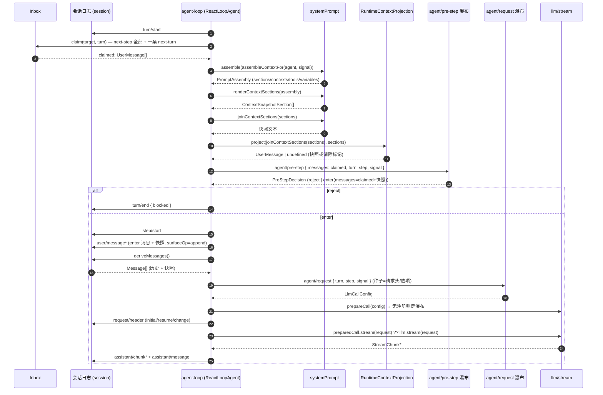
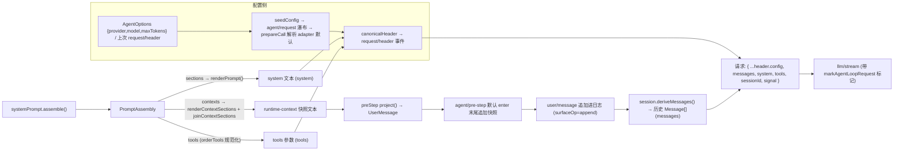

# Step 与请求拼装（core/agent-loop）

本页记录 `@deepseek-ai/dsh-agent-loop` 的驱动 `ReactLoopAgent`（[`agent.ts`](../../../packages/core/agent-loop/src/agent.ts)）如何在一个 step 内把模型请求拼装出来：输入认领、prompt 组装、历史推导、runtime-context 快照插入、请求头折叠与进入 `llm/stream` 的时机。代码逐字摘录见 [code/agent-loop-request.md](code/agent-loop-request.md)。系统提示段/工具/变量的注册与组装本体归 [`01-system-prompt-registry.md`](01-system-prompt-registry.md)，本页只交代它们在请求中的汇入点与消息形态。

## 总览

每次模型调用都从会话日志派生：`ReactLoopAgent` 先认领一批输入，在 `agent/pre-step` 瀑布里决定这批输入是否进入（`enter`/`reject`），进入的消息连同 runtime-context 快照一起以 `user/message` 追加到日志（[`agent.ts`](../../../packages/core/agent-loop/src/agent.ts#L282)），`session.deriveMessages()` 再把这个历史投影成 `Message[]`（[`index.ts`](../../../packages/core/session/src/index.ts#L726)），与渲染好的 system prompt、工具 schema、请求配置一起在 `buildRequest` 中折叠成请求头并发送（[`agent.ts`](../../../packages/core/agent-loop/src/agent.ts#L407)）。"模型可见 ⟺ 已记录"由 `agent-loop-invariant` 在 `llm/stream` 上断言（[`invariant.ts`](../../../packages/core/agent-loop/src/invariant.ts#L21)）。

## 拼装时机主线

### turn/start 与第一次 preStep

驱动由 `wakeDriver` 进入 `running` 相（[`agent.ts`](../../../packages/core/agent-loop/src/agent.ts#L172)），随后 `kick` 反复执行 `turn()`（[`agent.ts`](../../../packages/core/agent-loop/src/agent.ts#L210)）。每个 turn 先 `session.append('turn/start', { turn })` 打开边界（[`agent.ts`](../../../packages/core/agent-loop/src/agent.ts#L255)），再循环提议 step：`preStep(target, { turn, step })`（[`agent.ts`](../../../packages/core/agent-loop/src/agent.ts#L266)），首个 step 的 `target` 是 `'next-turn'`，后续 step 是 `'next-step'`（[`agent.ts`](../../../packages/core/agent-loop/src/agent.ts#L261)、[`agent.ts`](../../../packages/core/agent-loop/src/agent.ts#L300)）。

### preStep：认领、assemble、pre-step 瀑布

`preStep`（[`agent.ts`](../../../packages/core/agent-loop/src/agent.ts#L225)）按顺序做四件事：

1. `inbox.claim(target, position.turn)` 认领下一输入——`next-step` 全部输入加（turn 边界时）一条 `next-turn` 消息（[`agent.ts`](../../../packages/core/agent-loop/src/agent.ts#L229)，实现见 [`inbox.ts`](../../../packages/core/agent/src/inbox.ts#L71)）。
2. `this.loopCtx.systemPrompt.assemble(assembleContextFor(this, signal))` 组装本次 prompt（[`agent.ts`](../../../packages/core/agent-loop/src/agent.ts#L230)）。`assembleContextFor(agent, signal)` 返回 `{ agent, scope: agent, signal }`（[`dispatch.ts`](../../../packages/core/agent/src/dispatch.ts#L174)），`AssembleContext.agent`/`scope` 由 `dsh-agent` 扩展（[`runtime-types.ts`](../../../packages/core/agent/src/runtime-types.ts#L16)），使 agent 作用域的段/变量/工具参与组装。
3. 渲染动态上下文并投影快照：`const sections = renderContextSections(assembly)`（[`agent.ts`](../../../packages/core/agent-loop/src/agent.ts#L232)），`const context = this.runtimeContext.project(joinContextSections(sections), sections)`（[`agent.ts`](../../../packages/core/agent-loop/src/agent.ts#L233)）。
4. 走 `agent/pre-step` 瀑布，默认决策是 `enter`：`messages: context === undefined ? claimed : [...claimed, context]`（[`agent.ts`](../../../packages/core/agent-loop/src/agent.ts#L234)）——即默认把 runtime-context 快照作为**最后一条**进入消息；瀑布 listener 可整体改写这批消息或 `reject`（事件契约见 [`runtime-types.ts`](../../../packages/core/agent/src/runtime-types.ts#L231)）。

`agent/pre-step` 是请求派生之前唯一的串行监听链（[`core.md`](../../subsystems/core.md#interception-decisions)）。

### reject 与 enter 的汇合

`preStep` 返回 `decision.kind === 'reject' ? decision : { ...decision, assembly }`（[`agent.ts`](../../../packages/core/agent-loop/src/agent.ts#L242)）。`turn` 里 `reject` 直接以 `turnEnds = { kind: 'blocked' }` 关闭 turn、不产生 step（[`agent.ts`](../../../packages/core/agent-loop/src/agent.ts#L267)）；首次 `enter` 被改写成空消息则关闭一个未花模型调用的 turn（[`agent.ts`](../../../packages/core/agent-loop/src/agent.ts#L274)）。否则 `session.append('step/start', { turn, step })` 打开 step 边界（[`agent.ts`](../../../packages/core/agent-loop/src/agent.ts#L279)），随后把 `decision.messages` 逐条以 `session.append('user/message', message, { surfaceOp: 'append' })` 追加进日志（[`agent.ts`](../../../packages/core/agent-loop/src/agent.ts#L282)），再 `await this.step(decision.assembly)`（[`agent.ts`](../../../packages/core/agent-loop/src/agent.ts#L287)）。

### step：渲染 system、派生历史、进入 llm/stream

`step(assembly)`（[`agent.ts`](../../../packages/core/agent-loop/src/agent.ts#L332)）首先 `const system = renderPrompt(assembly)` 渲染 system prompt 文本（[`agent.ts`](../../../packages/core/agent-loop/src/agent.ts#L337)，`renderPrompt` 实现见 [`index.ts`](../../../packages/core/system-prompt/src/index.ts#L212)），然后循环调用 `buildRequest(turn, step, assembly.tools, system, this.session.deriveMessages(), signal)`（[`agent.ts`](../../../packages/core/agent-loop/src/agent.ts#L340)）——历史消息在**此时**（step/start 与 enter 消息都已在日志中）从日志推导，一次一步内每个 `buildRequest` 调用都会重新 `deriveMessages()`。

拿到请求后选择流入口：`const stream = preparedCall?.stream(request) ?? this.loopCtx.llm.stream(request)`（[`agent.ts`](../../../packages/core/agent-loop/src/agent.ts#L345)）——有 `prepareCall` 结果时走注册绑定的流入口（见下），否则走 `llm/stream` 瀑布（[`index.ts`](../../../packages/llm/llm/src/index.ts#L64)）。流式块逐块 `session.append('assistant/chunk', { turn, step, chunk })` 落日志、同时喂给 `BlockAssembler`（[`agent.ts`](../../../packages/core/agent-loop/src/agent.ts#L347)）；结束后 `createAssistantMessage(...)` 组装 assistant 消息并以 `assistant/message` 追加（[`agent.ts`](../../../packages/core/agent-loop/src/agent.ts#L373)）。`finish.kind === 'error' || 'aborted'` 时走 `agent/request-error` 瀑布决定重试还是抛出 `LlmError`（[`agent.ts`](../../../packages/core/agent-loop/src/agent.ts#L354)）；`max-tokens` 直接结束 step（[`agent.ts`](../../../packages/core/agent-loop/src/agent.ts#L391)）；否则提取 `tool-call` 块交 `executeToolCalls`（[`agent.ts`](../../../packages/core/agent-loop/src/agent.ts#L393)、[`tool-calls.ts`](../../../packages/core/agent-loop/src/tool-calls.ts#L59)），`concluded` 时结束 step，否则带着下一批 context 进入下一个 step 循环。

### buildRequest：请求头折叠与 agent/request

`buildRequest`（[`agent.ts`](../../../packages/core/agent-loop/src/agent.ts#L407)）是请求装配点：

1. 读取持久化请求头 `const persistedHeader = session.requestHeader()`（[`agent.ts`](../../../packages/core/agent-loop/src/agent.ts#L419)，`requestHeader()` 是日志 `request/header` 事件的增量折叠、结果冻结，[`index.ts`](../../../packages/core/session/src/index.ts#L670)）。
2. 构造种子配置 `seedConfig`：已记录过请求头则用 `requestProposal(persistedHeader)`（去掉 adapter 默认来源的字段，[`agent.ts`](../../../packages/core/agent-loop/src/agent.ts#L55)），否则用 `{ provider, model, reasoningEffort?, maxTokens? }`（[`agent.ts`](../../../packages/core/agent-loop/src/agent.ts#L428)），并 `deepFreeze(structuredClone(...))`。
3. 走 `agent/request` 瀑布：`await this.dispatch.waterfall('agent/request', { turn, step, signal }, () => Promise.resolve(seedConfig))`（[`agent.ts`](../../../packages/core/agent-loop/src/agent.ts#L438)，事件契约见 [`runtime-types.ts`](../../../packages/core/agent/src/runtime-types.ts#L244)）；返回的配置必须有 `provider`/`model`，否则抛错（[`agent.ts`](../../../packages/core/agent-loop/src/agent.ts#L443)）。
4. `preparedCall = await this.loopCtx.llm.prepareCall(proposedConfig, signal)` 解析精确模型的 adapter 默认（reasoningEffort/maxTokens）并绑定注册（[`agent.ts`](../../../packages/core/agent-loop/src/agent.ts#L449)，实现见 [`index.ts`](../../../packages/llm/llm/src/index.ts#L779)）；未注册路由（`NO_ADAPTER`）则保留提议配置、走 `llm/stream` 让中间件接管（[`agent.ts`](../../../packages/core/agent-loop/src/agent.ts#L451)）。
5. 折叠请求头：`const header = canonicalHeader({ config, adapterDefaults?, system?, tools? })`（[`agent.ts`](../../../packages/core/agent-loop/src/agent.ts#L458)，`canonicalHeader` 把空 system/空 tools 归并为缺省字段，[`request-header.ts`](../../../packages/core/session/src/request-header.ts#L21)）。
6. 记录请求头：未记录过则 `session.append('request/header', { header, reason: baseline === undefined ? 'initial' : 'resume' })`；否则仅当与当前折叠 `headerEquals` 不等才追加 `reason: 'change'`（[`agent.ts`](../../../packages/core/agent-loop/src/agent.ts#L464)）。
7. 记录 `request/context`（provider/model/contextWindow），仅在路由元数据变化时追加（[`agent.ts`](../../../packages/core/agent-loop/src/agent.ts#L472)）。
8. 组装请求对象：`markAgentLoopRequest(deepFreeze({ ...header.config, messages: boundaryMessages, system?, tools?, sessionId, signal }))`（[`agent.ts`](../../../packages/core/agent-loop/src/agent.ts#L486)）——`header.config` 展开为 provider/model/reasoningEffort/temperature/maxTokens/stop，`messages` 是 `deriveMessages()` 结果，`system`/`tools` 来自请求头；`markAgentLoopRequest` 用进程内 `WeakSet` 打标（[`call-config.ts`](../../../packages/llm/llm/src/call-config.ts#L66)），供 `agent-loop-invariant` 识别（[`invariant.ts`](../../../packages/core/agent-loop/src/invariant.ts#L22)）。

`requestProposal` 在 `header.adapterDefaults` 存在时删掉对应 `reasoningEffort`/`maxTokens`（[`agent.ts`](../../../packages/core/agent-loop/src/agent.ts#L55)），使下一请求的 `agent/request` 瀑布能重新决策这些 adapter 默认值。

### 不变式：llm/stream 上的重建校验

`agent-loop-invariant` 以 `{ global: true, prepend: true }` 监听 `llm/stream`（[`invariant.ts`](../../../packages/core/agent-loop/src/invariant.ts#L21)），只检查带 loop 标记的请求：请求与 `messages` 必须冻结（[`invariant.ts`](../../../packages/core/agent-loop/src/invariant.ts#L23)），必须携带活 session id（[`invariant.ts`](../../../packages/core/agent-loop/src/invariant.ts#L24)），日志必须有 `step/start` 与 `request/header` 事件（[`invariant.ts`](../../../packages/core/agent-loop/src/invariant.ts#L32)），`JSON.stringify(options.messages) === JSON.stringify(session.deriveMessages())` 必须成立（[`invariant.ts`](../../../packages/core/agent-loop/src/invariant.ts#L39)），且 model/system/temperature/maxTokens/stop/tools 必须与 `foldRequestHeader` 折叠的请求头一致（[`invariant.ts`](../../../packages/core/agent-loop/src/invariant.ts#L44)）。

## runtime-context 快照的插入时机与形态

快照由 `RuntimeContextProjection`（[`runtime-context.ts`](../../../packages/core/agent-loop/src/runtime-context.ts#L25)）负责，它不拥有日志提交，只跟踪"最近一个仍在 surface 上的快照"：`retained: { seq, text } | null | undefined`，`undefined` 表示从未有过快照，`null` 表示曾有但已被 surface 替换移除（[`runtime-context.ts`](../../../packages/core/agent-loop/src/runtime-context.ts#L27)）。

每次 `preStep` 在 `assemble` 之后调用 `project(joinContextSections(sections), sections)`（[`agent.ts`](../../../packages/core/agent-loop/src/agent.ts#L232)）。`project` 的判定（[`runtime-context.ts`](../../../packages/core/agent-loop/src/runtime-context.ts#L64)）：

- `retained === undefined && current.length === 0`：从未有快照且当前动态上下文为空 → 返回 `undefined`，不插入任何消息。
- `snapshot = current.length === 0 ? CLEARED : current`：动态上下文清空但曾有过快照 → 快照文本换成 `CLEARED = 'Current runtime context: none. Earlier runtime-context snapshots no longer apply.'`（[`runtime-context.ts`](../../../packages/core/agent-loop/src/runtime-context.ts#L13)）。
- `retained?.text === snapshot`：文本与保留快照相同 → 返回 `undefined`，不重复插入、不增长日志（[loop.spec.ts](../../../packages/core/agent-loop/tests/loop.spec.ts#L384)）。
- 其余情况：`createUserMessage({ content: [{ type: 'text', text: snapshot }], source: sections.length === 0 ? { kind: 'plugin', plugin: SOURCE } : { kind: 'plugin', plugin: SOURCE, form: 'snapshot', sections } })`（[`runtime-context.ts`](../../../packages/core/agent-loop/src/runtime-context.ts#L68)）——`SOURCE = '@deepseek-ai/dsh-system-prompt'`（[`runtime-context.ts`](../../../packages/core/agent-loop/src/runtime-context.ts#L12)），`sections` 记录各具名贡献者。

插入形态：快照是一条 **user 角色消息**，正文是 `joinContextSections` 渲染出的整段文本（含前缀 `Current runtime context. This snapshot supersedes earlier runtime-context snapshots.`，[`index.ts`](../../../packages/core/system-prompt/src/index.ts#L236)），`source.kind === 'plugin'`。它在 `agent/pre-step` 的默认 `enter` 决策里追加在认领消息**之后**（[`agent.ts`](../../../packages/core/agent-loop/src/agent.ts#L238)），随后作为 `user/message` 以 `surfaceOp: 'append'` 进入日志（[`agent.ts`](../../../packages/core/agent-loop/src/agent.ts#L282)），从而被 `deriveMessages()` 投影为历史的一部分，不写进 system prompt、不改变请求头。

替换语义：普通更新是**追加**——新快照以新 seq 进日志，旧快照仍在 surface 上；只有 surface 替换（如压缩的 `replace`）会移除旧快照，构造器与 `session/event` 监听在 `isReplacementSurfaceEvent(event) && event.sourceEventSeqs?.includes(retained.seq)` 时把 `retained` 置为 `null`（[`runtime-context.ts`](../../../packages/core/agent-loop/src/runtime-context.ts#L46)），此后即使文本未变也会重新生成快照（[loop.spec.ts](../../../packages/core/agent-loop/tests/loop.spec.ts#L413)）。构造器从 `session.events` 倒序扫描恢复最近一个在 surface 上的拥有快照（[`runtime-context.ts`](../../../packages/core/agent-loop/src/runtime-context.ts#L34)），恢复的 `seq` 参与后续替换判定。非本会话的事件被忽略（[runtime-context.spec.ts](../../../packages/core/agent-loop/tests/runtime-context.spec.ts#L17)）。

`includeRuntimeContext` / `suppressRuntimeContext` 的作用点在 system-prompt 组装期而非 agent-loop：`includeRuntimeContext: false` 在 `SystemPrompt` 构造时调用全局 `suppressRuntimeContext()`（[`index.ts`](../../../packages/core/system-prompt/src/index.ts#L370)）；作用域内调用 `suppressRuntimeContext()` 同样生效（[`index.ts`](../../../packages/core/system-prompt/src/index.ts#L415)）。`assemble` 判定 `runtimeContextSuppressed` 后把 `contexts` 置空、不求值 context provider（[`index.ts`](../../../packages/core/system-prompt/src/index.ts#L470)）。于是 `renderContextSections(assembly)` 得到空数组、`joinContextSections` 得到 `''`，`project('')` 的结果取决于 retained：从无快照则 `undefined`（不插入），曾有过快照则插入 `CLEARED` 清除标记。抑制只改变快照文本的产出，不禁用拥有这些上下文的服务。

## 各部件汇入点

| 部件 | 汇入环节 | 消息形态 |
|---|---|---|
| system prompt 文本 | `step` 内 `renderPrompt(assembly)`（[`agent.ts`](../../../packages/core/agent-loop/src/agent.ts#L337)）→ `buildRequest` 的 `system` 参数 → `canonicalHeader`（[`agent.ts`](../../../packages/core/agent-loop/src/agent.ts#L461)）→ 请求 `system` 字段（[`agent.ts`](../../../packages/core/agent-loop/src/agent.ts#L489)） | 多段以空行连接的纯文本（`renderPrompt`，[`index.ts`](../../../packages/core/system-prompt/src/index.ts#L212)） |
| 历史消息 | `buildRequest` 调用时 `session.deriveMessages()`（[`agent.ts`](../../../packages/core/agent-loop/src/agent.ts#L341)）→ 请求 `messages` 字段（[`agent.ts`](../../../packages/core/agent-loop/src/agent.ts#L488)） | `Message[]`，从 surface 节点逐条投影（`deriveEventMessage`，[`surface.ts`](../../../packages/core/session/src/surface.ts#L83)） |
| runtime-context 快照 | `preStep` 内 `project(...)`（[`agent.ts`](../../../packages/core/agent-loop/src/agent.ts#L233)）→ 默认 enter 决策末尾（[`agent.ts`](../../../packages/core/agent-loop/src/agent.ts#L238)）→ 以 `user/message` 进日志（[`agent.ts`](../../../packages/core/agent-loop/src/agent.ts#L282)）→ 成为 `deriveMessages()` 的一部分 | 一条 user 角色、单 text 块、`source.plugin === '@deepseek-ai/dsh-system-prompt'` 的 `UserMessage` |
| tools 参数 | `step` 传 `assembly.tools`（[`agent.ts`](../../../packages/core/agent-loop/src/agent.ts#L340)）→ `canonicalHeader`（[`agent.ts`](../../../packages/core/agent-loop/src/agent.ts#L462)）→ 请求 `tools` 字段（[`agent.ts`](../../../packages/core/agent-loop/src/agent.ts#L490)） | `ToolSchema[]`（`{ name, description, parameters }`），已按 `orderTools` 规范化 |

## Mermaid —— 一个 step 从输入认领到 llm/stream

## Mermaid —— 一次请求的组成

## 相关文件

- 驱动源码：[packages/core/agent-loop/src/agent.ts](../../../packages/core/agent-loop/src/agent.ts)
- 快照投影：[packages/core/agent-loop/src/runtime-context.ts](../../../packages/core/agent-loop/src/runtime-context.ts)
- 重建不变式：[packages/core/agent-loop/src/invariant.ts](../../../packages/core/agent-loop/src/invariant.ts)
- 事件契约（pre-step/request/request-error）：[packages/core/agent/src/runtime-types.ts](../../../packages/core/agent/src/runtime-types.ts)
- 系统提示组装（含 `includeRuntimeContext`/`suppressRuntimeContext`）：[packages/core/system-prompt/src/index.ts](../../../packages/core/system-prompt/src/index.ts)
- 历史推导与请求头折叠：[packages/core/session/src/index.ts](../../../packages/core/session/src/index.ts)、[packages/core/session/src/surface.ts](../../../packages/core/session/src/surface.ts)、[packages/core/session/src/request-header.ts](../../../packages/core/session/src/request-header.ts)
- LLM 流与请求对象：[packages/llm/llm/src/index.ts](../../../packages/llm/llm/src/index.ts)、[packages/llm/llm/src/call-config.ts](../../../packages/llm/llm/src/call-config.ts)、[packages/llm/llm/src/types.ts](../../../packages/llm/llm/src/types.ts)
- 子系列上一篇：[01-system-prompt-registry.md](01-system-prompt-registry.md)
- 上层文档：[docs/architecture.md 的 Turn flow](../../architecture.md#turn-flow)、[docs/subsystems/core.md](../../subsystems/core.md)
