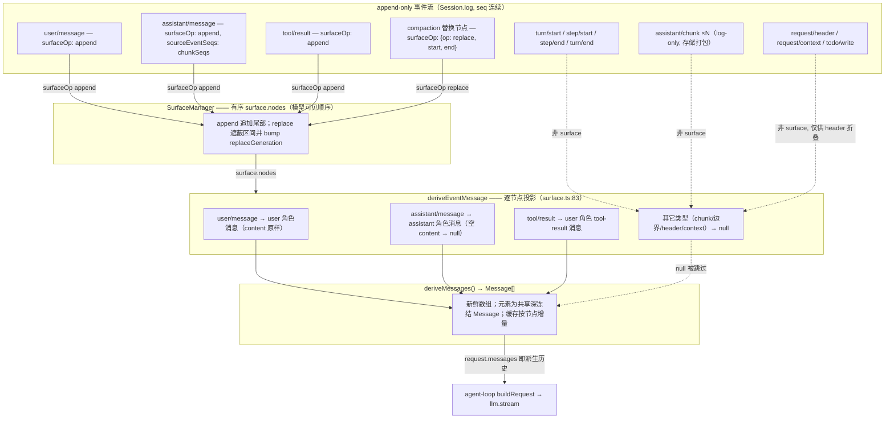
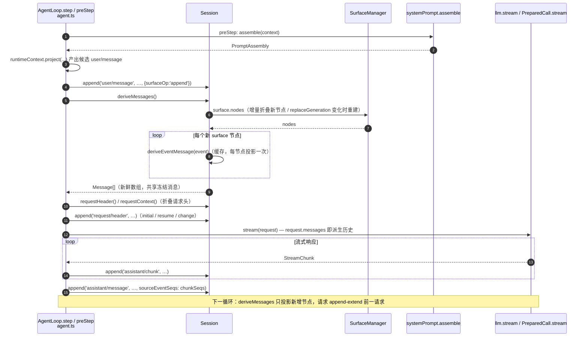

# 会话日志与模型历史派生

切片：`core/session`。主题：`SessionEventMap` 中哪些事件会投影成模型可见消息、`deriveMessages` 的投影规则、runtime-context 事件、请求头纪元（`EpochHeader`）折叠、fork/resume 重建。核心不变量：**模型可见 ⟺ 已记录** —— 会话日志（append-only `SessionEvent` 流）是模型所见上下文的唯一事实来源，`deriveMessages()` 从日志投影出模型历史；同一事件同时供投递、持久化与模型请求使用（[surface.ts](../../../packages/core/session/src/surface.ts#L77)）。

数据流总览：日志 → `SurfaceManager` 的有序 `surface.nodes` → 逐节点 `deriveEventMessage` → `Message[]`（`session.deriveMessages()`）→ agent-loop 的 `buildRequest` 作为 `request.messages` 发出。

## 事件清单：谁投影成模型消息

`SessionEventMap` 是合并可扩展的词汇表（[types.ts](../../../packages/core/session/src/types.ts#L236)）；`SurfaceEventType` 固定为三个消息生产类型 `user/message`、`assistant/message`、`tool/result`（[types.ts](../../../packages/core/session/src/types.ts#L343)）。只有这三个类型能携带 `surfaceOp` / `sourceEventSeqs`（[types.ts](../../../packages/core/session/src/types.ts#L423)），也只有它们经 `deriveEventMessage` 产生消息。插件合并进来的事件类型（如 `compaction/*`、`hook/*`）不可能是 surface 事件，永不产生模型消息。

| 事件类型 | payload 关键字段 | 日志中的产生者 | 投影结果 |
| --- | --- | --- | --- |
| `user/message` | `UserMessage`：`id`、`role:'user'`、`content`、`source`（[types.ts:264](../../../packages/core/session/src/types.ts#L264)） | agent-loop 认领的排队输入与 `agent.inject()` 上下文（[agent.ts:283](../../../packages/core/agent-loop/src/agent.ts#L283)）；runtime-context 快照（见下节）；goal 续轮等 | user 角色消息，`content` 原样透传（[surface.ts:96](../../../packages/core/session/src/surface.ts#L96)） |
| `assistant/message` | `turn`、`step`、`message: AssistantMessage`、`usage?`（[types.ts:273](../../../packages/core/session/src/types.ts#L273)） | agent-loop 流装配完成后的 `step()`（[agent.ts:373](../../../packages/core/agent-loop/src/agent.ts#L373)），`sourceEventSeqs` 为本次流的 chunk seq 列表（[agent.ts:389](../../../packages/core/agent-loop/src/agent.ts#L389)） | assistant 角色消息（含 `tool-call` 块）；空 `content` 投影为 `null` 且不入历史（[surface.ts:99](../../../packages/core/session/src/surface.ts#L99)） |
| `assistant/chunk` | `turn`、`step`、`chunk: StreamChunk`（[types.ts:266](../../../packages/core/session/src/types.ts#L266)） | agent-loop 流式循环逐块 append（[agent.ts:349](../../../packages/core/agent-loop/src/agent.ts#L349)） | 不投影。非 surface 事件，默认分支返回 `null`（[surface.ts:109](../../../packages/core/session/src/surface.ts#L109)） |
| `tool/call` | `turn`、`step`、`callId`、`name`、`arguments`（[types.ts:279](../../../packages/core/session/src/types.ts#L279)） | agent-loop 的 tool 调用执行路径 | 不投影。模型可见的 tool 调用是 `assistant/message` 内容里的 `tool-call` 块；`tool/call` 只是 log-only 记录 |
| `tool/result` | `turn`、`step`、`message: ToolResultMessage`、`error?`、`meta?`（[types.ts:291](../../../packages/core/session/src/types.ts#L291)） | agent-loop 的 tool 执行（`executeToolCalls`） | user 角色消息，单个 `tool-result` 块（[surface.ts:106](../../../packages/core/session/src/surface.ts#L106)）；`ToolResultMessage` 的 `role:'user'`（[message.ts:152](../../../packages/llm/llm/src/message.ts#L152)） |
| `turn/start` / `turn/end` / `step/start` / `step/end` | `turn`、`reason` 等边界字段（[types.ts:243](../../../packages/core/session/src/types.ts#L243)） | agent-loop 的 `turn()` / `preStep()` / `step()` | 不投影（边界/回放数据） |
| `todo/write` | `todos: TodoItem[]`（[types.ts:299](../../../packages/core/session/src/types.ts#L299)） | dsh-todo | 不投影，纯 UI 状态 |
| `request/header` | `header: EpochHeader`、`reason`（[types.ts:304](../../../packages/core/session/src/types.ts#L304)） | agent-loop `buildRequest`（[agent.ts:466](../../../packages/core/agent-loop/src/agent.ts#L466)） | 不投影；最新快照经 `foldRequestHeader` 重建请求头 |
| `request/context` | `RequestContext`（[types.ts:309](../../../packages/core/session/src/types.ts#L309)） | agent-loop `buildRequest`（[agent.ts:482](../../../packages/core/agent-loop/src/agent.ts#L482)） | 不投影；仅路由元数据 |
| `session/end-seed` | 空 payload（[types.ts:332](../../../packages/core/session/src/types.ts#L332)） | `Session` 构造函数（[index.ts:545](../../../packages/core/session/src/index.ts#L545)） | 不投影；`firstLiveSeq` 的持久投影 |

仓库内合并的完整事件词汇见 `KNOWN_SESSION_EVENT_TYPES`（[known-event-types.ts](../../../packages/core/session/src/known-event-types.ts#L19)），它们都不是 `SurfaceEventType`。持久化读取遇到未知类型时，若事件带 `ignorable: true` 才可安全跳过（[types.ts:412](../../../packages/core/session/src/types.ts#L412)）。

## runtime-context 事件

运行时上下文不是独立的 `SessionEventMap` 成员，而是由 agent-loop 投影成一条 `user/message`。`RuntimeContextProjection` 在 `preStep` 中对比上一份保留快照，仅在文本变化时产出候选消息（[runtime-context.ts:64](../../../packages/core/agent-loop/src/runtime-context.ts#L64)）；源标记为 `{ kind: 'plugin', plugin: '@deepseek-ai/dsh-system-prompt', form: 'snapshot', sections }`，清空时用固定标记文本 `Current runtime context: none. Earlier runtime-context snapshots no longer apply.`（[runtime-context.ts:12](../../../packages/core/agent-loop/src/runtime-context.ts#L12)）。

该候选经 `agent/pre-step` waterfall 的默认决策并入步骤消息（[agent.ts:238](../../../packages/core/agent-loop/src/agent.ts#L238)），随后与认领输入一起逐条 `append('user/message', …, { surfaceOp: 'append' })`（[agent.ts:282](../../../packages/core/agent-loop/src/agent.ts#L282)）。因为它是 `user/message`，`deriveEventMessage` 原样投影其文本（system-prompt 渲染的 `Current runtime context. This snapshot supersedes earlier runtime-context snapshots.` 前缀随 `content` 一起进入历史）。`RuntimeContextProjection` 由构造时回扫与 `session/event` 订阅维护"当前保留快照"状态（[runtime-context.ts:34](../../../packages/core/agent-loop/src/runtime-context.ts#L34)），被 compaction 替换遮蔽时置空（[runtime-context.ts:50](../../../packages/core/agent-loop/src/runtime-context.ts#L50)）。

## 投影规则：`deriveMessages` 如何遍历事件流

`Session.deriveMessages()` 遍历的是 `surface.nodes` —— 由 `SurfaceManager` 维护的模型可见事件序列，而不是原始 `log`（[index.ts:726](../../../packages/core/session/src/index.ts#L726)）。每个节点是三类 surface 事件之一，经 `deriveEventMessage` 投影；返回 `null` 的节点（空内容 `assistant/message`）跳过（[index.ts:739](../../../packages/core/session/src/index.ts#L739)）。投影核心源码见 [code/session-derivation.md](code/session-derivation.md)。

### chunk run 与 surface 事件的区别

`assistant/chunk` 是 token 级回放保真（[types.ts:266](../../../packages/core/session/src/types.ts#L266)），属于 log-only：seq 必须连续，因此持久化不能过滤它，但 `deriveEventMessage` 对它的默认分支返回 `null`（[surface.ts:109](../../../packages/core/session/src/surface.ts#L109)），`session.spec.ts:56` 断言"raw chunks must NOT appear in derived history"（[session.spec.ts:56](../../../packages/core/session/tests/session.spec.ts#L56)）。真正进入历史的 `assistant/message` 由 `step()` 用 `BlockAssembler` 装配后 append，并把本次流的全部 chunk seq 记入 `sourceEventSeqs`（[agent.ts:389](../../../packages/core/agent-loop/src/agent.ts#L389)），因此日志保留 chunk → message 的完整溯源。存储侧的 `packChunkRuns` / `decodeStorageRecord` 只把连续同块 delta chunk run 打包成存储行，解码后还原为逐字事件，属于持久化编码而非事件语义（[chunk-rows.ts:9](../../../packages/core/session/src/chunk-rows.ts#L9)）。

### 替换式 surface 事件

`SurfaceOp` 有两种：`'append'`（追加尾部）与 `{ op: 'replace', start, end }`（遮蔽 `start`–`end` 闭区间内的既有 surface 节点并插入自身，[types.ts:372](../../../packages/core/session/src/types.ts#L372)）。替换要求：`start`/`end` 必须是当前 surface 中的节点、`sourceEventSeqs` 必须覆盖全部被遮蔽节点（[surface.ts:211](../../../packages/core/session/src/surface.ts#L211)）、`tool/result` 替换只允许改写 `content`（[surface.ts:287](../../../packages/core/session/src/surface.ts#L287)）。折叠时 `applySurfacePlan` 用 splice 替换节点区间并把 `replaceGeneration` 加一（[surface.ts:368](../../../packages/core/session/src/surface.ts#L368)）。compaction 用替换遮蔽被摘要替代的历史；`isAppendSurfaceEvent` 判定的追加来源事件才是人类可见转录的原料，替换副本只对模型可见（[surface.ts:44](../../../packages/core/session/src/surface.ts#L44)）。

### 推导缓存（derived-cache）

`deriveMessages` 带缓存：`derived` 数组、`derivedNodes` 已投影节点数、`derivedGeneration` 缓存建立时的 `replaceGeneration`（[index.ts:701](../../../packages/core/session/src/index.ts#L701)）。每次调用只投影新增节点（O(new nodes)）；surface 被 `replace` 改写后 `replaceGeneration` 变化，缓存整体重建（[index.ts:730](../../../packages/core/session/src/index.ts#L730)）。返回的数组是每调一次的新快照，但元素是共享的深冻结 `Message`，内容复用事件已冻结的持久数据，无需二次深拷贝（[index.ts:717](../../../packages/core/session/src/index.ts#L717)）。`derived-cache.spec.ts` 用 from-scratch 重放作 oracle，断言增长、替换后重建与快照语义（[derived-cache.spec.ts:23](../../../packages/core/session/tests/derived-cache.spec.ts#L23)）。

### 请求头纪元（`EpochHeader`）如何进入模型请求

`EpochHeader` 是请求信封：`config`（provider/model/reasoningEffort/采样标量）、`adapterDefaults` 标记、`system`、`tools`（[types.ts:201](../../../packages/core/session/src/types.ts#L201)）。它是 log-only 状态：`foldRequestHeader` 选取最新 `request/header` 快照重建（[request-header.ts:65](../../../packages/core/session/src/request-header.ts#L65)），`Session.requestHeader()` 维护同一折叠的增量形式（[index.ts:670](../../../packages/core/session/src/index.ts#L670)）。`canonicalHeader` 把空 system/tools 规范化为缺省字段（[request-header.ts:21](../../../packages/core/session/src/request-header.ts#L21)），`headerEquals` 做逐字段比较以决定是否写 `change` 快照（[request-header.ts:44](../../../packages/core/session/src/request-header.ts#L44)）。

"哪些历史对模型可见"由 surface（派生历史）决定，而请求头决定非历史部分：agent-loop 的 `buildRequest` 把 `deriveMessages()` 的结果作为 `request.messages`，把 header 的 `system`/`tools`/`config` 并进去（[agent.ts:340](../../../packages/core/agent-loop/src/agent.ts#L340)、[agent.ts:486](../../../packages/core/agent-loop/src/agent.ts#L486)）。因此每次请求都是日志的纯函数：消息来自 surface 派生，其余来自最新 header 快照（[request-reconstruction.spec.ts:1](../../../packages/core/agent-loop/tests/request-reconstruction.spec.ts#L1)）。reason 记录循环实例边界：首个请求在无既有 header 时写 `initial`，在已有 header 的日志上（进程重启、fork 种子）写 `resume`，后续变化写 `change`（[agent.ts:465](../../../packages/core/agent-loop/src/agent.ts#L465)）。resume 时持久化 header 仅当 provider/model 与当前路由一致且非 adapter 默认标记时恢复显式 `reasoningEffort`（[agent.ts:419](../../../packages/core/agent-loop/src/agent.ts#L419)）。

### fork / resume 重建路径

`SessionStore.fork` 从活会话取稳定前缀：`_forkSeed` 校验 boundary 为连续既有 seq、前缀不得结束在未闭合 turn 内，然后 `events.slice(0, boundary + 1)` 作为子会话 seed，并写入 `parentSession` / `seedLength` 元数据（[index.ts:1081](../../../packages/core/session/src/index.ts#L1081)、[index.ts:1097](../../../packages/core/session/src/index.ts#L1097)）。

resume 走 `Session.fromRestore`（[index.ts:495](../../../packages/core/session/src/index.ts#L495)）：构造函数对 seed 逐条校验 envelope、`seq` 从 0 连续、surface 转移合法后冻结入 `log`（[index.ts:508](../../../packages/core/session/src/index.ts#L508)），`firstLiveSeq` 记为 seed 长度（[index.ts:539](../../../packages/core/session/src/index.ts#L539)），并在种子末尾追加 `session/end-seed` 标记（若尚未以此结尾，[index.ts:545](../../../packages/core/session/src/index.ts#L545)）。重建即重派生：`deriveMessages` 在同一事件流上重走 surface 折叠，`session.spec.ts:136` 断言 seed 重放后与原件派生相等（[session.spec.ts:136](../../../packages/core/session/tests/session.spec.ts#L136)），`derived-cache.spec.ts:23` 断言任意增长阶段与 from-scratch 重放深等（[derived-cache.spec.ts:23](../../../packages/core/session/tests/derived-cache.spec.ts#L23)）。

## 数据流图：日志事件流 → Message[]

## 时序图：一个 step 中 `deriveMessages` 的调用与消费

## 结论

- 模型可见消息只来自三个 `SurfaceEventType`；`assistant/chunk`、`tool/call`、边界、`request/header`、`request/context`、`todo/write` 都是 log-only，永不进入派生历史。
- `deriveMessages` 以 surface 为唯一事实来源，缓存增量投影，替换式 surface 事件通过 `replaceGeneration` 触发重建并遮蔽旧节点。
- runtime-context 以带来源的 `user/message` 落日志，随派生历史原样进入模型。
- 请求是日志的纯函数：`messages` 来自派生历史，`system`/`tools`/`config` 来自最新 `request/header` 快照；fork/resume 都只是重新种入同一事件流并重派生。
