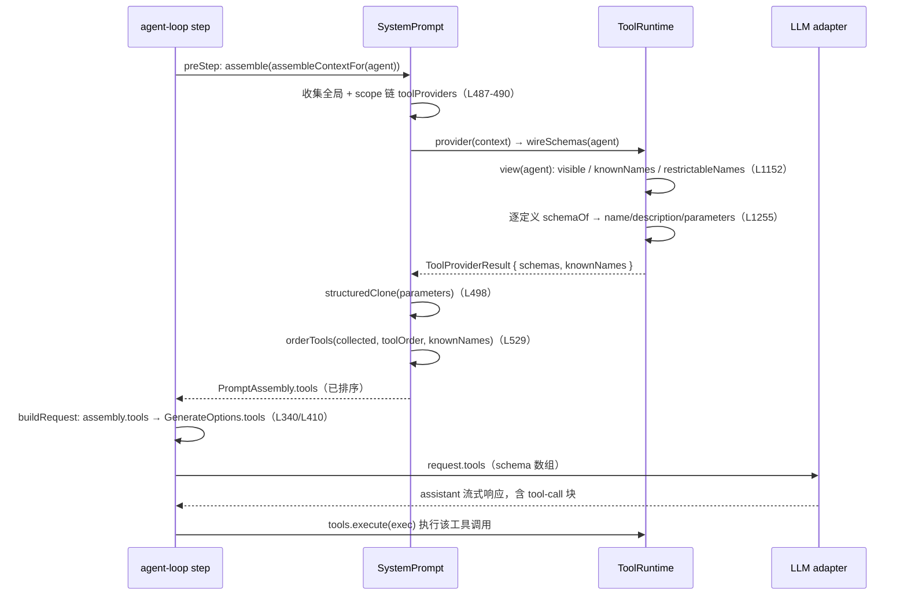

# 工具 Schema 的生成与拼装（Tool Schema Assembly）

本页记录工具 `name`/`description`/`parameters` 三字段如何从注册时的定义生成，如何经 `systemPrompt.tools()` provider 汇入 `PromptAssembly.tools`，`toolOrder` 排序与 `knownNames` 校验，作用域与 code-mode 对可见集的修改，以及 render intent（UI 呈现意图）与模型上下文文本的关系。

## ToolSchema 三字段的来源

`ToolSchema` 由 `@deepseek-ai/dsh-llm` 声明，是发给模型的三个字段：`{ name: string; description: string; parameters: Record<string, unknown> }`，`parameters` 是参数的 JSON Schema（[types.ts](../../../packages/llm/llm/src/types.ts#L312-L317)）。`ToolDefinition extends ToolSchema`，另带 `output`/`execute`/`presentCall` 等 host 字段（[index.ts](../../../packages/core/tools/src/index.ts#L222-L288)）。

注册时 `defineTool` 完成 `description` 与 `parameters` 的构造：`const parameters = parameterSchemaSpecToJsonSchema(options.parameters)` 把 `ParameterSchemaSpec`（每属性一个 `ValueSchemaSpec`，必填以 `required: true` 标注）编译为隐式开放 object 根（[schema.ts](../../../packages/core/tools/src/schema.ts#L566)），`parameterSchemaSpecToJsonSchema` 再 `assertSupportedJsonSchema`（[schema.ts](../../../packages/core/tools/src/schema.ts#L449-L458)）；输出 schema 经 `valueSchemaSpecToJsonSchema` 编译（[schema.ts](../../../packages/core/tools/src/schema.ts#L567)）。最终 `ToolDefinition` 三字段直接取自 `options.name`/`options.description`/编译后的 `parameters`（[schema.ts](../../../packages/core/tools/src/schema.ts#L569-L573)），`description` 就是定义者传入的字符串（[schema.ts](../../../packages/core/tools/src/schema.ts#L487)）。

每个参数的 `description`/`title`/`default`/`examples` 注解由 `copyAnnotations` 从 author schema 拷贝进编译结果（[schema.ts](../../../packages/core/tools/src/schema.ts#L185-L190)）。不走 `defineTool` 而直接 `register` 的工具可自带手写 JSON Schema `parameters`（如 [scoped.spec.ts](../../../packages/core/tools/tests/scoped.spec.ts#L36-L47) 的 `{ type: 'object', properties: {} }`）。

模型请求是显式白名单投影：`schemaOf` 只取 `name`/`description`/`parameters` 三字段，`output`/`execute`/`finalizeContent`/`timeoutMs`/`isConcurrencySafe`/`presentCall`/`presentResult` 永不外泄（[index.ts](../../../packages/core/tools/src/index.ts#L1255-L1267)），测试断言投影键恰为 `['description','name','parameters']`（[tools.spec.ts](../../../packages/core/tools/tests/tools.spec.ts#L68)），`timeoutMs` 被明确排除（[tools.spec.ts](../../../packages/core/tools/tests/tools.spec.ts#L75-L84)）。

## name universe（knownNames）与 toolOrder 校验

`ToolProviderResult` 携带 `schemas` 与可选的 `knownNames`（restriction 前的名字全集），缺省取 `schemas` 名（[system-prompt index.ts](../../../packages/core/system-prompt/src/index.ts#L104-L109)）。`TOOL_ORDER_REST = '<unlisted-tools>'` 是保留的 rest 标记（[system-prompt index.ts](../../../packages/core/system-prompt/src/index.ts#L140)）。

加载时 `validateToolOrder` 拒绝重复名、并要求恰好包含 rest 标记（[system-prompt index.ts](../../../packages/core/system-prompt/src/index.ts#L146-L157)）。组装时 `orderTools` 三件事：provider 返回名为 `TOOL_ORDER_REST` 的工具直接失败（[system-prompt index.ts](../../../packages/core/system-prompt/src/index.ts#L165-L168)）；`toolOrder` 中不在 `knownNames` 的名字报错 `toolOrder lists unregistered tool ...`（[system-prompt index.ts](../../../packages/core/system-prompt/src/index.ts#L170-L173)）；未配置 `toolOrder` 时按 `compareToolNames` 词法（code-unit）排序，配置时 listed 工具按配置顺序、未列出者在 rest 标记处词法插入（[system-prompt index.ts](../../../packages/core/system-prompt/src/index.ts#L174-L178)），词法比较是 locale 无关的 `a.name < b.name`（[system-prompt index.ts](../../../packages/core/system-prompt/src/index.ts#L181-L183)）。

`knownNames` 校验用的是 pre-restriction 全集，因此一个被 `restrict` 隐藏的已知工具名在 `toolOrder` 中允许缺席（[system-prompt index.ts](../../../packages/core/system-prompt/src/index.ts#L197-L200)）。上述行为由 [tool-order.spec.ts](../../../packages/core/system-prompt/tests/tool-order.spec.ts#L27-L115) 覆盖。

## 作用域：scoped 注册、每作用域可见集、隔离

`register` 通过调用 context 的作用域把定义写入对应 `ToolLayer` 的 `NamedEntries`，返回精确 disposer；同层重名报错（[index.ts](../../../packages/core/tools/src/index.ts#L1037-L1062)）。`view(scope)` 是单次层遍历解析：先取全局层再沿 scope 链由远到近覆盖（近层 shadow 远层），restriction 交集过滤继承面，自身 layer 的注册最后插入且不受 restriction 影响，非 native 模式再追加保留 transport `run_code`（[index.ts](../../../packages/core/tools/src/index.ts#L1152-L1193)）。

`knownNames` 收集继承名与 scope-local 名，`restrictableNames` 只收集继承名——scope-local 工具不可被 `restrict()` 命名（[index.ts](../../../packages/core/tools/src/index.ts#L1167-L1180)），`restrict()` 拒绝空 filter、拒绝命名保留的 `run_code`、拒绝未知名（[index.ts](../../../packages/core/tools/src/index.ts#L1071-L1098)）。隔离语义由 [scoped.spec.ts](../../../packages/core/tools/tests/scoped.spec.ts#L70-L117) 覆盖：scoped 工具仅对自身可见/可执行，其他 scope 与全局视角不可见，越界执行等同 `unknown tool`。

## code-mode 对可见集的修改

`ToolPresentationMode = 'native' | 'code' | 'both'`（[index.ts](../../../packages/core/tools/src/index.ts#L651)），默认 `native`（[index.ts](../../../packages/core/tools/src/index.ts#L790-L793)）。`wireSchemas` 按模式投影：native 返回全部可见 schema + `knownNames`；code 先 `requireCodeRuntime`（语言必须注册了 SDK renderer）再过滤为 `[run_code]` 且 `knownNames = [RUN_CODE_NAME]`；both 返回全部 + `knownNames ∪ {run_code}`（[index.ts](../../../packages/core/tools/src/index.ts#L980-L1001)）。`run_code` 的 `description`/`parameters` 是语言感知的 getter，按 `ctx.codeRuntime.language`（`'typescript' | 'python'`）在 schema 投影时求值（[code-mode.ts](../../../packages/core/tools/src/code-mode.ts#L659-L671)），`RUN_CODE_NAME = 'run_code'`、`SDK_SECTION_ORDER = 150`（[code-mode.ts](../../../packages/core/tools/src/code-mode.ts#L20-L23)）。

## 呈现意图（render intent）

render intent 词汇在 `dsh-tools` 的 [presentation.ts](../../../packages/core/tools/src/presentation.ts)：`ToolCallView` 是 `generic | terminal | diff` 三态（[presentation.ts](../../../packages/core/tools/src/presentation.ts#L46)），`ToolResultView` 再加 `search | read | web`（[presentation.ts](../../../packages/core/tools/src/presentation.ts#L140)）。`presentCall`/`presentResult` 在 `ToolDefinition` 上声明，契约是纯函数：side-effect-free、只依赖 `args`（与 result），可同时被 live streaming 与 session-log replay 调用（[index.ts](../../../packages/core/tools/src/index.ts#L270-L287)）。

关键事实：render intent 是 UI 卡片形态，**不进入模型上下文**。模型看到的工具结果文本来自 `output.render(args, value)` 返回的 `ContentBlock[]`（[index.ts](../../../packages/core/tools/src/index.ts#L1792-L1823)），UI 卡来自 `presentResult`；`locations`（`FileLocation { path, line? }`，[presentation.ts](../../../packages/core/tools/src/presentation.ts#L23-L26)）是给有能力编辑器做文件 follow-along/jump 的元数据，不改变模型上下文；`diff`/`terminal`/`search`/`read`/`web` 卡都只决定 UI 如何渲染，用户不可见的 `meta` 需要 result-time 结构化数据时经 `output.presentationMeta` 投影并持久化在 `tool/result.meta`（仅顶层调用执行，[index.ts](../../../packages/core/tools/src/index.ts#L1805-L1814)）。

## 拼装机制：tools → provider → assembly → 请求

注册表构造时注册全局 provider：`ctx.systemPrompt.tools(context => this.wireSchemas(context.scope))`（[index.ts](../../../packages/core/tools/src/index.ts#L832)）。`systemPrompt.tools()` 把 provider 存入层的 `AnonymousEntries`，返回 disposer（[system-prompt index.ts](../../../packages/core/system-prompt/src/index.ts#L430-L436)）。`assemble` 每次求值：收集全局 + scope 链所有 provider（[system-prompt index.ts](../../../packages/core/system-prompt/src/index.ts#L487-L490)），逐个调用 `provider(context)` 并对每个 `parameters` 做 `structuredClone`（[system-prompt index.ts](../../../packages/core/system-prompt/src/index.ts#L493-L499)），汇总 `knownNames`（[system-prompt index.ts](../../../packages/core/system-prompt/src/index.ts#L500-L503)），最后 `tools: orderTools(collected, this.toolOrder, knownNames)` 写入 `PromptAssembly.tools`（[system-prompt index.ts](../../../packages/core/system-prompt/src/index.ts#L529)），随后跑 `system-prompt/assemble` waterfall，其返回值权威（[system-prompt index.ts](../../../packages/core/system-prompt/src/index.ts#L532-L535)）。

agent-loop 在每个 step 前 `preStep` 调用一次 `systemPrompt.assemble(assembleContextFor(this, signal))`（[agent.ts](../../../packages/core/agent-loop/src/agent.ts#L230)），`step` 把 `assembly.tools` 传入 `buildRequest`（[agent.ts](../../../packages/core/agent-loop/src/agent.ts#L340-L341)）并作为 `GenerateOptions.tools`（[agent.ts](../../../packages/core/agent-loop/src/agent.ts#L410)）冻结进 `request`（[agent.ts](../../../packages/core/agent-loop/src/agent.ts#L486-L493)）；`tools` 同时随 `request/header` 落盘，满足"模型可见 ⟺ 已记录"（[agent.ts](../../../packages/core/agent-loop/src/agent.ts#L458-L470)）。线格式细节（`GenerateOptions.tools` → 各 adapter 的 `tools` 字段，如 deepseek 的 `{ type: 'function', function: { name, description, parameters } }`，[serialize.ts](../../../packages/llm/llm-deepseek/src/serialize.ts#L161-L168)）属于模型请求文档，见 [docs/subsystems/llm-streaming.md](../../../docs/subsystems/llm-streaming.md#the-model-request-and-result)。

## 全链路 flowchart

```mermaid
flowchart LR
  A["defineTool: 参数/输出 DSL → JSON Schema<br/>schema.ts L449-458 / L566-567"] --> B["ToolDefinition<br/>name / description / parameters / output / execute<br/>index.ts L221-288"]
  B --> C["tools.register() 写入层<br/>index.ts L1037-1062"]
  C --> D["ToolLayer.tools NamedEntries（全局或 agent scope）<br/>index.ts L713-729"]
  D --> E["view(scope): 继承 + 自身 + restriction + run_code<br/>index.ts L1152-1193"]
  E --> F["wireSchemas(scope): schemaOf 三字段投影 + knownNames<br/>index.ts L980-1001"]
  F --> G["ctx.systemPrompt.tools(provider)<br/>index.ts L832"]
  G --> H["assemble: 求值 provider + structuredClone(parameters)<br/>system-prompt L487-503"]
  H --> I["orderTools: toolOrder 校验 + 词法排序<br/>system-prompt L164-178"]
  I --> J["PromptAssembly.tools（已排序 ToolSchema[]）<br/>system-prompt L529"]
  J --> K["agent-loop buildRequest → GenerateOptions.tools<br/>agent.ts L340 / L410 / L490"]
  K --> L["adapter serializeRequest → 线格式 tools<br/>llm-deepseek serialize.ts L161-168"]
```

## 一次带工具调用的 step 中 schema 的求值时机

