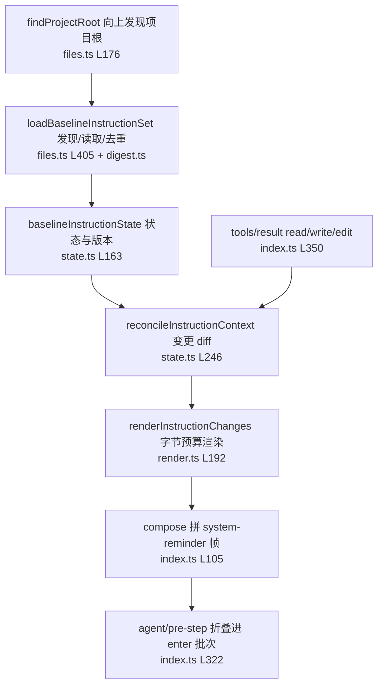
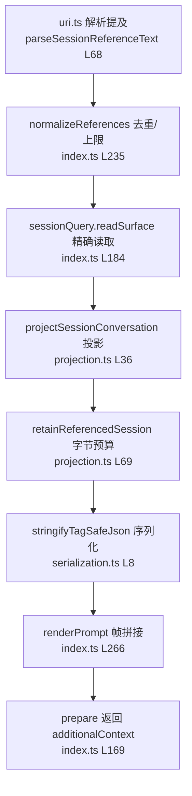
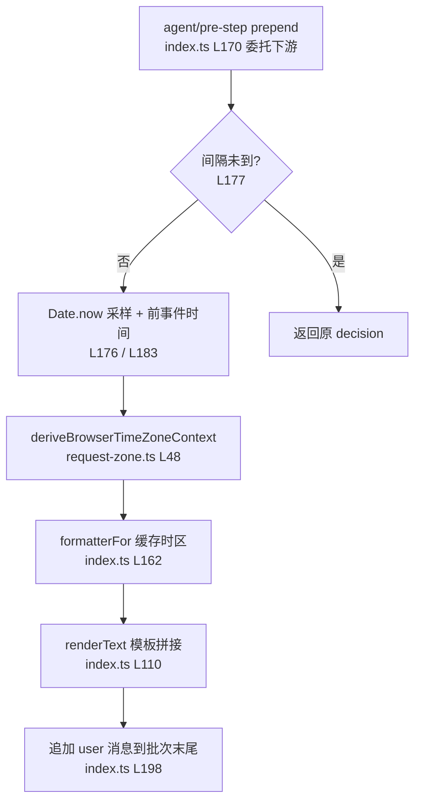
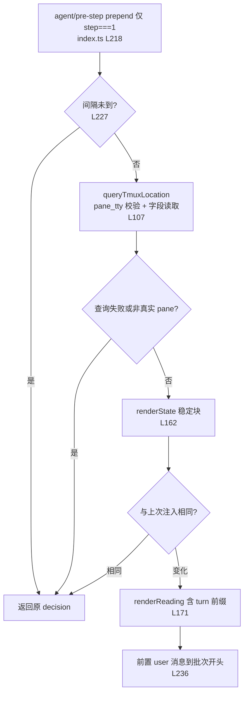
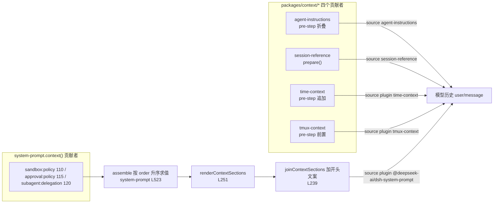

# 动态上下文贡献者（packages/context/*）

> 本文件只记录从源码读到的确定事实，每条结论附源码行号；不写推测与变更历史。模板原文逐字内容见 [prompts/](prompts/) 目录下的四个独立文件，正文用链接引用。

## 结论先行：四个贡献者不走 `systemPrompt.context()`

任务框架假定四个包经 `systemPrompt.context()` 注册并汇入 "Current runtime context" 快照。源码事实相反：在 `packages/context` 内 grep `systemPrompt\.context\(` 命中 0 处，四个包都各自把一条带来源的 user 消息注入模型历史，与 system-prompt 的运行时快照块是两条独立链路。

| 包 | 注册机制 | 源码位置 | 注入消息的 source |
|---|---|---|---|
| agent-instructions | `ctx.on('agent/pre-step', …)` 普通瀑布监听器 + `agent.inbox` | [index.ts](../../../packages/context/agent-instructions/src/index.ts#L322) | `{ kind: 'agent-instructions', form: 'instructions', changes, … }` |
| session-reference | 服务方法 `prepare()`，由宿主在入队前调用并挂接 | [index.ts](../../../packages/context/session-reference/src/index.ts#L169) | `{ kind: 'session-reference', form: 'recall', version: 1, references }` |
| time-context | `ctx.on('agent/pre-step', …, { prepend: true })`，追加到批次末尾 | [index.ts](../../../packages/context/time-context/src/index.ts#L170) | `{ kind: 'plugin', plugin: 'time-context', form: 'snapshot', sections }` |
| tmux-context | `ctx.on('agent/pre-step', …, { prepend: true })`，前置到批次开头 | [index.ts](../../../packages/context/tmux-context/src/index.ts#L218) | `{ kind: 'plugin', plugin: 'tmux-context', form: 'snapshot', sections }` |

四个包都不注册 `systemPrompt.context()`，因此没有 order 值，也不参与 `{{variable}}` 插值；它们的模板都在注入时刻用 JS 模板字符串求值（渲染时机见各节）。

## "Current runtime context" 快照的拼装机制（system-prompt + agent-loop）

这是另一条链路，属于调用了 `systemPrompt.context()` 的包（见下节清单）。

1. `PromptContext` 声明 `name`、`order`、`text: string \| ((context) => string)`，见 [index.ts](../../../packages/core/system-prompt/src/index.ts#L77)（L77-L85）。
2. `context()` 校验 order 为有限数后插入当前作用域层，见 [index.ts](../../../packages/core/system-prompt/src/index.ts#L398)（L398-L407）；注册/销毁发出 `system-prompt/change`。
3. `assemble()` 收集并求值：`contexts` 按 order 升序排序（L523-L524），每条 `text` 是函数则每次组装求值（L527）；存在 `suppressRuntimeContext()` 抑制器时 `contexts` 置空（L521），见 [index.ts](../../../packages/core/system-prompt/src/index.ts#L519)（L519-L528）。
4. `renderContextSections(assembly)` 逐条插值并过滤空文本，见 [index.ts](../../../packages/core/system-prompt/src/index.ts#L251)（L251-L255）。
5. `joinContextSections(sections)` 用 `'\n\n'` 连接各段正文，并加逐字开头：`Current runtime context. This snapshot supersedes earlier runtime-context snapshots.`，见 [index.ts](../../../packages/core/system-prompt/src/index.ts#L239)（L236-L240）。
6. `renderContextSnapshot(assembly)` 即 `joinContextSections(renderContextSections(assembly))`，见 [index.ts](../../../packages/core/system-prompt/src/index.ts#L224)（L224-L226）。
7. agent-loop 在 `preStep()` 中调用 `renderContextSections` + `joinContextSections`，把结果交给 `RuntimeContextProjection.project()`，生成的 user 消息追加在已领取批次末尾（`[...claimed, context]`），见 [agent.ts](../../../packages/core/agent-loop/src/agent.ts#L232)（L230-L240）。
8. 该快照消息的 source 为 `{ kind: 'plugin', plugin: '@deepseek-ai/dsh-system-prompt', form: 'snapshot', sections }`；无任何贡献时注入清除文案 `Current runtime context: none. Earlier runtime-context snapshots no longer apply.`，见 [runtime-context.ts](../../../packages/core/agent-loop/src/runtime-context.ts#L12)（L12-L75）。

## 全部 `systemPrompt.context()` 调用点（真实贡献者清单）

生产代码（grep 全 packages）：

| name | order | 调用位置 |
|---|---|---|
| `sandbox:policy` | 110 | [index.ts](../../../packages/sandbox/sandbox-policy/src/index.ts#L113) |
| `approval:policy` | 115 | [index.ts](../../../packages/interaction/user-approval/src/index.ts#L205) |
| `subagent:delegation` | 120 | [child-agent.ts](../../../packages/subagent/subagent/src/child-agent.ts#L170) |

测试/示例里的调用点：`preset/persona/tests/persona.spec.ts`、`examples/agent-spine-demo/tests/agent-core.spec.ts`、`core/agent-loop/tests/loop.spec.ts`、`core/system-prompt/tests/system-prompt.spec.ts`、`core/system-prompt/tests/scoped.spec.ts`。

`systemPrompt.suppressRuntimeContext()` 的生产调用点：`preset/persona/src/index.ts#L67`（`includeRuntimeContext` 为 false 时抑制）；测试调用点在 `core/system-prompt/tests/scoped.spec.ts#L151`。

## agent-instructions：workspace 指令快照

**快照的事实**：把用户全局与项目根的 AGENTS.md/CLAUDE.md 系列指令文件内容快照成一条 user 消息；首个请求前注入完整 baseline，后续成功触碰 `read`/`write`/`edit` 文件的工具结果（[index.ts](../../../packages/context/agent-instructions/src/index.ts#L70) 的 `FILE_TOUCH_TOOL_NAMES`，L70）触发增量 reconcile。

**收集方式**：`findProjectRoot` 向上找 `.git` 等标记（[files.ts](../../../packages/context/agent-instructions/src/files.ts#L176)，L176-L191）；`loadBaselineInstructionSet` 发现候选、按 `maxSourceBytes` 有界读取、按目录 trimmed 摘要去重、渲染（[files.ts](../../../packages/context/agent-instructions/src/files.ts#L405)，L405-L449）；动态变更由 `reconcileInstructionContext` 对比可见状态与 provider 文件并产生 `set`/`replace`/`remove` 转换（[state.ts](../../../packages/context/agent-instructions/src/state.ts#L246)，L246-L433）。

**注册点**：`ctx.on('agent/pre-step', …)` 普通瀑布监听器（[index.ts](../../../packages/context/agent-instructions/src/index.ts#L322)，L322-L348），先 `await next()` 再折叠；上下文经 `syncInbox` 维护在 `agent.inbox.nextStep`（L224-L248），`tools/result` 把触碰路径排队为异步投影（L350-L366）。折叠位置注释明确说明"紧接已领取批次之后，直接提示词在前、驱动器追加的 runtime context 在后"（L343-L347）。

**原文模板**：见 [prompts/agent-instructions.md](prompts/agent-instructions.md)，包括 `<system-reminder>` 帧、三类 intro、`Instructions from:` 节、增量变更三态文本、字节预算标记。

**渲染与插值**：每次注入时用 JS 模板字符串求值（`renderWorkspaceContext`、`renderInstructionChanges`，[render.ts](../../../packages/context/agent-instructions/src/render.ts#L341) L341-L361、L192-L213）；不使用 `{{variable}}`。消息 source 为 `{ kind: 'agent-instructions', form: 'instructions', … }`（[index.ts](../../../packages/context/agent-instructions/src/index.ts#L212)，L212-L221）。

## session-reference：跨会话快照

**快照的事实**：宿主把 `@[label](dsh-session:…)` 提及归一化为结构化引用后，`prepare()` 精确读取其他会话的当前表面并投影成"用户+助手纯文本对话"JSON，作为不可信只读背景快照。

**收集方式**：`normalizeReferences` 去重并校验上限（[index.ts](../../../packages/context/session-reference/src/index.ts#L235)，L235-L264；`MAX_REFERENCES = 3`，[config.ts](../../../packages/context/session-reference/src/config.ts#L4)）；`sessionQuery.readSurface` 精确读取（L184）；`projectSessionConversation` 只保留 `user`/`assistant` 文本、排除工具结果与注入上下文（[projection.ts](../../../packages/context/session-reference/src/projection.ts#L36)，L36-L60）；`retainReferencedSession` 在 `maxReferenceBytes` 预算内丢弃/截断（L69-L138）。

**注册点**：无事件监听器；`SessionReferenceResolver.prepare(agent, content, references, signal)` 服务方法返回 `{ content, additionalContext }`（[index.ts](../../../packages/context/session-reference/src/index.ts#L169)，L169-L217），宿主负责入队与挂接时机（空闲时安装一次性 `agent/pre-step` 包装、运行时 `inject()`+`steer()`，见 [README.zh.md](../../../packages/context/session-reference/README.zh.md) L17）。

**原文模板**：见 [prompts/session-reference.md](prompts/session-reference.md)，含 `## Referenced sessions` 前缀、`<referenced-sessions>` 帧、tag-safe JSON 包络与截断提示。

**渲染与插值**：每次调用 `prepare()` 时求值（`renderPrompt`，[index.ts](../../../packages/context/session-reference/src/index.ts#L266)，L266-L268）；序列化用 `stringifyTagSafeJson` 把每个 `<` 转义成 `\u003c`（[serialization.ts](../../../packages/context/session-reference/src/serialization.ts#L8)，L8-L12）；不使用 `{{variable}}`。消息 source 为 `{ kind: 'session-reference', form: 'recall', version: 1, references }`（L200-L211）。

## time-context：请求时钟快照

**快照的事实**：在每个符合条件的 step 记录采样时刻的本地时间戳、浏览器时区事实与距上一模型可见消息/step 上下文的耗时。

**触发条件**：opting 可选注入；`refreshIntervalMs > 0` 时距上一次注入不足该间隔则跳过（[index.ts](../../../packages/context/time-context/src/index.ts#L177)，L177-L182）；`step === 1` 时基线是上一模型可见消息，`step > 1` 时基线是上一 step 上下文（L183-L185）。

**收集方式**：`Date.now()` 采样（L176）；浏览器时区来自本轮 user-rpc 消息的 `clientTimeZone`，`deriveBrowserTimeZoneContext` 归并为 `resolved`/`mixed`/`missing`（[request-zone.ts](../../../packages/context/time-context/src/request-zone.ts#L48)，L48-L59）；`createTimestampFormatter` + `formatTimestamp` 生成 ISO 形时间戳（[timestamp.ts](../../../packages/context/time-context/src/timestamp.ts#L31)，L31-L37）。

**注册点**：`ctx.on('agent/pre-step', …, { prepend: true })`（[index.ts](../../../packages/context/time-context/src/index.ts#L170)，L170-L208），先 `await next()` 委托下游，然后向返回批次末尾追加消息（`messages: [...decision.messages, createUserMessage(…)]`，L198-L207）。

**原文模板**：见 [prompts/time-context.md](prompts/time-context.md)。

**渲染与插值**：每次求值（`renderText`，[index.ts](../../../packages/context/time-context/src/index.ts#L110)，L110-L125）；JS 模板字符串拼接，不使用 `{{variable}}`。消息 source 为 `{ kind: 'plugin', plugin: 'time-context', form: 'snapshot', sections: [{ name, text }] }`（L204）。companion 有真实运行时校验（正则 + 位置 + 时区一致性），见 [invariant.ts](../../../packages/context/time-context/src/invariant.ts#L14) L14-L20。

## tmux-context：tmux 位置快照

**快照的事实**：在每个 turn 的首个请求（`step === 1`）记录本进程真实所在的 tmux session/window/pane 位置与窗口 pane-tree 布局。

**触发条件**：仅 `step === 1`（[index.ts](../../../packages/context/tmux-context/src/index.ts#L223)，L223）；`refreshIntervalMs > 0` 时距上次注入不足间隔则跳过（L227-L230）；渲染的稳定状态块与上次注入相同则不重注入（L234）；tmux 环境缺失、仅继承环境、无 `ctx.shell` 或查询失败都是 no-op（L224-L232）。

**收集方式**：`queryTmuxLocation` 通过 `ctx.shell` 跑一条只读 bash 命令，先用 `ps -o tty=` 取本进程控制 tty，再 `tmux display-message` 取 `#{pane_tty}` 比对，确认本进程真在该 pane 内（[index.ts](../../../packages/context/tmux-context/src/index.ts#L107)，L107-L155，命令体 L114-L121）。

**注册点**：`ctx.on('agent/pre-step', …, { prepend: true })`（[index.ts](../../../packages/context/tmux-context/src/index.ts#L218)，L218-L246），先委托下游，再向返回批次开头前置消息（`messages: [createUserMessage(…), ...decision.messages]`，L236-L245）。

**原文模板**：见 [prompts/tmux-context.md](prompts/tmux-context.md)。

**渲染与插值**：每次求值（`renderReading` / `renderState`，[index.ts](../../../packages/context/tmux-context/src/index.ts#L162) L162-L173）；JS 模板字符串拼接，不使用 `{{variable}}`。消息 source 为 `{ kind: 'plugin', plugin: 'tmux-context', form: 'snapshot', sections: [{ name, text }] }`（L241）。

## 总览：四个贡献者与 "Current runtime context" 快照的关系

四个包各自独立地把带来源的 user 消息注入模型历史；只有 `systemPrompt.context()` 的贡献者（sandbox/approval/subagent）才进入 "Current runtime context" 快照块。agent-instructions 的折叠注释也印证两者同批共存但互不合并（[index.ts](../../../packages/context/agent-instructions/src/index.ts#L343)，L343-L347）。

