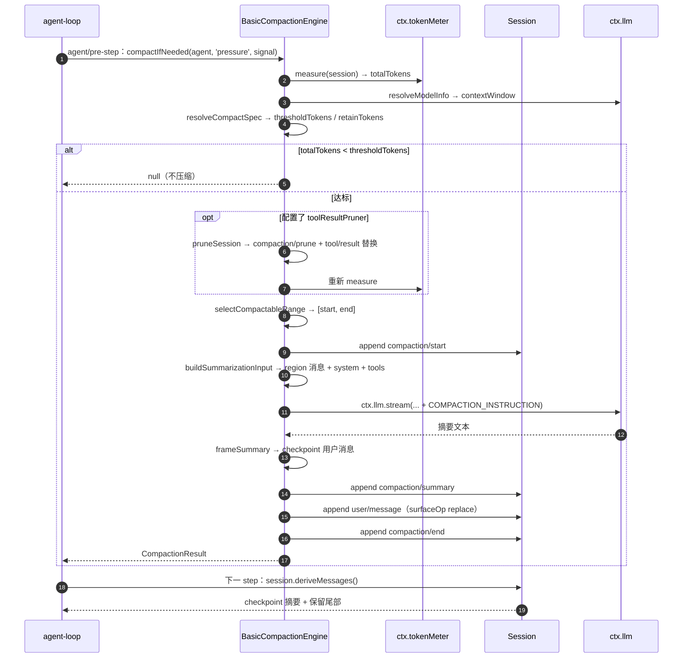
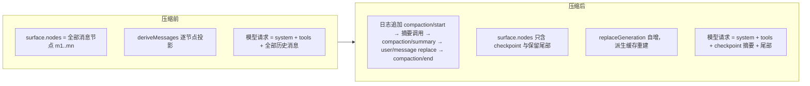

# Compaction：压缩历史与日志投影

本页是 `docs/research/model-context/` 研究系列第 06 篇，研究 `packages/compaction/*` —— 上下文压缩（compaction）如何用摘要/修剪替换历史日志投影，从而改写模型可见的历史。配套文件：[摘要提示词原文](prompts/compaction-basic.md) 与 [关键源码摘录](code/compaction.md)。

## 能力缝隙：Service Definition / Provider / Consumer

Compaction 是三条角色组成的能力缝隙（capability seam），与 bash 的切法一致：Service Definition 由 [@deepseek-ai/dsh-compaction](../../../packages/compaction/compaction) 提供，挂在 `ctx.compaction`（[index.ts#L81](../../../packages/compaction/compaction/src/index.ts#L81)）；Provider 由后端实现，仓库内的 [@deepseek-ai/dsh-compaction-basic](../../../packages/compaction/compaction-basic) 是默认实现；人类侧 Consumer 由 [@deepseek-ai/dsh-command-compact](../../../packages/compaction/command-compact) 提供 `/compact` 命令。另有一个模型无关的修剪服务 [@deepseek-ai/dsh-compaction-tool-result-pruner](../../../packages/compaction/compaction-tool-result-pruner)（`ctx.toolResultPruner`，[index.ts#L32](../../../packages/compaction/compaction-tool-result-pruner/src/index.ts#L32)），由 compaction-basic 在选摘要区间前调用。子系统页面的权威定义见 [docs/subsystems/compaction.md](../../subsystems/compaction.md)。

Service Definition 的核心是抽象类 `CompactionEngine`（[index.ts#L96](../../../packages/compaction/compaction/src/index.ts#L96)），声明 `compactIfNeeded(agent, trigger, signal)`、`compactNow(agent, signal, sourceCommandId?)`、`compactRegion(start, end, agent, signal?)` 三个抽象方法（[index.ts#L113](../../../packages/compaction/compaction/src/index.ts#L113)、[index.ts#L139](../../../packages/compaction/compaction/src/index.ts#L139)、[index.ts#L164](../../../packages/compaction/compaction/src/index.ts#L164)）。每次成功运行把选中的 surface 区间替换成一个摘要节点，并防止同一会话的并发压缩（[index.ts#L88](../../../packages/compaction/compaction/src/index.ts#L88)）；替换用的 user 消息 source 必须用 `compactCheckpointSource` 携带事务身份 `CompactionId`，使消费者与后端无关地识别并关联它（[index.ts#L92](../../../packages/compaction/compaction/src/index.ts#L92)）。

## 事件词汇：compaction/* 与 checkpoint 替换

Compaction 通过声明合并向 `SessionEventMap` 增加三个只记录（log-only）事件，都不进入 surface（[types.ts#L16](../../../packages/compaction/compaction/src/types.ts#L16)）：`compaction/start`（[types.ts#L23](../../../packages/compaction/compaction/src/types.ts#L23)）标记压缩开始、持有锁直到 `compaction/end`，`turn` 为数字表示自动压缩归属的 open turn，`null` 表示回合间的手动压缩；`compaction/summary`（[types.ts#L33](../../../packages/compaction/compaction/src/types.ts#L33)）记录摘要内容、被遮蔽区间 `shadowedRange`/`shadowedSeqs`/`shadowedTokenCount`，以及摘要模型调用事实 `provider`、`model`、`maxTokens?`、`usage?` 与可选的 `rawOutput`/`llmStreamCall`（[types.ts#L53](../../../packages/compaction/compaction/src/types.ts#L53)）；`compaction/end`（[types.ts#L71](../../../packages/compaction/compaction/src/types.ts#L71)）释放锁，`error` 记录失败尝试；`compaction/prune`（[types.ts#L81](../../../packages/compaction/compaction/src/types.ts#L81)）是模型无关修剪替换的阴影价格（shadow price）事件。

真正的 surface 变更只有紧随 `compaction/summary` 之后的 `user/message` 替换（[types.ts#L25](../../../packages/compaction/compaction/src/types.ts#L25)）：`commitCompactionBody` 先追加 `compaction/summary`，再同步追加 `user/message`（`surfaceOp: { op: 'replace', start, end }`、`sourceEventSeqs` 列出遮蔽节点与两个记账事件）（[region.ts#L448](../../../packages/compaction/compaction-basic/src/region.ts#L448)）。替换消息的 source 由 `compactCheckpointSource(compactionId, sourceCommandId?)` 生成（[checkpoint.ts#L33](../../../packages/compaction/compaction/src/checkpoint.ts#L33)），结构为 `{ kind: 'plugin', plugin: 'compact', compactionId, sourceCommandId? }`（[checkpoint.ts#L19](../../../packages/compaction/compaction/src/checkpoint.ts#L19)、[checkpoint.ts#L22](../../../packages/compaction/compaction/src/checkpoint.ts#L22)），`isCompactCheckpointSource` 用 `plugin === 'compact'` 识别持久化 checkpoint（[checkpoint.ts#L49](../../../packages/compaction/compaction/src/checkpoint.ts#L49)）。

## 投影如何跳过被压缩区域

模型的全部历史来自 `Session.deriveMessages()`，它按 surface 顺序逐个投影消息事件（[index.ts#L726](../../../packages/core/session/src/index.ts#L726)）。surface 是 `SurfaceManager` 维护的消息事件有序视图：一次 `replace` 把 `[startIdx, endIdx]` 整段节点从 `state.nodes` 移除、插入替换事件自身的 seq，并令 `replaceGeneration` 自增（[surface.ts#L362](../../../packages/core/session/src/surface.ts#L362)）；`deriveMessages` 的派生缓存按 `replaceGeneration` 重建（[index.ts#L730](../../../packages/core/session/src/index.ts#L730)），随后把 surface 上每个 seq 经 `deriveEventMessage` 投影为消息（[index.ts#L735](../../../packages/core/session/src/index.ts#L735)）。

`deriveEventMessage`（[surface.ts#L83](../../../packages/core/session/src/surface.ts#L83)）只对三种消息事件投影：`user/message` 原样返回 `event.data`（[surface.ts#L96](../../../packages/core/session/src/surface.ts#L96)）、非空 `assistant/message` 返回 `event.data.message`（[surface.ts#L99](../../../packages/core/session/src/surface.ts#L99)）、`tool/result` 返回 `event.data.message`（[surface.ts#L106](../../../packages/core/session/src/surface.ts#L106)）；其余事件（`compaction/*`、turn 边界、chunk、usage）一律投影为 `null`，永远到不了模型（[surface.ts#L109](../../../packages/core/session/src/surface.ts#L109)）。

因此压缩后的 checkpoint 替换在日志里只是又一个 `user/message`：`deriveMessages` 不区分它与普通用户消息，投影规则天然让旧历史消失——被遮蔽的 seq 已不在 `surface.nodes` 因而不会被折叠，checkpoint 自身的消息成为该 surface 位置唯一可见的内容。

## 触发条件：配置阈值

自动策略由配置阈值驱动。默认 `thresholdRatio = 0.8`、`retainRatio = 0.16`（[config.ts#L20](../../../packages/compaction/compaction-basic/src/config.ts#L20)、[config.ts#L23](../../../packages/compaction/compaction-basic/src/config.ts#L23)），`maxTokens = 8192`、`compactionRetries = 1`、`maxOverflowRetries = 1`、`auto = true`（[config.ts#L91](../../../packages/compaction/compaction-basic/src/config.ts#L91)）。按路由到的模型容量把比例换算成 token 预算：`thresholdTokens = floor(contextWindow * thresholdRatio)`，`retainTokens` 取显式配置或 `floor(contextWindow * retainRatio)`（[config.ts#L144](../../../packages/compaction/compaction-basic/src/config.ts#L144)）。

自动压缩注册了两个监听器：`agent/pre-step` 触发 `pressure` 策略（[index.ts#L147](../../../packages/compaction/compaction-basic/src/index.ts#L147)），`agent/request-error` 遇到 `CONTEXT_WINDOW_EXCEEDED_CODE` 触发 `context-overflow` 恢复（[index.ts#L179](../../../packages/compaction/compaction-basic/src/index.ts#L179)）。`compactIfNeeded` 的 `pressure` 路径先解析路由目标（[index.ts#L263](../../../packages/compaction/compaction-basic/src/index.ts#L263)），`measurement.totalTokens < thresholdTokens` 时直接返回 `null`（[index.ts#L304](../../../packages/compaction/compaction-basic/src/index.ts#L304)）；达标后先跑可选修剪并重新测量，若仍超阈值进入压缩循环（[index.ts#L308](../../../packages/compaction/compaction-basic/src/index.ts#L308)）。`context-overflow` 路径不查阈值，直接以 `retainTokens = 0` 选区间，强制做一次平衡缩减（[index.ts#L283](../../../packages/compaction/compaction-basic/src/index.ts#L283)）。

区间选择 `selectCompactableRange`（[region.ts#L98](../../../packages/compaction/compaction-basic/src/region.ts#L98)）从尾部反向累计 token 直到达到 `retainTokens` 预算（[region.ts#L112](../../../packages/compaction/compaction-basic/src/region.ts#L112)），再把切点向头部移动直到切点满足 tool-call/result 配对平衡，返回 `[首节点, 切点前一节点]`（[region.ts#L122](../../../packages/compaction/compaction-basic/src/region.ts#L122)）。区间两端都必须是平衡边界，不拆 assistant tool-call/result 对（[region.ts#L327](../../../packages/compaction/compaction-basic/src/region.ts#L327)）。

## 摘要生成机制

`summarize` 是 `BasicCompactionEngine` 唯一的子类定制点（[index.ts#L103](../../../packages/compaction/compaction-basic/src/index.ts#L103)），默认实现走 `summarizeWithLlm`（[summarizer.ts#L121](../../../packages/compaction/compaction-basic/src/summarizer.ts#L121)）：解析目标模型（配置的 summarization 目标优先、其次最新路由请求、最后 AgentOptions，[summarizer.ts#L128](../../../packages/compaction/compaction-basic/src/summarizer.ts#L128)），把摘要指令作为最后一条 `user/message` 追加到重建的会话前缀之后，用 `ctx.llm.stream()` 一次性调用（[summarizer.ts#L146](../../../packages/compaction/compaction-basic/src/summarizer.ts#L146)）。

摘要指令全文见 [prompts/compaction-basic.md](prompts/compaction-basic.md)（[summarizer.ts#L31](../../../packages/compaction/compaction-basic/src/summarizer.ts#L31)）。重建前缀 `buildSummarizationInput`（[region.ts#L498](../../../packages/compaction/compaction-basic/src/region.ts#L498)）取 `session.requestHeader()` 的 system 与 tools，再把被遮蔽 seq 逐个 `deriveEventMessage` 成 region 消息，因此辅助调用是最近一次路由请求的真前缀，复用提供方 KV 缓存（[summarizer.ts#L24](../../../packages/compaction/compaction-basic/src/summarizer.ts#L24)）。模型输出经 `summaryText` 只保留文本块、拒绝图像（[summarizer.ts#L217](../../../packages/compaction/compaction-basic/src/summarizer.ts#L217)），再经 `frameSummary` 包裹成 checkpoint 内容：`CHECKPOINT_PREAMBLE` + `<compacted-summary>` + 摘要 + `</compacted-summary>`（[summarizer.ts#L189](../../../packages/compaction/compaction-basic/src/summarizer.ts#L189)）。compaction-basic 还强制摘要必须比遮蔽内容小：`estimateMessage(checkpoint) < shadowedTokenCount`，否则整个事务失败（[region.ts#L373](../../../packages/compaction/compaction-basic/src/region.ts#L373)）。

## 拼装机制：从触发到模型请求看到压缩历史

压缩前后模型上下文的差异：压缩前 `deriveMessages` 对 surface 上每个节点逐条投影，模型请求携带 system、tools 与全部历史消息；压缩后旧区间被 shadowed，`replaceGeneration` 自增使派生缓存重建，模型请求的 messages 变为 checkpoint 摘要（`CHECKPOINT_PREAMBLE` + `<compacted-summary>` 摘要 `</compacted-summary>`，见 [summarizer.ts#L189](../../../packages/compaction/compaction-basic/src/summarizer.ts#L189)）加保留的最近尾部，旧消息不再出现。token 计量同步下降：token-meter 的 surface 投影通过 `compaction/summary`/`compaction/prune` 阴影价格折叠做减法（[surface-projection.ts#L66](../../../packages/llm/token-meter/src/surface-projection.ts#L66)），`compaction/summary` 中的 `shadowedTokenCount` 即被替换区间在固定估算器下的价格（[types.ts#L33](../../../packages/compaction/compaction/src/types.ts#L33)）。`compaction/summary` 携带 `llmStreamCall: true` 与完整 `rawOutput`、`provider`、`model`、`usage`，使摘要调用可从日志与代码重建，满足模型可见 ⟺ 已记录（[types.ts#L53](../../../packages/compaction/compaction/src/types.ts#L53)）。

## 人类 Consumer：/compact 命令

`command-compact` 注册无参命令 `/compact`（[index.ts#L100](../../../packages/compaction/command-compact/src/index.ts#L100)），把命令输出改写成 `CommandResult`：`rawInput` 非空时报用法（[index.ts#L62](../../../packages/compaction/command-compact/src/index.ts#L62)）；`compactNow` 返回 `null` 时输出 `No compactable history yet.`（[index.ts#L67](../../../packages/compaction/command-compact/src/index.ts#L67)）；成功时输出 `Compacted ${result.shadowedSeqs.length} history items (~${result.shadowedTokenCount} tokens).` 并把 `sourceEventSeq` 指向 `summarySeq`（[index.ts#L68](../../../packages/compaction/command-compact/src/index.ts#L68)）；`ManualCompactionError` 按 `busy`/`cancelled`/`changed`/`summary`/`commit`/`persistence` 六个码映射为人类可读文案（[index.ts#L23](../../../packages/compaction/command-compact/src/index.ts#L23)）。

## 模型无关修剪：tool-result-pruner

`ToolResultPruner` 用确定的头/中/尾字符预算修剪超长 tool result，全部规则为确定性的、不调用模型。默认 `thresholdChars = 8192`、`headChars = 4096`、`tailChars = 1024`，被剪掉的中间段替换成 `PRUNE_MARKER = '\n\n[... tool result middle pruned ...]\n\n'`（[config.ts#L7](../../../packages/compaction/compaction-tool-result-pruner/src/config.ts#L7)、[config.ts#L10](../../../packages/compaction/compaction-tool-result-pruner/src/config.ts#L10)）。`pruneContent` 只在总字符超过 `thresholdChars` 时修剪，按 Unicode code point 切片、不拆代理对（[index.ts#L83](../../../packages/compaction/compaction-tool-result-pruner/src/index.ts#L83)）。`pruneSession` 对当前 surface 上每个超预算的 `tool/result` 节点，先追加 `compaction/prune` 阴影价格事件（用 token-meter 估算被替换节点价格），再追加只改 `content` 的 `tool/result` 替换（`surfaceOp: { op: 'replace' }`、`sourceEventSeqs: [seq]`）（[index.ts#L136](../../../packages/compaction/compaction-tool-result-pruner/src/index.ts#L136)）。修剪保留每个被替换节点的完整事件数据，仅替换 `content`，并可被 replay 恢复（[index.ts#L152](../../../packages/compaction/compaction-tool-result-pruner/src/index.ts#L152)）。

## 相关文件

- [checkpoint.ts](../../../packages/compaction/compaction/src/checkpoint.ts)：checkpoint source 构造与识别
- [types.ts](../../../packages/compaction/compaction/src/types.ts)：`compaction/*` 事件与 `CompactionResult`
- [region.ts](../../../packages/compaction/compaction-basic/src/region.ts)：区间选择与压缩事务（start/summary/end + 替换）
- [summarizer.ts](../../../packages/compaction/compaction-basic/src/summarizer.ts)：摘要模型调用与 checkpoint 框架
- [surface.ts](../../../packages/core/session/src/surface.ts)：surface 折叠与逐节点投影
- [index.ts（core/session）](../../../packages/core/session/src/index.ts)：`Session.deriveMessages`
