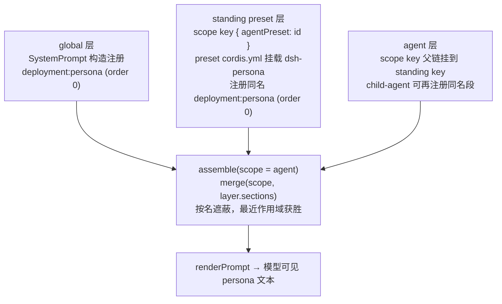
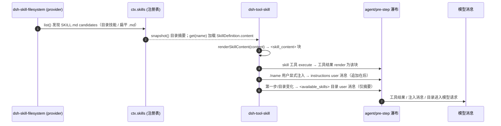

# 07 —— 部署人设、预设与技能指令进入模型上下文

本页记录三条模型上下文来源及其拼装关系：部署人设（`deployment:persona` 槽位）的默认与遮蔽、agent preset 组合层如何参与拼装、以及技能指令（SKILL.md）如何进入模型上下文。注册表语义依赖 [01-system-prompt-registry.md](01-system-prompt-registry.md)；本页只讲三者如何落到 `assemble()` 与模型消息上。

## 部署人设：默认与遮蔽

默认部署 persona 由 bundle patch 的 `system-prompt` 行 `config.persona` 提供，逐字文本与来源见 [prompts/persona-defaults.md](prompts/persona-defaults.md)。

`SystemPrompt` 构造时把 `config.persona ?? ''` 注册为全局 `deployment:persona` 段（order `0`，[index.ts](../../../packages/core/system-prompt/src/index.ts#L364)）；槽位名与序位是导出的常量 `PERSONA_SECTION`/`PERSONA_ORDER`（[index.ts](../../../packages/core/system-prompt/src/index.ts#L128)），组合方命名同一 section 正是替换生效而非重复的原因（[index.ts](../../../packages/core/system-prompt/src/index.ts#L122)）。

遮蔽机制：`assemble()` 的 `merge(scope, layer => layer.sections)` 先载入全局表，再沿父链从远到近逐层覆盖，最近作用域的同名段获胜（[index.ts](../../../packages/core/system-prompt/src/index.ts#L484)）；遮蔽发生在求值任何 `text` provider 之前。同层重名注册抛错（[index.ts](../../../packages/core/system-prompt/src/index.ts#L316)）。

## preset/persona —— scoped 遮蔽行

`@deepseek-ai/dsh-persona` 是一个“仅作用域”的行：`apply` 把 `config.text` 以 `PERSONA_SECTION`/`PERSONA_ORDER` 注册进调用上下文的作用域层（[index.ts](../../../packages/preset/persona/src/index.ts#L61)）。

- 挂在 agent preset 内（作用域上下文）即遮蔽部署人设；挂在全局（无作用域）会与注册表自身的 `deployment:persona` 同层重复而失败 loud——报 `"deployment:persona" is already registered`（[persona.spec.ts](../../../packages/preset/persona/tests/persona.spec.ts#L21)）。
- `config.complete: true` 使该段成为该作用域的唯一 prompt section，其余所有段在瀑布后恢复为仅此段（[index.ts](../../../packages/preset/persona/src/index.ts#L42)，[persona.spec.ts](../../../packages/preset/persona/tests/persona.spec.ts#L89)）。
- `config.includeRuntimeContext: false` 对该 agent 作用域抑制全部动态运行时上下文（[index.ts](../../../packages/preset/persona/src/index.ts#L67)，[persona.spec.ts](../../../packages/preset/persona/tests/persona.spec.ts#L106)）。
- 同一段名与序位从 `@deepseek-ai/dsh-system-prompt` 导入而非重述，两个硬编码副本会漂移成“并列”而非“遮蔽”（[index.ts](../../../packages/preset/persona/src/index.ts#L23)）。

## agent preset 组合层

`@deepseek-ai/dsh-agent-presets` 让每个会话从一份 preset 组合文件 `agent.cordis.yml`（`COMPOSITION_FILE`，[discovery.ts](../../../packages/preset/agent-presets/src/discovery.ts#L26)）组合其模型侧插件集。

- 每个 preset 只挂载一次：`ensureStanding` 在 `selfCtx` 上建一个 standing scope（key `{ agentPreset: preset.id }`），`mountPreset` 用 `PresetTree`（`Include` 子类）加载组合文件（[index.ts](../../../packages/preset/agent-presets/src/index.ts#L513)，[mount.ts](../../../packages/preset/agent-presets/src/mount.ts#L332)）。
- agent 通过 scope key 父链加入：`mount`/`composeFrom`/`recompose` 用 `bindScopeParent(agentKey, standing.key)` 把 agent 的 scope key 挂到 standing key 下（[index.ts](../../../packages/preset/agent-presets/src/index.ts#L286)）。
- 组合行注册进 standing scope 的作用域层：preset 内的 `ctx.tools`/`ctx.systemPrompt`/`ctx.skills` 注册都落进该 preset 层（[mount.ts](../../../packages/preset/agent-presets/src/mount.ts#L5)）。对 agent 而言，`assemble` 的 scope 链是 全局 → preset 层 → agent 层，故 preset 挂载的 `dsh-persona` 以同名 `deployment:persona` 遮蔽全局部署人设，agent 层可再遮蔽 preset 层。
- 组合失败拒绝挂载：行未激活、或行把服务发布进 root realm 都抛 `PresetMountError`（[mount.ts](../../../packages/preset/agent-presets/src/mount.ts#L357)）。
- 子代理继承父组合：`dsh-subagent` 的 child 通过 `composeFrom` 加入父的 standing 组合（[child-agent.ts](../../../packages/subagent/subagent/src/child-agent.ts#L168)）；per-child persona 由 `childCtx.systemPrompt.section({ name: 'deployment:persona', order: 0, text: composition.persona })` 直接注册在 child 层（[child-agent.ts](../../../packages/subagent/subagent/src/child-agent.ts#L172)），遮蔽 preset 层与全局层。

## 技能指令进入模型上下文的路径

SKILL.md 正文不注册为 prompt section；它作为 `SkillDefinition.content`（frontmatter 剥离后的正文，[index.ts](../../../packages/skill/skill-filesystem/src/index.ts#L833)）被 `renderSkillContent` 渲染为 `<skill_content>` 块（[index.ts](../../../packages/skill/skill/src/index.ts#L171)），再经两条路径进入模型上下文：

1. **`skill` 工具结果**：`dsh-tool-skill` 注册 `skill` 工具，`execute` 以 `ctx.skills.list/get({ scope: agent })` 加载并校验模型可调策略，工具结果 `render` 为 `<skill_content>` 文本（[index.ts](../../../packages/skill/tool-skill/src/index.ts#L125)）。工具结果进入模型消息即技能正文进入上下文的这条路径。
2. **用户显式 `/name` 注入**：`agent/pre-step` 瀑布监听器扫描 `source.kind === 'user'` 消息中的 `/name` 手势，对 user-invocable 技能把渲染块作为 `instructions` 形式注入 user 消息，追加在其它注入之后（[index.ts](../../../packages/skill/tool-skill/src/index.ts#L177)，[tool-skill.spec.ts](../../../packages/skill/tool-skill/tests/tool-skill.spec.ts#L978)）。这是 `disable-model-invocation` 技能的唯一入口。

此外 `dsh-tool-skill` 在第一步（或目录变化时）发布持久的 `<available_skills>` 目录 user 消息，只含 name+description 摘要、不含正文（[index.ts](../../../packages/skill/tool-skill/src/index.ts#L213)）；目录只告诉模型何时用 `skill` 工具加载正文。目录帧（首次发布与完整替换两种）逐字原文见 [prompts/skill-catalog.md](prompts/skill-catalog.md)。

技能来源由 provider 提供：`dsh-skill-filesystem` 从 project/user/custom/bundled 根发现目录技能（目录内 `SKILL.md`）或扁平 `.md` 技能（[index.ts](../../../packages/skill/skill-filesystem/src/index.ts#L719)），`get` 经 `parseSkillFile` 解析 frontmatter 返回正文（[index.ts](../../../packages/skill/skill-filesystem/src/index.ts#L793)）；`dsh-skill-badge` 以 bundled provider 提供单个 `dsh-badge` 技能（[index.ts](../../../packages/skill/skill-badge/src/index.ts#L36)）。技能注册表本身只合并 provider 目录与运行时注册，不直接贡献 prompt section。

技能层也是 scope-layered：base bundle 的 `skill-filesystem`/`tool-skill` 行是 host 全局的（[cordis.patch.yml](../../../packages/bundle/base/cordis.patch.yml#L240)），而 Web surface 把这两行禁用、改由每个 agent preset 自己挂载（[cordis.patch.yml](../../../packages/bundle/web-app/cordis.patch.yml#L330)），因此 `standard` preset 的组合文件里 `skill-filesystem`+`tool-skill` 注册进该 preset 的技能层（[agent.cordis.yml](../../../apps/cli/config/agent-presets/standard/agent.cordis.yml#L83)），agent 读取的是其 scope 链合并后的目录。`dsh-skill-badge` 在 base bundle 中默认 `disabled: true`（[cordis.patch.yml](../../../packages/bundle/base/cordis.patch.yml#L243)），需要时由 overlay 或 preset 启用。

## systemPrompt.section() 注册点清单

以下为源码（`src/`）中的全部 `systemPrompt.section()` 注册点，按 `order` 升序：

| section 名 | order | 来源文件:行 |
|---|---|---|
| `harness:identity` | -100 | [index.ts](../../../packages/core/system-prompt/src/index.ts#L358) |
| `harness:source` | -99 | [index.ts](../../../packages/boot/app-boot/src/index.ts#L824) |
| `app:web-surface` | -98 | [index.ts](../../../packages/bundle/web-app/src/index.ts#L143) |
| `deployment:persona` | 0 | [index.ts](../../../packages/core/system-prompt/src/index.ts#L364) |
| `deployment:persona` | 0 | [index.ts](../../../packages/preset/persona/src/index.ts#L61) |
| `deployment:persona` | 0 | [child-agent.ts](../../../packages/subagent/subagent/src/child-agent.ts#L172) |
| `plan:policy` | 50 | [index.ts](../../../packages/plan/plan-mode/src/index.ts#L225) |
| `tools:code-only` | 99 | [index.ts](../../../packages/core/tools/src/index.ts#L834) |
| `tool:read` | 100 | [read.ts](../../../packages/fs/tool-fs/src/read.ts#L70) |
| `tool:write` | 101 | [write.ts](../../../packages/fs/tool-fs/src/write.ts#L63) |
| `tool:edit` | 102 | [edit.ts](../../../packages/fs/tool-fs/src/edit.ts#L77) |
| `tool:glob` | 103 | [glob.ts](../../../packages/fs/tool-fs-search/src/glob.ts#L301) |
| `tool:grep` | 104 | [grep.ts](../../../packages/fs/tool-fs-search/src/grep.ts#L276) |
| `tool:bash` | 105 | [index.ts](../../../packages/shell/tool-bash/src/index.ts#L236) |
| `tool:pwsh` | 105 | [index.ts](../../../packages/shell/tool-pwsh/src/index.ts#L245) |
| `tool:jobs` | 106 | [index.ts](../../../packages/jobs/tool-jobs/src/index.ts#L263) |
| `tool:pty` | 106 | [index.ts](../../../packages/terminal/tool-terminal/src/index.ts#L156) |
| `tool:web_search` | 110 | [search.ts](../../../packages/web/tool-web/src/search.ts#L216) |
| `tool:web_fetch` | 111 | [fetch.ts](../../../packages/web/tool-web/src/fetch.ts#L430) |
| `tool:lsp` | 112 | [index.ts](../../../packages/lsp/tool-lsp/src/index.ts#L104) |
| `tool:session-query` | 113 | [index.ts](../../../packages/session-query/tool-session-query/src/index.ts#L60) |
| `tool:goal` | 114 | [index.ts](../../../packages/goal/tool-goal/src/index.ts#L189) |
| `tool:cordis` | 115 | [index.ts](../../../packages/extensions/tool-cordis/src/index.ts#L36) |
| `tool:{workflow toolName}` | 115 | [index.ts](../../../packages/workflow/tool-workflow/src/index.ts#L212) |
| `tool:ralph` | 116 | [index.ts](../../../packages/workflow/tool-ralph/src/index.ts#L407) |
| `tool:{subagent toolName}` | 116.5 | [index.ts](../../../packages/subagent/tool-subagent/src/index.ts#L459) |
| `tool:report` | 117 | [index.ts](../../../packages/subagent/tool-subagent-report/src/index.ts#L54) |
| `tools:sdk` | 150 | [index.ts](../../../packages/core/tools/src/index.ts#L835) |
| `tool:structured_output` | 190 | [structured.ts](../../../packages/subagent/subagent-in-process-driver/src/structured.ts#L99) |
| `ui:deliverable-file-references` | 190 | [index.ts](../../../packages/client/ui-deliverables/src/index.ts#L23) |

`tools:code-only`（`COLLAPSE_SECTION_ORDER`，值 `99`，[index.ts](../../../packages/core/tools/src/index.ts#L51)）与 `tools:sdk`（`SDK_SECTION_ORDER`，值 `150`，[code-mode.ts](../../../packages/core/tools/src/code-mode.ts#L23)）是 code-mode 呈现段，由 `dsh-tools` 在非 native 模式部署时全局注册、或在 `presentAs` 按 scope 注册，正文随调用 scope 生成并在 native 作用域渲染为空（[index.ts](../../../packages/core/tools/src/index.ts#L834)，[index.ts](../../../packages/core/tools/src/index.ts#L968)）。

测试 fixture 也注册 prompt section 以验证组合行为：`preset:{tool}`（order `10`）见于 [contribute.js](../../../packages/preset/agent-presets/tests/fixtures/plugins/contribute.js#L15) 与 [preset-tool.js](../../../packages/subagent/subagent-in-process-driver/tests/fixtures/plugins/preset-tool.js#L15)。

## 拼装机制

### preset 层遮蔽全局人设

`assemble(scope)` 的 scope 链合并顺序是 全局 → standing preset 层 → agent 层，按名遮蔽、最近者胜；`renderPrompt` 把胜出的 persona 段渲染为模型可见文本。

### 技能指令从文件到模型上下文

SKILL.md 正文经 provider 加载为 `SkillDefinition.content`，`renderSkillContent` 渲染为 `<skill_content>` 块；该块作为 `skill` 工具结果、或 `/name` 用户显式注入的 instructions user 消息进入模型上下文，目录 user 消息只含摘要。

## 相关文档

- 注册表全流程：[01-system-prompt-registry.md](01-system-prompt-registry.md)
- 部署人设默认逐字文本：[prompts/persona-defaults.md](prompts/persona-defaults.md)
- 槽位语义与替换机制：[prompts/deployment-persona-slot.md](prompts/deployment-persona-slot.md)
- 技能目录与注入测试：[tool-skill.spec.ts](../../../packages/skill/tool-skill/tests/tool-skill.spec.ts)
