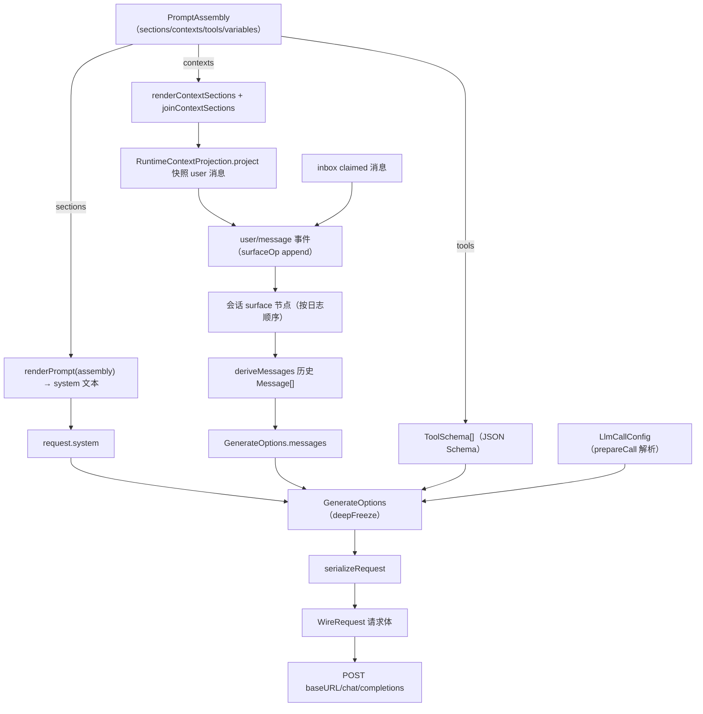
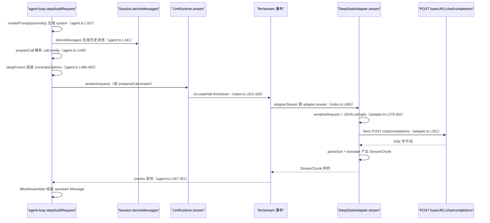

# 08 llm 适配器与线格式

本节研究切片为 `llm/llm` 与 `llm/llm-deepseek`，回答一个问题：拼装好的 PromptAssembly（system 文本）、历史 Message[]、runtime-context 快照、tools 参数，最终如何变成发给模型的 API 请求（messages 数组 + tools 参数的最终线格式）。

关键源码摘录见 [code/llm-assembler.md](code/llm-assembler.md)。

## Message 词汇

`Message` 是消息的唯一共享表示（delivery、durable history、model requests 共用），字段为 `id`、`role`、`content`、`source`（[message.ts](../../../packages/llm/llm/src/message.ts#L129-L138)）。

`role` 是三值字面量 `'system' | 'user' | 'assistant'`（[message.ts](../../../packages/llm/llm/src/message.ts#L133)）；`content` 是 `ContentBlock[]`，块类型来自 merge-extensible 的 `ContentBlockMap`：`text` / `reasoning` / `image` / `tool-call` / `tool-result`（[types.ts](../../../packages/llm/llm/src/types.ts#L99-L110)）。

没有独立的 `SystemMessage` 接口——system 只是 `Message` 的一个 role 分支，且 agent-loop 发出的系统提示文本不以 `Message` 形式进入 messages 数组，而是单独放在 `GenerateOptions.system` 字符串字段（见下「SystemMessage 的来源」）。

三个角色特化：

- `UserMessage`：`role: 'user'`（[message.ts](../../../packages/llm/llm/src/message.ts#L141-L143)）。
- `AssistantMessage`：`role: 'assistant'`，`source: ModelMessageSource`（含 provider / model / replayState）（[message.ts](../../../packages/llm/llm/src/message.ts#L146-L149)）。
- `ToolResultMessage`：`role: 'user'`，`content: [ToolResultBlock]`，`source: ToolMessageSource`（kind `'tool'` + callId）（[message.ts](../../../packages/llm/llm/src/message.ts#L152-L156)）。

`MessageSource` 是 merge-extensible 联合，`kind` 回答「谁产生的」：`user` / `plugin` / `model` / `tool`（[message.ts](../../../packages/llm/llm/src/message.ts#L96-L126)）。

## 每个消息角色的来源与最终字段

| role（harness Message） | 来源 | 最终 wire 字段（llm-deepseek） |
| --- | --- | --- |
| `system` | 历史中的 system 消息（如 compaction 注入）由 `serializeMessages` 直通 | `{role:'system', content: flattenText(...)}`（[serialize.ts](../../../packages/llm/llm-deepseek/src/serialize.ts#L116-L118)） |
| `user` | inbox 消息（用户输入 / steer / inject），`source.kind='user'`，`turn()` 以 `user/message` 事件追加（[agent.ts](../../../packages/core/agent-loop/src/agent.ts#L282-L284)） | `{role:'user', content: flattenText(...)}`（[serialize.ts](../../../packages/llm/llm-deepseek/src/serialize.ts#L128-L129)） |
| `user`（快照） | `RuntimeContextProjection.project`，`source.kind='plugin'`，`form:'snapshot'`（[runtime-context.ts](../../../packages/core/agent-loop/src/runtime-context.ts#L64-L75)） | 同上 user 字段 |
| `user`（工具结果） | `createToolResultMessage`，`source.kind='tool'`（[tool-calls.ts](../../../packages/core/agent-loop/src/tool-calls.ts#L276-L288)） | 展开为 `{role:'tool', tool_call_id, content}`（[serialize.ts](../../../packages/llm/llm-deepseek/src/serialize.ts#L131-L137)） |
| `assistant` | `BlockAssembler` 组装 + `createAssistantMessage`，`source.kind='model'` 带 provider/model（[agent.ts](../../../packages/core/agent-loop/src/agent.ts#L373-L380)） | `{role:'assistant', content, reasoning_content?, tool_calls?}`（[serialize.ts](../../../packages/llm/llm-deepseek/src/serialize.ts#L71-L102)） |

assistant 的 wire 形态规则：纯文本回合只发 `content`；带 tool_calls 的回合发 `content: ""`（绝不 null）且仅在带 reasoning 时回传 `reasoning_content`；带 tool_calls 时展开 `tool_calls: [{id, type:'function', function:{name, arguments}}]`（[serialize.ts](../../../packages/llm/llm-deepseek/src/serialize.ts#L85-L101)）。

## SystemMessage 的内容 = renderPrompt(assembly) 的产物

调用点是 `step()` 内的 `const system = renderPrompt(assembly)`（[agent.ts](../../../packages/core/agent-loop/src/agent.ts#L337)）。

`renderPrompt` 定义在 system-prompt 包：按 `order` 升序排好的 sections 逐个插值 `{{variable}}`、去掉空段、以 `'\n\n'` 连接（[index.ts](../../../packages/core/system-prompt/src/index.ts#L212-L217)）；assembly 由 `systemPrompt.assemble()` 在 `preStep` 里构建（[agent.ts](../../../packages/core/agent-loop/src/agent.ts#L230)）。

`system` 文本的流向：`buildRequest` 把它写进 `header.system`（[agent.ts](../../../packages/core/agent-loop/src/agent.ts#L461)），再随 request 以 `system` 字段发出（[agent.ts](../../../packages/core/agent-loop/src/agent.ts#L489)）；线格式上 `serializeRequest` 把 system 文本放在 wire messages 数组的 `[0]`：`messages.push({ role: 'system', content: options.system })`（[serialize.ts](../../../packages/llm/llm-deepseek/src/serialize.ts#L156-L158)）。

## 历史 Message[] 与快照 user 消息的相对位置

`preStep` 里先对 assembly 渲染上下文（`renderContextSections` + `joinContextSections`），再用 `runtimeContext.project(...)` 生成快照 user 消息，最后把快照追加到 claimed 之后：`messages: context === undefined ? claimed : [...claimed, context]`（[agent.ts](../../../packages/core/agent-loop/src/agent.ts#L232-L240)）。

`turn()` 把 `decision.messages`（claimed + 快照）按序以 `user/message` 事件写入会话，`surfaceOp:'append'`（[agent.ts](../../../packages/core/agent-loop/src/agent.ts#L282-L284)），这些事件进入会话 surface 节点。

`step()` 里 `this.session.deriveMessages()`（[agent.ts](../../../packages/core/agent-loop/src/agent.ts#L341)）遍历 surface 全序产出 `boundaryMessages`，因此最终 messages 数组的相对位置是：`[更早历史] + [本轮 claimed] + [快照 user 消息]`——快照位于尾部。

快照 user 消息只在内容变化时重新投影，未变则保留上一次的快照、不新增消息（[runtime-context.ts](../../../packages/core/agent-loop/src/runtime-context.ts#L67)）；surface 重写（compaction replace）会重建投影（[runtime-context.ts](../../../packages/core/agent-loop/src/runtime-context.ts#L50-L54)）。

可重建性由「THEOREM」测试锁定：对每个请求断言 `request.messages` 与从日志前缀全新重建的 `deriveMessages()` 字节相等（[request-reconstruction.spec.ts](../../../packages/core/agent-loop/tests/request-reconstruction.spec.ts#L600)），并断言 `request.system` / `request.tools` / call-config 字段与 `request/header` 快照一致（[request-reconstruction.spec.ts](../../../packages/core/agent-loop/tests/request-reconstruction.spec.ts#L604-L611)）。

## tools 参数的 JSON Schema 形态

`ToolSchema` 只有三个字段：`name`、`description`、`parameters`（一个 JSON Schema 对象，`Record<string, unknown>`）（[types.ts](../../../packages/llm/llm/src/types.ts#L312-L317)）。

组装路径：`systemPrompt.tools(provider)` 注册 tool-schema 提供者（[index.ts](../../../packages/core/system-prompt/src/index.ts#L430-L436)）；`assemble()` 收集全部 schema 并对 `parameters` 做 `structuredClone`（[index.ts](../../../packages/core/system-prompt/src/index.ts#L495-L499)），再按配置 `toolOrder` 或字典序排序（[index.ts](../../../packages/core/system-prompt/src/index.ts#L529)）。

请求携带：`request.tools = header.tools`（[agent.ts](../../../packages/core/agent-loop/src/agent.ts#L490)），header.tools 来自 assembly.tools（[agent.ts](../../../packages/core/agent-loop/src/agent.ts#L462)）。

线格式：每个 tool 包成 `{type:'function', function:{name, description, parameters}}`（[serialize.ts](../../../packages/llm/llm-deepseek/src/serialize.ts#L161-L168)），即 `WireTool`（[types.ts](../../../packages/llm/llm-deepseek/src/types.ts#L83-L90)）；tools 数组为空时整个字段省略（[serialize.ts](../../../packages/llm/llm-deepseek/src/serialize.ts#L182)）。

## call-config 的解析：模型选择如何影响请求

`buildRequest` 先从会话 `request/header` 快照恢复已持久化的 config（`requestProposal` 会去掉由 adapter 默认物化的字段，见 [agent.ts](../../../packages/core/agent-loop/src/agent.ts#L55-L61)），或从 `AgentOptions.provider/model` 起步（[agent.ts](../../../packages/core/agent-loop/src/agent.ts#L419-L437)）；`agent/request` 瀑布可改写配置（[agent.ts](../../../packages/core/agent-loop/src/agent.ts#L438-L441)）。

随后 `llm.prepareCall(proposedConfig)` 按当前 adapter 注册快照解析 exact-model 默认值：`provider` 选中 adapter 注册（[index.ts](../../../packages/llm/llm/src/index.ts#L816-L820)），`resolveCallFor` 通过 `adapter.resolveModel` 拿到模型元数据并物化 `defaultMaxTokens`、解析 reasoning effort，模型不支持显式 effort 时抛 `UNSUPPORTED_REASONING_EFFORT`（[index.ts](../../../packages/llm/llm/src/index.ts#L734-L769)）；`adapterDefaults` 标记哪些字段来自 adapter 而非调用方（[index.ts](../../../packages/llm/llm/src/index.ts#L786-L793)）。

最终 request 的 `provider / model / reasoningEffort / temperature / maxTokens / stop` 全部来自 `header.config`（[agent.ts](../../../packages/core/agent-loop/src/agent.ts#L486-L487)）。

模型选择影响请求的具体落点：`options.provider` 决定走哪个 adapter（[index.ts](../../../packages/llm/llm/src/index.ts#L849)），`options.model` 直接写进 wire `model` 字段（[serialize.ts](../../../packages/llm/llm-deepseek/src/serialize.ts#L174)）；DeepSeek 的 `resolveModel` 按 catalog 命中或 `defaultContextWindow` 给出 `contextWindow`，`defaultMaxTokens = configured?.maxTokens ?? connection.maxTokens`，thinking 被部署禁用时只暴露 `off` effort（[adapter.ts](../../../packages/llm/llm-deepseek/src/adapter.ts#L175-L212)）。

## DeepSeek 适配器最终 HTTP 请求体字段结构

`WireRequest` 字段（[types.ts](../../../packages/llm/llm-deepseek/src/types.ts#L12-L30)）：`model`、`messages`、`stream: true`、`stream_options: {include_usage: true}`、可选 `thinking?: {type:'enabled'|'disabled'}`、`reasoning_effort?: 'high'|'max'`、`tools?`、`temperature?`、`max_tokens?`、`stop?`。

`serializeRequest` 组装顺序：先 push system 文本为 messages[0]，再展开全部历史消息；tools 只在非空时带上；thinking/reasoning_effort 由 `resolveThinking` 决定——`purpose:'session-title'` 强制 disabled，effort `off` 映射为 disabled 且不写 effort，`high`/`max` 映射为 enabled + effort，部署锁 disabled 时拒绝非 off effort（[serialize.ts](../../../packages/llm/llm-deepseek/src/serialize.ts#L37-L53)）。

HTTP 传输：`fetch(\`${baseURL}/chat/completions\`, {method:'POST', headers, body: JSON.stringify(body), signal})`（[adapter.ts](../../../packages/llm/llm-deepseek/src/adapter.ts#L301-L306)）；headers 固定含 `authorization: Bearer <key>`、`content-type: application/json`、`accept: text/event-stream`、`user-agent`（attribution，见 [attribution.ts](../../../packages/llm/llm/src/attribution.ts#L64-L68)）、`x-deepseek-harness-user-id`，另按需加 `x-deepseek-harness-session-id` 与 `x-deepseek-harness-compact`（[adapter.ts](../../../packages/llm/llm-deepseek/src/adapter.ts#L283-L295)）。

## 完整映射：PromptAssembly + 历史 + 快照 + tools → 最终请求体

## 时序：agent/request → llm/stream → 适配器 → HTTP

## 关键结论

系统提示是 `GenerateOptions.system` 字符串而非 messages 数组元素，wire 上才落为 messages[0] 的 `{role:'system'}`；历史与快照都在 `deriveMessages()` 的 surface 全序里，快照 user 消息位于数组尾部；tools 走 `{type:'function', function:{name, description, parameters}}` 的 OpenAI 兼容形态；call-config 的 provider/model 决定 adapter 与 wire model，其余采样字段决定 temperature / max_tokens / stop / thinking 相关字段。
