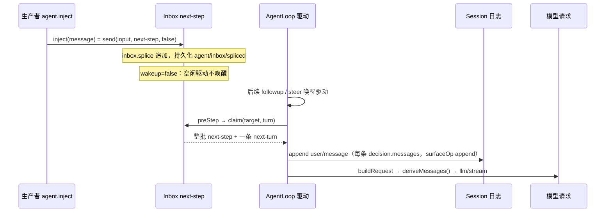
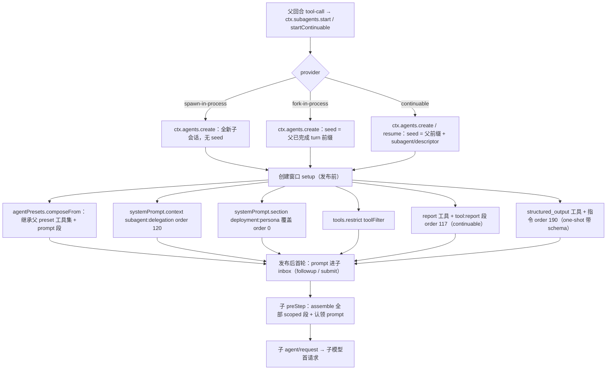
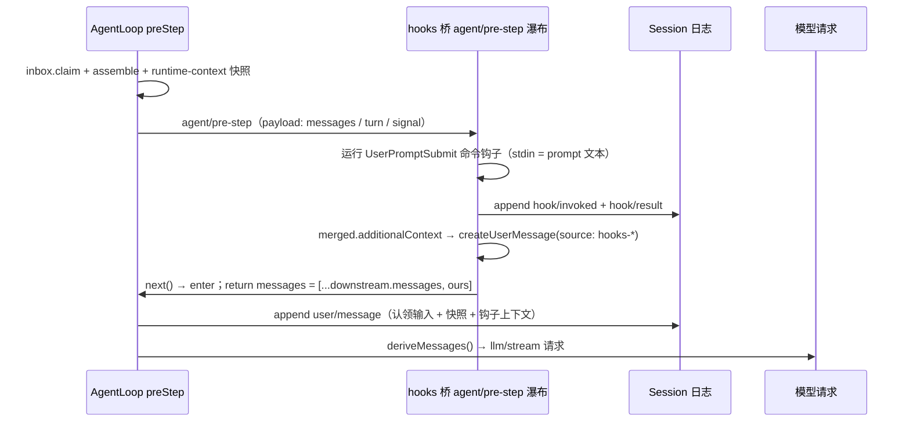

# 09 注入路径：agent.inject、hooks 桥与子代理

本页回答一个问题：绕过「用户直接发一条消息」的常规路径，内容还能以哪些方式进入模型上下文，以及这些内容何时、以何种会话事件落日志，从而满足「模型可见 ⟺ 已记录」。三条路径：`agent.inject()`（注入 inbox 等下一消息）、`hooks/*` 钩子桥（在 `agent/pre-step` 等拦截点上改写/追加提示词）、`subagent/*`（子代理自己组装模型上下文、结果以消息形态回到父上下文）。请求构造的主流程与 `agent/pre-step` 瀑布本体见 [02-step-and-request-construction.md](02-step-and-request-construction.md)，全量内容清单见 [context-inventory.md](context-inventory.md)。

## 总览

所有路径都汇入同一条最终通道：内容进入 `agent/pre-step` 瀑布的 `enter` 决策消息集（或经 `agent.inject()` 先入 inbox 再被 `preStep` 认领），随后 `turn()` 把每条消息以 `user/message` 事件写入会话（[agent.ts](../../../packages/core/agent-loop/src/agent.ts#L282)），`session.deriveMessages()` 沿 surface 把这些事件投影成请求消息（[index.ts](../../../packages/core/session/src/index.ts#L726)），投影规则见 [surface.ts](../../../packages/core/session/src/surface.ts#L83)——`user/message` 原样投影（[surface.ts](../../../packages/core/session/src/surface.ts#L96)）、`assistant/message` 非空投影（[surface.ts](../../../packages/core/session/src/surface.ts#L99)）、`tool/result` 投影（[surface.ts](../../../packages/core/session/src/surface.ts#L106)）。

`agent/request` 瀑布不是内容注入点：它只返回 `LlmCallConfig`（provider/model/参数），事件契约明确「Model-visible content must use logged channels; this waterfall cannot mutate messages」（[runtime-types.ts](../../../packages/core/agent/src/runtime-types.ts#L244)），即请求前能改写消息的唯一串行监听链是 `agent/pre-step`（[runtime-types.ts](../../../packages/core/agent/src/runtime-types.ts#L231)）。

## 1 agent.inject()：注入 inbox 等待下一消息

### 1.1 API 与语义

`Agent.inject(message: UserMessage): void` 的契约：为下一个 pre-step 排队模型面向的上下文、不唤醒驱动（[runtime-types.ts](../../../packages/core/agent/src/runtime-types.ts#L143)）；「正在运行的驱动在最近的后续 step 边界认领它，空闲驱动保持待定直到 follow-up 或 steering 唤醒；它可能错过一个 pre-step 已认领批次的请求；取消或销毁可能丢弃待定上下文」（[runtime-types.ts](../../../packages/core/agent/src/runtime-types.ts#L135-L143)）。

实现是 `inject(input) { this.send(input, 'next-step', false) }`（[agent.ts](../../../packages/core/agent-loop/src/agent.ts#L130)）：目标固定为 `next-step`、唤醒标志为 `false`。`send` 在唤醒-取消竞态下把目标重分类为 `next-turn`，否则 `this.inbox.splice(target, Infinity, 0, [message])`，`wakeup` 为真才 `wakeDriver`（[agent.ts](../../../packages/core/agent-loop/src/agent.ts#L113)）。

`Inbox` 持有两条待定列表 `next-turn` / `next-step`（[inbox.ts](../../../packages/core/agent/src/inbox.ts#L26)）。`splice` 先持久化 `agent/inbox/spliced` 事件、后变异内存投影（[inbox.ts](../../../packages/core/agent/src/inbox.ts#L186)、[inbox.ts](../../../packages/core/agent/src/inbox.ts#L158)）；事件载荷含 `target`/`start`/`removedCount`/`inserted`/`outcome`（[types.ts](../../../packages/core/agent/src/types.ts#L19)）。每次变异同步发布 `agent/inbox/inserted` / `agent/inbox/discarded` 通知（[inbox.ts](../../../packages/core/agent/src/inbox.ts#L188-L191)，接线在 [agent.ts](../../../packages/core/agent-loop/src/agent.ts#L87-L91)），事件契约见 [runtime-types.ts](../../../packages/core/agent/src/runtime-types.ts#L186)。

### 1.2 认领时机：从「待定」到「模型可见」

`preStep(target, position)` 四步：`inbox.claim(target, position.turn)` 认领输入（[agent.ts](../../../packages/core/agent-loop/src/agent.ts#L229)）→ `systemPrompt.assemble`（[agent.ts](../../../packages/core/agent-loop/src/agent.ts#L230)）→ 渲染并投影 runtime-context 快照（[agent.ts](../../../packages/core/agent-loop/src/agent.ts#L232)）→ 走 `agent/pre-step` 瀑布，默认决策是 `enter`：`messages: context === undefined ? claimed : [...claimed, context]`（[agent.ts](../../../packages/core/agent-loop/src/agent.ts#L234-L240)）。`claim` 总是先取走整批 `next-step`，再按 `next-turn` 边界取一条 `next-turn`（[inbox.ts](../../../packages/core/agent/src/inbox.ts#L71)），并发布 `agent/inbox/claimed`（[inbox.ts](../../../packages/core/agent/src/inbox.ts#L76)）。

认领发生在 `preStep` 内，但「模型可见」发生在 `turn()`：`preStep` 返回 `enter` 后，`turn()` 打开 `step/start` 边界、把 `decision.messages` 逐条 `session.append('user/message', message, { surfaceOp: 'append' })`（[agent.ts](../../../packages/core/agent-loop/src/agent.ts#L279-L284)），然后 `step()` 调用 `buildRequest(..., this.session.deriveMessages(), ...)` 派生历史并进 `llm/stream`（[agent.ts](../../../packages/core/agent-loop/src/agent.ts#L340-L345)）。因此注入内容从「待定」变「模型可见」的临界点是 `turn()` 的 `user/message` 追加——它同时是持久化点与投影点，二者不可分。

一个已认领但被 `agent/pre-step` 拒绝（`reject`）的批次会以 `turnEnds = blocked` 关闭 turn、消息既不入日志也不重发（[runtime-types.ts](../../../packages/core/agent/src/runtime-types.ts#L188-L190)、[agent.ts](../../../packages/core/agent-loop/src/agent.ts#L267)）。空闲驱动不消费 `next-step`：只有 follow-up/steer/唤醒后 `wakeDriver` 进入 `running` 才开始认领（[agent.ts](../../../packages/core/agent-loop/src/agent.ts#L172)）。

### 1.3 其他 inject() 消费者

除钩子（见下节）与子代理报告（见第 3 节）外，生产代码里 `agent.inject()` 的直接调用点：批准策略切换 `setPolicy`（[index.ts](../../../packages/interaction/user-approval/src/index.ts#L230)）、计划模式叙述（[index.ts](../../../packages/plan/plan-mode/src/index.ts#L443)）、后台任务完成通知（[index.ts](../../../packages/jobs/tool-jobs/src/index.ts#L299)）、Cordis 主机运行结果回注（[index.ts](../../../packages/extensions/cordis-host-runner/src/index.ts#L1153)）。它们的共同形态都是 `createUserMessage(...)` + `agent.inject(...)`，注入后等下一步认领、以 `user/message` 落日志。

## 2 hooks/* 钩子桥：改写与追加提示词

### 2.1 钩子输出词汇与合并

两个桥 `hooks-claude-code`、`hooks-codex` 共享 `dsh-hook-protocol` 的词汇与执行。`HookOutput.additionalContext` 即「注入给下一模型请求的额外上下文」（[types.ts](../../../packages/hooks/hook-protocol/src/types.ts#L127)）；`updatedInput`（工具输入改写）被解析但**不生效**，桥只记日志+警告（[types.ts](../../../packages/hooks/hook-protocol/src/types.ts#L132)、claude-code 警告点 [index.ts](../../../packages/hooks/hooks-claude-code/src/index.ts#L175)）；`systemMessage` 同样只警告不面世（[index.ts](../../../packages/hooks/hooks-claude-code/src/index.ts#L178)）。多个钩子输出经 `mergeHookOutputs` 折叠：决策取 `deny > ask > allow`，`additionalContext` 按钩子顺序累积（[merge.ts](../../../packages/hooks/hook-protocol/src/merge.ts#L62)、[merge.ts](../../../packages/hooks/hook-protocol/src/merge.ts#L83)）。

钩子运行在会话日志里成对落 `hook/invoked` + `hook/result` 事件（log-only，无 `surfaceOp`，不投影为消息）（[types.ts](../../../packages/hooks/hook-protocol/src/types.ts#L19-L40)、追加实现在 [events.ts](../../../packages/hooks/hook-protocol/src/events.ts#L75)）。这对事件只在钩子点处于打开回合（`opts.turn` 有值）时记录；SessionStart/SubagentStart 是 detached 的 emit 型点，不记这对事件（claude-code [index.ts](../../../packages/hooks/hooks-claude-code/src/index.ts#L157-L183)）。

### 2.2 各钩子点的注入位置与对应会话事件

| 钩子点（dialect） | 监听的事件/瀑布 | 注入/动作 | 注入内容落日志的事件 | 源码 |
|---|---|---|---|---|
| SessionStart（cc） | `agent/session-start`（emit，detached） | `merged.additionalContext` → `agent.inject(context)` | 被认领后 `user/message`（source `{kind:'plugin',plugin:'hooks-claude-code'}`） | [index.ts](../../../packages/hooks/hooks-claude-code/src/index.ts#L206-L215)、注入 [index.ts](../../../packages/hooks/hooks-claude-code/src/index.ts#L210) |
| SessionStart（codex） | 同上 | 纯 stdout（exit 0、无结构化 context、非 `{` 开头）转 `additionalContext` → `agent.inject(context)` | 同上（plugin `hooks-codex`） | [index.ts](../../../packages/hooks/hooks-codex/src/index.ts#L152-L156)、[index.ts](../../../packages/hooks/hooks-codex/src/index.ts#L188-L196)、注入 [index.ts](../../../packages/hooks/hooks-codex/src/index.ts#L192) |
| UserPromptSubmit（cc/codex） | `agent/pre-step`（waterfall，turn 内） | `prompt` 作为 stdin payload；`deny` → `reject`；否则 `next()` 委托后在 `enter` 决策的 `messages` 尾部追加 context | 追加消息被 `turn()` 持久化为 `user/message`；钩子运行本身记 `hook/invoked`+`hook/result` | cc [index.ts](../../../packages/hooks/hooks-claude-code/src/index.ts#L219-L235)、追加 [index.ts](../../../packages/hooks/hooks-claude-code/src/index.ts#L231-L234)；codex [index.ts](../../../packages/hooks/hooks-codex/src/index.ts#L199-L222)、追加 [index.ts](../../../packages/hooks/hooks-codex/src/index.ts#L218-L221) |
| PreToolUse（cc/codex） | `tools/pre-execute`（waterfall，turn 内） | `deny` → `{kind:'deny'}`；cc 额外支持 `ask` | 无内容注入；决策影响工具是否执行 | cc [index.ts](../../../packages/hooks/hooks-claude-code/src/index.ts#L238-L244)；codex [index.ts](../../../packages/hooks/hooks-codex/src/index.ts#L225-L231) |
| PostToolUse（cc/codex） | `tools/post-execute`（waterfall，turn 内） | `deny` → `{kind:'block', feedback}`；context 经 `additionalContexts` 返回 | `additionalContexts` 进 `tool/result` 之后的下一 `next-step` inbox（[tool-calls.ts](../../../packages/core/agent-loop/src/tool-calls.ts#L156)、[agent.ts](../../../packages/core/agent-loop/src/agent.ts#L395-L398)），下一步认领后 `user/message` | cc [index.ts](../../../packages/hooks/hooks-claude-code/src/index.ts#L247-L265)；codex [index.ts](../../../packages/hooks/hooks-codex/src/index.ts#L234-L253) |
| Stop（cc/codex） | `agent/turn-stopping`（serial，turn 内） | `deny` → `agent.steer(...)` 强制续跑 | steering 消息入 `next-step`，下一步认领后 `user/message` | cc [index.ts](../../../packages/hooks/hooks-claude-code/src/index.ts#L270-L277)；codex [index.ts](../../../packages/hooks/hooks-codex/src/index.ts#L260-L270) |
| SubagentStart（cc） | `subagent/start`（emit，detached） | `additionalContext` → `child.inject(context)`（同进程 child） | 被 child 下一步认领后以 `user/message` 落 child 日志 | [index.ts](../../../packages/hooks/hooks-claude-code/src/index.ts#L281-L290)、注入 [index.ts](../../../packages/hooks/hooks-claude-code/src/index.ts#L287) |
| SubagentStop（cc） | `subagent/end`（emit，detached） | 只观察，不注入 | 无 | [index.ts](../../../packages/hooks/hooks-claude-code/src/index.ts#L291-L295) |

`contextFrom(merged)` 把 `additionalContext` 拼成一条 `createUserMessage`，source 固定为 `{kind:'plugin', plugin:'hooks-claude-code'|'hooks-codex'}`（[index.ts](../../../packages/hooks/hooks-claude-code/src/index.ts#L87)、[index.ts](../../../packages/hooks/hooks-claude-code/src/index.ts#L192-L196)）。

### 2.3 钩子内容在请求中的位置

UserPromptSubmit 钩子监听 `agent/pre-step`，先 `await next()` 委托给下游（含 loop 默认决策 `[...claimed, context]`），再把自己的一条 context 追加到 `enter` 决策的 `messages` 尾部（cc [index.ts](../../../packages/hooks/hooks-claude-code/src/index.ts#L228-L234)），因此最终消息顺序是 `[认领的输入] + [runtime-context 快照] + [钩子 additionalContext]`。PostToolUse 的 `additionalContexts` 走工具结果通道先进 `next-step` inbox，由**下一个** pre-step 认领（[agent.ts](../../../packages/core/agent-loop/src/agent.ts#L395-L398)、[tool-calls.ts](../../../packages/core/agent-loop/src/tool-calls.ts#L156)），所以它不在本步请求里、而在后续 step 的请求里。

## 3 subagent/*：子代理上下文组装与报告回流

### 3.1 子代理是新建 session 还是复用

每个子代理都是**新建的 Session + 新建的 Agent**（自己的日志、自己的模型上下文），只是 seed 不同。`spawn` 提供方：全新会话、零父历史（[index.ts](../../../packages/subagent/subagent-spawn-in-process/src/index.ts#L41-L53)）。`fork` 提供方：以父会话「已完成 turn 前缀」（到最后一个 `turn/end` 为止）作 `seed` 创建子会话，子代理因此继承父对话的完成回合（[index.ts](../../../packages/subagent/subagent-fork-in-process/src/index.ts#L48-L54)、[index.ts](../../../packages/subagent/subagent-fork-in-process/src/index.ts#L61-L89)）。`continuable` 子代理：持久化 child session，seed 由父前缀（可选）+ `subagent/descriptor` 事件构成（[descriptor-seed.ts](../../../packages/subagent/subagent/src/descriptor-seed.ts#L23-L31)），cold resume 时从持久化会话重建 Agent（[continuation.ts](../../../packages/subagent/subagent/src/continuation.ts#L883)）。

会话元数据 `childSessionMeta` 记录 `cwd`、`parentSession`、`origin:'subagent'`、`delegationDepth`、`seedLength`、`agentPreset`（[child-agent.ts](../../../packages/subagent/subagent/src/child-agent.ts#L102-L120)）；`delegationDepth` 是持久化的递归预算，resume 不会从零重算（[depth.ts](../../../packages/subagent/subagent/src/depth.ts#L28)）。

### 3.2 模型上下文组成（创建窗口 setup 内注册）

子代理创建/恢复通过 `ctx.agents.create` / `resume` 的 `setup` 回调在其未发布的作用域里注册全部 scoped 贡献（one-shot 驱动 setup 在 [index.ts](../../../packages/subagent/subagent-in-process-driver/src/index.ts#L120-L130)，continuable 在 [continuation.ts](../../../packages/subagent/subagent/src/continuation.ts#L996-L1005)）：

1. `agentPresets.composeFrom(childCtx, parent.ctx)`：子代理**加入父的 preset**，继承父的工具集与 prompt 段——缺了这一步子代理会看到空工具注册表、没有任何父级 prompt 段（[child-agent.ts](../../../packages/subagent/subagent/src/child-agent.ts#L168)）。
2. `childCtx.systemPrompt.context({ name:'subagent:delegation', order:120, text: SUBAGENT_DELEGATION_CONTEXT })`：固定委派范围陈述（权限固定、需批准的操作被自动拒绝），作为 runtime-context 贡献而非 system 段（[child-agent.ts](../../../packages/subagent/subagent/src/child-agent.ts#L170)、常量 [child-agent.ts](../../../packages/subagent/subagent/src/child-agent.ts#L135)）。
3. `childCtx.systemPrompt.section({ name:'deployment:persona', order:0, text: persona })`：按名字遮蔽部署人设（可选，需 provider `persona` 能力）（[child-agent.ts](../../../packages/subagent/subagent/src/child-agent.ts#L172)）。
4. `childCtx.tools.restrict(toolFilter)`：子代理工具过滤（可选，需 provider `toolFilter` 能力）（[child-agent.ts](../../../packages/subagent/subagent/src/child-agent.ts#L174)）。
5. continuable 子代理额外安装 `report` 工具与 `tool:report` 段（order 117）——经 `registerContinuableSetup` 注册、`setupRegistry.apply` 在创建窗口装入（[index.ts](../../../packages/subagent/tool-subagent-report/src/index.ts#L140)、[activation-setup-registry.ts](../../../packages/subagent/subagent/src/activation-setup-registry.ts#L90)）；段文本与工具见 [index.ts](../../../packages/subagent/tool-subagent-report/src/index.ts#L54-L104)。
6. one-shot 带 `outputSchema` 的子代理额外安装 `structured_output` 工具 + `tool:structured_output` 段（order 190）+ 终态守卫（[structured.ts](../../../packages/subagent/subagent-in-process-driver/src/structured.ts#L49-L141)，段注册 [structured.ts](../../../packages/subagent/subagent-in-process-driver/src/structured.ts#L99)）。
7. `subagent/descriptor` 事件（log-only、不进模型历史）：one-shot 由 `attachDescriptorAppend` 在子代理初始 turn 内、首请求前追加（[index.ts](../../../packages/subagent/subagent-in-process-driver/src/index.ts#L79-L89)）；continuable 在创建 seed 里先于 create 写入（[continuation.ts](../../../packages/subagent/subagent/src/continuation.ts#L437)）。事件与版本见 [descriptor.ts](../../../packages/subagent/subagent/src/descriptor.ts#L28-L47)。

委派策略覆盖：创建窗口内把父的 sandbox 覆盖与 `approval:'never'` 以 `source:'delegation'` 事件写到子日志（[child-agent.ts](../../../packages/subagent/subagent/src/child-agent.ts#L199-L225)）。

子代理 `AgentOptions`：默认继承父的 provider/model/maxTokens，覆盖字段按请求合并，并盖 `subagentDepth` 戳（[child-agent.ts](../../../packages/subagent/subagent/src/child-agent.ts#L68-L83)；`subagentDepth` 经声明合并进 `AgentOptions`，[depth.ts](../../../packages/subagent/subagent/src/depth.ts#L11)）。

### 3.3 首请求

one-shot：`drivePublishedRun` 在子代理发布后 `child.followup(createUserMessage({ content: prompt, source: { kind: 'user' } }))`（[index.ts](../../../packages/subagent/subagent-in-process-driver/src/index.ts#L177)），随后 `await child.whenIdle()`（[index.ts](../../../packages/subagent/subagent-in-process-driver/src/index.ts#L178)）。continuable：`submit` → `activation.handle.agent.followup(message)`（[continuation.ts](../../../packages/subagent/subagent/src/continuation.ts#L1139-L1142)）。之后由子代理自己的 loop 走 `preStep`：`assemble` 把所有 scoped 段（继承的 preset 段 + 委派声明 + persona/工具段 + report/structured 段）渲染进 system，认领 prompt 并 `user/message` 落子日志，再经子 `agent/request` 发首个模型请求。结果读取：`readResult` 从 `boundary` 之后的事件折叠，`finalAssistantOutput` 取最后一个非空 assistant 消息（[index.ts](../../../packages/subagent/subagent-in-process-driver/src/index.ts#L208-L233)、[assistant-output.ts](../../../packages/subagent/subagent/src/assistant-output.ts#L66)）。

### 3.4 报告与结算如何回到父上下文

子代理 `report` 工具执行时调 `ctx.subagents.reportFrom(child, content, { delivery, signal })`（[index.ts](../../../packages/subagent/tool-subagent-report/src/index.ts#L94-L103)）。`reportFrom` 校验发送者是活动的 continuable 子代理（[continuation.ts](../../../packages/subagent/subagent/src/continuation.ts#L596)），按持久化 `parentSession` 解析直系父（[continuation.ts](../../../packages/subagent/subagent/src/continuation.ts#L616)），再 `deliverReport`：把内容包成 `Background subagent <id> reported:` + 原始内容、source 为 `{kind:'subagent-report', form:'relay', senderSessionId}` 的 `UserMessage`（[continuation.ts](../../../packages/subagent/subagent/src/continuation.ts#L630-L653)）。调度按 `delivery`：`wakeup` 用 `parent.followup(message)`（进父 `next-turn` 并唤醒）、`quiet` 用 `parent.inject(message)`（进父 `next-step` 不唤醒）（[continuation.ts](../../../packages/subagent/subagent/src/continuation.ts#L678-L693)）。父侧收到的是这条 relay user 消息，认领后以 `user/message` 落父日志进入父模型上下文；`report` 工具自己的 `{messageId}` 结果则以 `tool/result` 回到**子代理自己**的回合（[index.ts](../../../packages/subagent/tool-subagent-report/src/index.ts#L81-L93)）——报告对父不是 tool result 形态，而是 relay user 消息形态。

结算通知：子代理 dispose 时 `notifySettlement` 无条件给直系父发一条 `subagent-settled` notice（source `{kind:'subagent-settled', form:'notice', summary}`，内容 = 摘要 + 收尾消息，[continuation.ts](../../../packages/subagent/subagent/src/continuation.ts#L1400-L1449)）。调度三态：父自身 lineage 已关闭 → `parent.inject(message)`（[continuation.ts](../../../packages/subagent/subagent/src/continuation.ts#L1430)）；父空闲 → `parent.followup(message)`（开一个普通 turn，[continuation.ts](../../../packages/subagent/subagent/src/continuation.ts#L1440)）；父正忙 → `parent.steer(message)`（进 `next-step`，多个子同时结算只花一个 step，[continuation.ts](../../../packages/subagent/subagent/src/continuation.ts#L1441)）。

## 4 interaction/ask-user 的上下文贡献

`ask_user_question` 工具（[index.ts](../../../packages/interaction/tool-ask-user/src/index.ts#L20-L100)）阻塞等待 UI 回答，把答案数组作为**普通工具结果**返回：`execute` 调 `ctx.userQuestions.ask(...)` 拿到 `result.answers`，`defineTool` 的输出经 [tool-calls.ts](../../../packages/core/agent-loop/src/tool-calls.ts#L281) 以 `tool/result` 落日志、由 `deriveMessages` 投影成 tool-role 消息进入模型上下文。它不经过 inbox、不调用 `agent.inject()`，也没有独立的上下文注入路径。user-approval 的 `setPolicy` 走的是第 1 节的 `agent.inject()`（[index.ts](../../../packages/interaction/user-approval/src/index.ts#L230)）。

## Mermaid

### 图 1：inject → inbox 等待 → 下一消息认领 → 进入请求

### 图 2：子代理上下文从创建到首请求的组成

### 图 3：钩子注入时序（UserPromptSubmit → agent/pre-step）

## 相关文件

- 请求拼装主线：[02-step-and-request-construction.md](02-step-and-request-construction.md)
- 全量内容清单：[context-inventory.md](context-inventory.md)
- 「模型可见 ⟺ 已记录」的可执行断言：[10-invariants-and-reconstruction.md](10-invariants-and-reconstruction.md)
