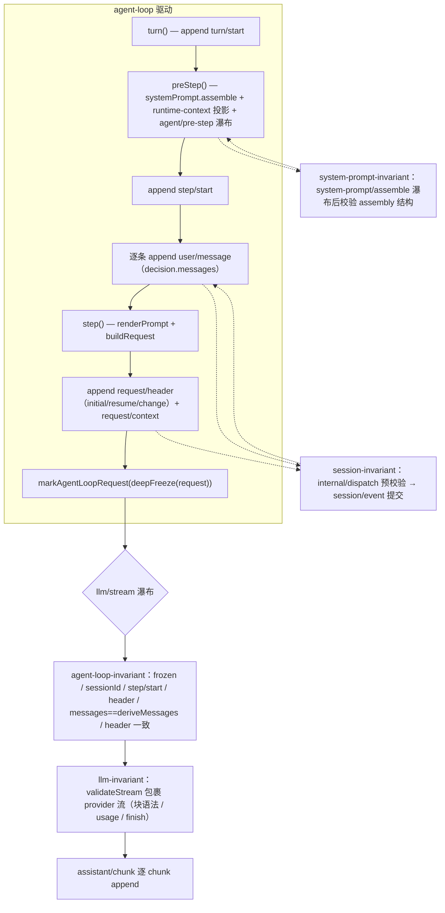

# 不变式与请求重建（invariants & request reconstruction）

本页记录四个包拥有的 invariant 伴生插件如何把「模型可见 ⟺ 已记录」及相邻运行时属性变成可执行断言，以及请求重建（request reconstruction）如何从会话日志重建一次模型请求。核心契约的声明位置是 [`docs/architecture.md`](../../architecture.md#session-log) 的 Session log 一节：`deriveMessages()` 从日志投影模型历史，`assistant/chunk` 保留回放保真，任何进入模型请求的内容都必须能从日志重建，并由运行时不变式断言。

不变式注册表是 [`packages/runtime-diagnostics/invariants/src/index.ts`](../../../packages/runtime-diagnostics/invariants/src/index.ts)：`InvariantRegistry.register(packageName, installer)`（[`index.ts`](../../../packages/runtime-diagnostics/invariants/src/index.ts#L136)）保留包名并把 installer 放进子 fiber；`installer` 收到的 `fail` 会抛出 `InvariantError`，报错形如 `invariant violated by "<packageName>": <message>`（[`index.ts`](../../../packages/runtime-diagnostics/invariants/src/index.ts#L49)）。四个包各自导出 `./invariant` 伴生插件，用 `ctx.invariants.register(PACKAGE_NAME, install)` 安装（agent-loop [`invariant.ts`](../../../packages/core/agent-loop/src/invariant.ts#L62)、system-prompt [`invariant.ts`](../../../packages/core/system-prompt/src/invariant.ts#L59)、session [`invariant.ts`](../../../packages/core/session/src/invariant.ts#L249)、llm [`invariant.ts`](../../../packages/llm/llm/src/invariant.ts#L111)）。

## dsh-agent-loop：请求重建不变式

包名 `@deepseek-ai/dsh-agent-loop`，伴生插件 `agent-loop-invariant`（[`invariant.ts`](../../../packages/core/agent-loop/src/invariant.ts#L11)）。它监听 `llm/stream` waterfall，`{ global: true, prepend: true }` 注册（[`invariant.ts`](../../../packages/core/agent-loop/src/invariant.ts#L21)、[`invariant.ts`](../../../packages/core/agent-loop/src/invariant.ts#L54)），即排在所有流监听器之前——注释说明这是为了防止一个短路的回放监听器吞掉检查（[`invariant.ts`](../../../packages/core/agent-loop/src/invariant.ts#L20)）。

只有 `isAgentLoopRequest(options)` 为真的请求受检（[`invariant.ts`](../../../packages/core/agent-loop/src/invariant.ts#L22)）：loop 通过 `markAgentLoopRequest` 把请求对象登记进进程本地 `WeakSet`（[`call-config.ts`](../../../packages/llm/llm/src/call-config.ts#L66)），非 loop 请求直接 `next()` 放行。逐条断言：

| 断言 | 语义 | 触发点 | 违反报错 |
|---|---|---|---|
| 请求对象冻结 | `Object.isFrozen(options)` 必须为真 | `llm/stream` 分派 | `a loop-built request must be frozen`（[`invariant.ts`](../../../packages/core/agent-loop/src/invariant.ts#L23)） |
| 携带 sessionId | `options.sessionId !== undefined` | 同上 | `a loop-built request must carry a session id`（[`invariant.ts`](../../../packages/core/agent-loop/src/invariant.ts#L24)） |
| sessionId 对应活会话 | `ctx.sessions.get(options.sessionId)` 非空 | 同上 | `a loop-built request must carry a live session id, got "…"`（[`invariant.ts`](../../../packages/core/agent-loop/src/invariant.ts#L26)） |
| messages 数组冻结 | `Object.isFrozen(options.messages)` 必须为真 | 同上 | `a loop-built request must carry a frozen messages array`（[`invariant.ts`](../../../packages/core/agent-loop/src/invariant.ts#L28)） |
| 日志有 step/start | `session.events` 含 `step/start` | 同上 | `a loop-built request with no step/start in its session log`（[`invariant.ts`](../../../packages/core/agent-loop/src/invariant.ts#L33)） |
| 日志有 request/header | `foldRequestHeader(events)` 非空 | 同上 | `a loop-built request with no request/header event in its session log`（[`invariant.ts`](../../../packages/core/agent-loop/src/invariant.ts#L37)） |
| messages 等于派生 | `JSON.stringify(options.messages)` 必须等于 `JSON.stringify(session.deriveMessages())` | 同上 | `llm request for session "…" diverges from the dispatch-time durable derivation (log-reconstruction desync)`（[`invariant.ts`](../../../packages/core/agent-loop/src/invariant.ts#L41)） |
| header 一致 | `model/system/temperature/maxTokens/stop/tools` 与折叠 header 逐项相等 | 同上 | `llm request for session "…" diverges from the folded request header`（[`invariant.ts`](../../../packages/core/agent-loop/src/invariant.ts#L51)） |

最后两项是「模型可见 ⟺ 已记录」的落点：请求的 messages 必须是 dispatch 时从会话日志 `deriveMessages()` 得到的精确派生，请求的 model/system/采样参数/工具 schema 必须等于日志里最新 `request/header` 快照折叠出的 header。被它保护的性质是：任何进入模型请求的内容都能仅凭日志重建，任何在分派点对请求的篡改（无论来自监听器还是缓存不同步）都会让这一条断言抛错。

测试 `invariant.spec.ts` 覆盖这些分支：冻结/未冻结、缺 sessionId、幽灵 session、缺 `step/start`、缺 `request/header`、messages 前缀或后缀漂移、header 字段漂移、以及 prepend 抢在短路监听器之前（[`invariant.spec.ts`](../../../packages/core/agent-loop/tests/invariant.spec.ts#L38)）。

## 请求重建机制（request reconstruction）

请求在 agent-loop 驱动里逐次构建，`buildRequest` 是唯一构造点（[`agent.ts`](../../../packages/core/agent-loop/src/agent.ts#L407)）：

1. 从 `session.requestHeader()` 取持久 header（[`agent.ts`](../../../packages/core/agent-loop/src/agent.ts#L419)），经 `agent/request` waterfall 得出 `proposedConfig`（[`agent.ts`](../../../packages/core/agent-loop/src/agent.ts#L438)），再经 `llm.prepareCall` 解析精确模型默认值得到 `config`（[`agent.ts`](../../../packages/core/agent-loop/src/agent.ts#L449)）。
2. `canonicalHeader` 归一化 header（[`agent.ts`](../../../packages/core/agent-loop/src/agent.ts#L458)）；首条请求追加 `request/header`（reason `initial`/`resume`），后续仅当 `!headerEquals(baseline, header)` 时追加 reason `change` 的新快照（[`agent.ts`](../../../packages/core/agent-loop/src/agent.ts#L464)）。
3. 路由/容量变化时追加 `request/context`（[`agent.ts`](../../../packages/core/agent-loop/src/agent.ts#L478)）。
4. `deepFreeze` 冻结请求并 `markAgentLoopRequest`（[`agent.ts`](../../../packages/core/agent-loop/src/agent.ts#L486)）。

重建路径全部纯函数：

- 历史：`deriveMessages()`（[`index.ts`](../../../packages/core/session/src/index.ts#L726)）沿 surface 节点投影；每条消息由 `deriveEventMessage` 决定（[`surface.ts`](../../../packages/core/session/src/surface.ts#L83)）——`user/message` 原样、`assistant/message` 跳过空内容、`tool/result` 取结果消息、其余事件投影为 null。
- header：`foldRequestHeader(events, from?)` 纯离线折叠（[`request-header.ts`](../../../packages/core/session/src/request-header.ts#L65)）；活会话用增量缓存 `requestHeader()`（[`index.ts`](../../../packages/core/session/src/index.ts#L670)）。

`request-reconstruction.spec.ts` 验证整个定理：每次请求都能从日志单独字节级重建——取该 step 的首个 `assistant/chunk` 之前的日志前缀重建 Session，`deriveMessages()` 与请求 messages 相等，`foldRequestHeader` 与请求的 model/system/tools/采样参数相等（[`request-reconstruction.spec.ts`](../../../packages/core/agent-loop/tests/request-reconstruction.spec.ts#L566)）。其余用例覆盖：请求逐 step 冻结、turn 间前缀扩展（[`spec.ts`](../../../packages/core/agent-loop/tests/request-reconstruction.spec.ts#L74)）、effort/maxTokens 默认值记录与恢复（[`spec.ts`](../../../packages/core/agent-loop/tests/request-reconstruction.spec.ts#L114)）、system-prompt 变化产生 `change` 快照而稳定提示不产生（[`spec.ts`](../../../packages/core/agent-loop/tests/request-reconstruction.spec.ts#L433)）、`inject()` 只在下一步边界进入请求（[`spec.ts`](../../../packages/core/agent-loop/tests/request-reconstruction.spec.ts#L457)）、冻结请求被改写时大声抛错（[`spec.ts`](../../../packages/core/agent-loop/tests/request-reconstruction.spec.ts#L485)）、压缩 replace 改写重发而日志自解释（[`spec.ts`](../../../packages/core/agent-loop/tests/request-reconstruction.spec.ts#L406)）、resume 锚定 `resume` 快照且字节一致续接（[`spec.ts`](../../../packages/core/agent-loop/tests/request-reconstruction.spec.ts#L509)）。

## dsh-system-prompt：组装不变式

包名 `@deepseek-ai/dsh-system-prompt`，伴生插件 `system-prompt-invariant`（[`invariant.ts`](../../../packages/core/system-prompt/src/invariant.ts#L7)）。它监听 `system-prompt/assemble` waterfall，`{ global: true, prepend: true }`，先 `await next()` 拿到权威返回值再校验（[`invariant.ts`](../../../packages/core/system-prompt/src/invariant.ts#L46)）——不短路，而是对瀑布结果做后置校验。`validateAssembly`（[`invariant.ts`](../../../packages/core/system-prompt/src/invariant.ts#L16)）断言：

- section 名非空（[`invariant.ts`](../../../packages/core/system-prompt/src/invariant.ts#L19)）、同层不重复（[`invariant.ts`](../../../packages/core/system-prompt/src/invariant.ts#L20)）、text 为字符串（[`invariant.ts`](../../../packages/core/system-prompt/src/invariant.ts#L22)）。
- context 名非空（[`invariant.ts`](../../../packages/core/system-prompt/src/invariant.ts#L27)）、不重复（[`invariant.ts`](../../../packages/core/system-prompt/src/invariant.ts#L28)）、text 为字符串（[`invariant.ts`](../../../packages/core/system-prompt/src/invariant.ts#L30)）。
- 工具名非空（[`invariant.ts`](../../../packages/core/system-prompt/src/invariant.ts#L34)）。
- 变量名匹配 `^[a-z][a-z0-9_]*$`（[`invariant.ts`](../../../packages/core/system-prompt/src/invariant.ts#L38)），值必须是字符串或 `undefined`（[`invariant.ts`](../../../packages/core/system-prompt/src/invariant.ts#L39)）。

触发点：每次 `assemble(context)` 的瀑布返回后（[`index.ts`](../../../packages/core/system-prompt/src/index.ts#L532)）。保护性质：进入模型的拼装结果始终结构良好——名字可属性化、顺序稳定、变量可严格插值，任意插件监听器改坏 assembly 都会在此暴露。

## dsh-session：日志关系不变式

包名 `@deepseek-ai/dsh-session`，伴生插件 `session-invariant`（[`invariant.ts`](../../../packages/core/session/src/invariant.ts#L15)）。它维护每会话的 `SessionTrace`（`lastSeq`/`openTurn`/`openStep`/`nextTurn`/`nextStep`/`pendingCalls`，[`invariant.ts`](../../../packages/core/session/src/invariant.ts#L23)），在 `internal/dispatch` 预校验每个候选事件（纯函数、不改动 trace，[`invariant.ts`](../../../packages/core/session/src/invariant.ts#L233)），事件提交发布后在 `session/event` 回调里应用已通过校验的转移（[`invariant.ts`](../../../packages/core/session/src/invariant.ts#L223)）。先建会话时对全量事件播种（[`invariant.ts`](../../../packages/core/session/src/invariant.ts#L207)），`session/created` 时对新会话播种（[`invariant.ts`](../../../packages/core/session/src/invariant.ts#L221)）。

`validateEvent`（[`invariant.ts`](../../../packages/core/session/src/invariant.ts#L55)）按事件类型断言关系：

| 事件 | 断言 |
|---|---|
| 全部 | `seq` 严格递增（[`invariant.ts`](../../../packages/core/session/src/invariant.ts#L60)） |
| `turn/start` | 无开着的 turn；turn 号等于期望 `nextTurn`（[`invariant.ts`](../../../packages/core/session/src/invariant.ts#L72)） |
| `turn/end` | 关闭的是当前 open turn；turn 内无开着 step（[`invariant.ts`](../../../packages/core/session/src/invariant.ts#L84)） |
| `step/start` | 在 open turn 内；无开着 step；step 号等于 `nextStep`（[`invariant.ts`](../../../packages/core/session/src/invariant.ts#L94)） |
| `step/end` | 命名当前 open turn/step；清空 `pendingCalls`（[`invariant.ts`](../../../packages/core/session/src/invariant.ts#L107)） |
| `assistant/chunk`、`assistant/message` | 命名当前 open turn/step（[`invariant.ts`](../../../packages/core/session/src/invariant.ts#L114)、[`invariant.ts`](../../../packages/core/session/src/invariant.ts#L118)） |
| `tool/call` | 命名当前 open turn/step；callId 记入 pending（[`invariant.ts`](../../../packages/core/session/src/invariant.ts#L122)） |
| `tool/result` | surface 替换版本可在任何 open turn 外（[`invariant.ts`](../../../packages/core/session/src/invariant.ts#L130)）；append 版本必须命名 open turn/step，且要么 pending 里有对应 `tool/call`，要么是 `TOOL_NOT_STARTED` 合成结果（[`invariant.ts`](../../../packages/core/session/src/invariant.ts#L136)） |
| `user/message` | 无约束（[`invariant.ts`](../../../packages/core/session/src/invariant.ts#L145)） |
| `session/end-seed` | 无约束——不平衡 seed 合法地落在 open turn 内（[`invariant.ts`](../../../packages/core/session/src/invariant.ts#L147)） |
| `todo/write`、`request/header`、`request/context` | 必须位于某个 open turn 内（核心执行事件必须被 turn 包围，[`invariant.ts`](../../../packages/core/session/src/invariant.ts#L150)） |
| 其余 | 归各自的合并扩展拥有方（[`invariant.ts`](../../../packages/core/session/src/invariant.ts#L158)） |

违反时报错示例：`seq must strictly increase: saw 2 after 1`、`turn/start 2 while turn 1 is still open`、`tool/result for c1 with no prior tool/call in this step`、`request/header appended outside any open turn (core execution events must be turn-enclosed)`。预校验与提交分离的机制保证：后到的 dispatch 监听器可能否决该事件，校验是纯的，被弃用的弱键转移不会推进或保留会话（[`invariant.ts`](../../../packages/core/session/src/invariant.ts#L239)）。

## dsh-llm：流协议不变式

包名 `@deepseek-ai/dsh-llm`，伴生插件 `llm-invariant`（[`invariant.ts`](../../../packages/llm/llm/src/invariant.ts#L7)）。两条检查：

- `llm/stream` 上以 `{ global: true, prepend: true }` 用 `validateStream` 包裹 provider 流（[`invariant.ts`](../../../packages/llm/llm/src/invariant.ts#L88)）：索引必须是非负安全整数（[`invariant.ts`](../../../packages/llm/llm/src/invariant.ts#L15)）；`block-start` 不得重复索引（[`invariant.ts`](../../../packages/llm/llm/src/invariant.ts#L46)）；text/reasoning/tool-call delta 必须命中已开的同名块（[`invariant.ts`](../../../packages/llm/llm/src/invariant.ts#L51)）；`block-end` 必须关闭一个开着的、类型匹配的块（[`invariant.ts`](../../../packages/llm/llm/src/invariant.ts#L60)）；`usage` 至多一次（[`invariant.ts`](../../../packages/llm/llm/src/invariant.ts#L70)）；`finish` 后不得再有块（[`invariant.ts`](../../../packages/llm/llm/src/invariant.ts#L44)），除 error/aborted 外 finish 时不得有开着的块（[`invariant.ts`](../../../packages/llm/llm/src/invariant.ts#L74)），流必须以 `finish` 终止（[`invariant.ts`](../../../packages/llm/llm/src/invariant.ts#L83)）。
- `llm/adapters-updated` 发出时，每个 provider 都必须有可读的注册（`providerRetryPolicy` 不可读即失败，[`invariant.ts`](../../../packages/llm/llm/src/invariant.ts#L89)）。

触发点：每次模型流被消费、每次适配器表更新通知。保护性质：块协议完整（模型输出与工具调用可被 `BlockAssembler` 组装、可被会话逐 chunk 记录）、注册表通知承诺的可读性不落空。

## ignorable 信封与 SESSION_FORMAT_VERSION

- 信封：`SessionEvent` 的 `ignorable?: true` 标记（[`types.ts`](../../../packages/core/session/src/types.ts#L404)）——缺失标记的未知事件类型必须拒绝重建而非静默丢弃；`ignorable: true` 只允许用于纯信息记录，其丢失不影响重建（[`types.ts`](../../../packages/core/session/src/types.ts#L413)）。默认「必须认识」意味着忘记打标记只会过度拒绝（不便），不会静默恢复被掏空的会话（[`types.ts`](../../../packages/core/session/src/types.ts#L420)）。
- 版本：`SESSION_FORMAT_VERSION = 0`（[`types.ts`](../../../packages/core/session/src/types.ts#L56)），写入每个新建会话的 `SessionHeader.version`（[`types.ts`](../../../packages/core/session/src/types.ts#L63)），持久后端加载时拒绝其它版本（[`index.ts`](../../../packages/core/session/src/index.ts#L101)）。升级判据看写端：只有结构性变化（header 形状、信封、核心事件语义、surface 机制）才 bump；新增普通事件类型不 bump，交给 `ignorable` 兜底（[`types.ts`](../../../packages/core/session/src/types.ts#L48)）。
- 已知词汇：`KNOWN_SESSION_EVENT_TYPES`（[`known-event-types.ts`](../../../packages/core/session/src/known-event-types.ts#L19)）列出本构建理解的完整事件集合；持久读取路径对集合外的类型，除非带 `ignorable` 否则拒绝解释——这类日志很可能由更新版本的 harness 写入，静默跳过必需事件会重建出错误的会话（[`known-event-types.ts`](../../../packages/core/session/src/known-event-types.ts#L8)）。仓库外插件的下游事件天然不在集合内（[`known-event-types.ts`](../../../packages/core/session/src/known-event-types.ts#L15)）。

## Mermaid —— 不变式在流水线中的断言点

## 相关文件

- 不变式注册表：[packages/runtime-diagnostics/invariants/src/index.ts](../../../packages/runtime-diagnostics/invariants/src/index.ts)
- 子系统页：[docs/subsystems/invariants.md](../../subsystems/invariants.md)
- 会话事件词汇（已知类型）：[packages/core/session/src/known-event-types.ts](../../../packages/core/session/src/known-event-types.ts)
