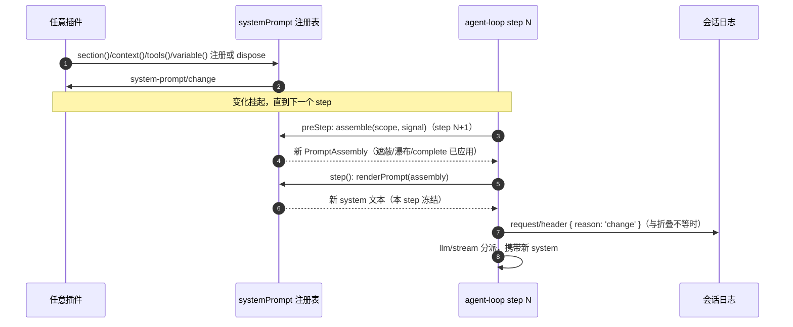

# 11 —— 变化时机与插入时机（system prompt 变化 + 合成 user 消息插入）

本页回答两个时序问题：system prompt 文本在什么时候发生变化、以什么机制生效；所有"伪装成 user message"的内容（`user/message` 事件、但 `source.kind !== 'user'` 的合成消息）在什么时刻被插入、以什么机制进入模型历史。逐项机制索引见文末。术语与逐字原文分别见 [context-inventory.md](context-inventory.md) 与 [prompts/](prompts/)；每步请求的拼装主流程见 [02-step-and-request-construction.md](02-step-and-request-construction.md)。

## 一、system prompt 的变化时机

system 文本不是常驻对象：`step()` 每个 step 开头执行一次 `renderPrompt(assembly)`（[`agent.ts`](../../../packages/core/agent-loop/src/agent.ts#L337)），而 `assembly` 来自该 step 的 `preStep` 中 `systemPrompt.assemble()`（[`agent.ts`](../../../packages/core/agent-loop/src/agent.ts#L230)）。因此**任何变化都从下一个 step 起生效**，一次 step 内的所有请求（含重试）共享同一份冻结的 system 文本。变化的触发源有四类：

1. **注册变化**：`systemPrompt.section()/context()/tools()/variable()` 及其 dispose 都会发 `system-prompt/change` 事件（注册表在层变更回调中 `ctx.emit('system-prompt/change')`，[`index.ts`](../../../packages/core/system-prompt/src/index.ts#L349)）。生效时刻 = 下一次 `assemble()`（组装按步求值，没有跨 step 缓存）。本仓库当前没有该事件的生产监听者（仅测试与 API catalog 引用），事件是通知面，注册本身即变化源。
2. **作用域与变量变化**：agent 的 scope 链（preset 组合、`agent.ctx` 挂载/卸载）改变遮蔽结果，下一次 `assemble` 生效；`{{provider}}`/`{{model}}`/`{{cwd}}` 每次 `assemble` 重新求值（[`index.ts`](../../../packages/core/agent-loop/src/index.ts#L351)），per-agent 模型选择还可在 `system-prompt/assemble` 瀑布里覆写 provider/model 变量（[`model-selection.ts`](../../../packages/core/agent/src/model-selection.ts#L39)）——变量值变了，即使 section 文本未变，`renderPrompt` 输出也变。
3. **组装瀑布改写**：`system-prompt/assemble` 是每步求值的 expert 瀑布，返回值权威，可改写 sections/contexts/tools（[`index.ts`](../../../packages/core/system-prompt/src/index.ts#L532)）；`complete: true` 段在瀑布后恢复为唯一 system 段（[`index.ts`](../../../packages/core/system-prompt/src/index.ts#L536)）。这两类变化同样从下一个 step 起生效。
4. **构造期配置**：`persona`、`toolOrder`、`includeHarnessIdentity` 只在 `SystemPrompt` 构造期读取（[`index.ts`](../../../packages/core/system-prompt/src/index.ts#L353)），改配置需重挂插件或重启进程，不参与运行时变化。

变化的**日志事实**记录在 `request/header` 事件：`buildRequest` 折叠 `canonicalHeader({ config, adapterDefaults?, system?, tools? })` 后与 `session.requestHeader()` 的当前折叠比较（[`agent.ts`](../../../packages/core/agent-loop/src/agent.ts#L458)），未记录过记 `reason: 'initial'`（或恢复时 `'resume'`），不等则追加 `reason: 'change'`（[`agent.ts`](../../../packages/core/agent-loop/src/agent.ts#L464)）。因此「system prompt 变了」的可验证时点是该 step 的 `request/header` 事件，位置在 `step/start` 与 enter 消息落日志之后、`llm/stream` 分派之前。

## 二、"伪装成 user message"的消息与插入时机

机制本体：`deriveEventMessage` 把一切 `user/message` 事件**原样**投影为 user 角色历史（[`surface.ts`](../../../packages/core/session/src/surface.ts#L50)），合成消息的区分只靠 `message.source.kind`。生产环境中出现过的 `source.kind`：`plugin`、`goal`、`skill-catalog`、`skill-invocation`、`agent-instructions`、`subagent-report`、`coordinator`、`session-reference`（capability-only）、`model`/`tool`（assistant 与工具结果，非 user）。按插入机制分四类：

### A. `agent/pre-step` 瀑布内插入（每步、请求之前）

时机：`preStep` 里先认领 inbox、再走 `agent/pre-step` 瀑布，默认决策是 `enter(messages = [...claimed, 快照])`（[`agent.ts`](../../../packages/core/agent-loop/src/agent.ts#L234)）；瀑布返回的 enter 消息随后在 `turn()` 里逐条以 `user/message`（`surfaceOp: 'append'`）落日志（[`agent.ts`](../../../packages/core/agent-loop/src/agent.ts#L282)）。因此插入时刻在 `step/start` 之后、该步请求之前，**该步请求即可见**。

批次内相对位置由两条规则决定：`{ prepend: true }` 监听器跑在瀑布最外层、消息落在头部（time-context、tmux-context）；普通监听器包住驱动默认决策，可插可删。驱动默认把快照追加在 claimed 之后；`dsh-agent-instructions` 明确把 workspace 上下文插在「最后一条 claimed 之后、快照之前」（[`index.ts`](../../../packages/context/agent-instructions/src/index.ts#L343)）；其余普通监听器（技能目录、`/name` 手势、`@pluginId` 引用、hooks UserPromptSubmit）追加在决策尾部，相对顺序 = 注册顺序。

| 内容 | source.kind | 插入条件（去重/抑制） | 批次位置 |
|---|---|---|---|
| runtime-context 快照 | `plugin`（`@deepseek-ai/dsh-system-prompt`，`form: 'snapshot'`） | 文本不变不插；清空发 `CLEARED`；被 surface 替换移除后重建（[`runtime-context.ts`](../../../packages/core/agent-loop/src/runtime-context.ts#L64)） | claimed 之后（驱动默认决策） |
| workspace 指令（AGENTS.md） | `agent-instructions` | 内容不变不插（`sameContextPayload`，[`index.ts`](../../../packages/context/agent-instructions/src/index.ts#L340)） | 最后一条 claimed 之后、快照之前 |
| 时间上下文 | `plugin`（`time-context`） | 刷新间隔 + 文本变化 | 头部（prepend） |
| tmux 位置读数 | `plugin`（`tmux-context`） | 每 turn 首个 step、状态变化 + 刷新间隔 | 头部（prepend） |
| 技能目录（`<available_skills>`） | `skill-catalog` | 仅当 agent 可见本插件的 `skill` 工具精确定义；摘要不变不插、变化则替换旧帧（[`index.ts`](../../../packages/skill/tool-skill/src/index.ts#L213)） | 尾部 |
| `/name` 手势技能指令（`<skill_content>`） | `skill-invocation` | 仅扫描 `source.kind === 'user'` 消息、技能 user-invocable | 尾部（在目录之后） |
| `@pluginId` 引用上下文 | `plugin`（`tool-cordis`，`form: 'instructions'`） | 消息中出现 `@pluginId` 令牌 | 尾部 |
| hooks UserPromptSubmit additionalContext | `plugin`（hooks 桥） | hook 返回非空 `additionalContext` | 尾部 |

### B. inbox 注入（下一个 step 边界）

时机：`agent.inject()` 走 `send(input, 'next-step', false)`——进 next-step 队列但**不唤醒**（[`agent.ts`](../../../packages/core/agent-loop/src/agent.ts#L130)）；`agent.followup()` 进 next-turn 并唤醒；`agent.steer()` 进 next-step 并唤醒。内容在**下一次认领**时进入 enter 批次、随 `user/message` 落日志（[`agent.ts`](../../../packages/core/agent-loop/src/agent.ts#L282)），模型在唤醒它的那一步看到。

| 内容 | 通道 | 触发时机 |
|---|---|---|
| 批准策略切换通知（user-approval） | `inject` | `setPolicy` 调用后、下一步 |
| 计划模式叙述（plan-mode） | `inject` | 计划模式边界 |
| 任务完成通知（tool-jobs） | `inject` | 后台任务结束 |
| 子代理报告回传 | `followup`（wakeup 模式）/ `inject`（quiet 模式）；空闲时 `followup`、运行中 `steer`（[`continuation.ts`](../../../packages/subagent/subagent/src/continuation.ts#L684)、[`continuation.ts`](../../../packages/subagent/subagent/src/continuation.ts#L1440)） | 子代理结束 |
| hooks SessionStart / SubagentStart 上下文 | `inject` | 会话/子代理启动 hook 回调 |
| Cordis 主机运行结果 | `inject` / `steer` | 动态包运行结束 |
| 目标续轮提示（`<goal_round>`） | `followup` | agent 空闲、目标 armed、未达轮数上限 |

### C. 工具结果之后（deferContext / post-execute additionalContexts）

时机：`executeToolCalls` 的 `acceptContext` 把这两类上下文 `splice` 进 next-step inbox 尾部（[`agent.ts`](../../../packages/core/agent-loop/src/agent.ts#L397)），它们在下一次认领时落日志，历史位置在该步工具结果**之后**、下一次请求**之前**。若工具欠下一次请求，它们随下一步（同一 turn 的 step+1）的请求进入模型。

| 内容 | 通道 | 触发时机 |
|---|---|---|
| 目标收尾指令（`<goal_complete>/<goal_blocked>`） | `exec.deferContext`（tool-goal） | 自动目标轮的 complete/blocked 更新 |
| 嵌套图片读取结果 | `exec.deferContext`（tool-fs read-image） | 嵌套调用的 read_image 完成 |
| 重复调用提醒 | `tools/post-execute` 决策 `additionalContexts` | 连续相同调用计数命中阈值 |
| hooks PostToolUse additionalContexts | `tools/post-execute` 决策 `additionalContexts` | PostToolUse hook 返回 |

### D. 表面替换（compaction）

时机：`compactIfNeeded` 挂在 `agent/pre-step`（[`index.ts`](../../../packages/compaction/compaction-basic/src/index.ts#L147)），摘要完成后以 `user/message` + `surfaceOp: { op: 'replace', sourceEventSeqs }` 提交检查点（[`region.ts`](../../../packages/compaction/compaction-basic/src/region.ts#L462)）。替换发生在该 step 的 `preStep` 内、`step()` 的 `deriveMessages()` 之前，因此**触发压缩的那一步**的请求就只看到压缩后的历史（检查点 user 消息在尾部，被遮蔽区间被 splice 掉，[`surface.ts`](../../../packages/core/session/src/surface.ts#L362)）。

## 三、机制列表

| # | 机制 | 入口点 | 生效边界 | 日志/事件载体 |
|---|---|---|---|---|
| 1 | 提示注册 + 作用域遮蔽 | `systemPrompt.section/context/tools/variable()` | 下一次 `assemble()` | `system-prompt/change` |
| 2 | 组装瀑布 | `system-prompt/assemble`（expert，返回值权威） | 每步 | 无（运行时改写） |
| 3 | 严格渲染 | `renderPrompt` + `interpolate`（`{{variable}}`） | 每 step 一次，本 step 冻结 | 无 |
| 4 | 动态上下文快照 | `renderContextSections` + `joinContextSections` + `RuntimeContextProjection.project` | 每步（去重/CLEARED） | `user/message`（快照消息） |
| 5 | 预步瀑布 | `agent/pre-step`（enter/reject、prepend 序） | 每步、请求之前 | `user/message`（enter 批次） |
| 6 | inbox 三通道 | `agent.inject`（不唤醒）/ `followup`（next-turn 唤醒）/ `steer`（next-step 唤醒） | 下一次认领 | `user/message` |
| 7 | user 角色原样投影（"伪装"本体） | `deriveEventMessage` 的 `user/message` 分支 | 每次 `deriveMessages()` | 历史 `Message[]` |
| 8 | 工具延迟与事后上下文 | `exec.deferContext` / `tools/post-execute` `additionalContexts` → `acceptContext` → next-step inbox splice | 工具结果之后、下一次认领 | `user/message` |
| 9 | 表面替换 | compaction checkpoint（`surfaceOp: replace`） | 触发步的 `deriveMessages()` 即生效 | `user/message`（replace）+ `compaction/*` |
| 10 | 请求头纪元 | `canonicalHeader` / `headerEquals` / `foldRequestHeader` | 每步 `buildRequest` | `request/header`（initial/resume/change） |
| 11 | 模型选择变量覆写 | `installModelSelection`（`system-prompt/assemble` + `agent/request`） | 每步 | 无（影响 system 文本与请求配置） |
| 12 | complete 段 | `PromptSection.complete` | 下一次 `assemble()`（瀑布后恢复） | 无 |
| 13 | 抑制开关 | `suppressRuntimeContext()` / `config.includeRuntimeContext` | 下一次 `assemble()`（contexts 置空 → 快照不生成或 CLEARED） | 无（只改变快照产出） |

## 相关文件

- 每步拼装主线：[02-step-and-request-construction.md](02-step-and-request-construction.md)
- 注册表与瀑布：[01-system-prompt-registry.md](01-system-prompt-registry.md)
- 全量清单：[context-inventory.md](context-inventory.md)
- 按业务类别的插入矩阵与核心策略：[12-context-organization-strategy.md](12-context-organization-strategy.md)
- 逐字原文：[prompts/](prompts/)
