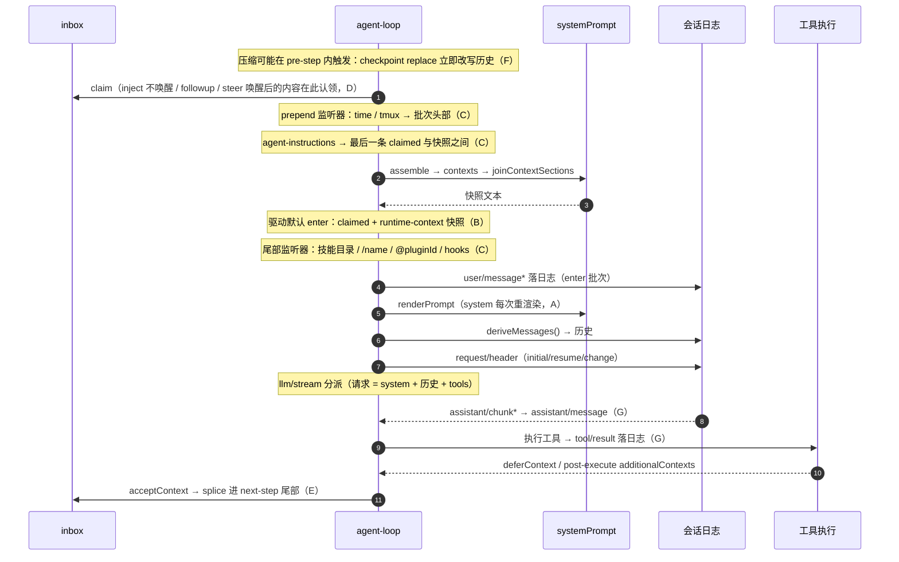

# 12 —— 上下文组织核心策略（按业务类别的插入时机与插入方式）

本页把「什么内容、以什么方式、在什么时刻进入模型上下文」按**业务类别**逐项展开，是整套研究文档的策略视图。机制层面的交叉索引见 [11-change-and-insertion-timing.md](11-change-and-insertion-timing.md)，逐项内容与原文见 [context-inventory.md](context-inventory.md) 与 [prompts/](prompts/)。

一条总纲贯穿全部条目：**模型上下文只有四条承载面**（`system` 文本、`messages` 历史、`tools` 参数、tool 结果），**每一段内容都必须先落日志、再从日志投影**（模型可见 ⟺ 已记录，[`invariant.ts`](../../../packages/core/agent-loop/src/invariant.ts#L21)）。所以"插入方式"= 产生点（API/事件）+ 落日志形态 + 投影规则，三者不可分割；"插入时机"= 产生点所在的事件边界 + 被认领/被投影的 step 边界。

## 按业务类别的插入矩阵

### A. system 文本：注册段落（部署策略与工具指引）

| 业务 | 插入方式 | 插入时机 | 位置 | 更新/去重语义 | 策略意图 |
|---|---|---|---|---|---|
| harness 身份段、源码位置段、Web 面段（order -100/-99/-98） | `systemPrompt.section()` 注册（构造期/引导期/服务注入期）→ `assemble` 排序 → `renderPrompt` 插值 | 注册变化从下一次 `assemble` 起生效；每 step 重渲染一次 | `system` 字段（wire `messages[0]`） | 静态文本；`includeHarnessIdentity` 关闭即不注册 | 部署身份，恒定 |
| 部署人设 `deployment:persona`（order 0） | `config.persona` 构造期注册；preset/子代理以同名段遮蔽 | 遮蔽层变化从下一次 `assemble` 起生效 | `system` 字段 | 同名遮蔽=替换而非重复；可含 `{{variable}}` | 部署级行为契约，每会话稳定 |
| 策略与工具指引段（`plan:policy` order 50、`tools:code-only` 99、`tool:*` 100–116.5、`tools:sdk` 150、structured output 190、UI 交付物段 190） | 各插件激活时 `ctx.systemPrompt.section()`（全局或 agent 作用域层） | 插件挂载/卸载即变化，下一次 `assemble` 生效 | `system` 字段 | 同层重名抛错；作用域同名遮蔽 | 工具使用方法说明跟工具走，不硬编码进循环 |

### B. 会话内可变事实：runtime-context 快照（`systemPrompt.context`）

| 业务 | 插入方式 | 插入时机 | 位置 | 更新/去重语义 | 策略意图 |
|---|---|---|---|---|---|
| `sandbox:policy` / `approval:policy` / `subagent:delegation`（order 110/115/120） | `systemPrompt.context()` 注册 → `renderContextSections` + `joinContextSections` → `RuntimeContextProjection.project()` → `user/message`（source `plugin`，`form: 'snapshot'`） | 每次 `preStep` 求值并投影 | claimed 之后（驱动默认 enter 尾部） | 文本不变不插；清空发 `CLEARED`；被压缩替换移除后重建 | 会随会话变化的"事实"进 durable 历史、不进 system，快照前缀声明 supersede 旧快照 |

### C. 每步注入：`agent/pre-step` 监听器

| 业务 | 插入方式 | 插入时机 | 位置 | 更新/去重语义 | 策略意图 |
|---|---|---|---|---|---|
| workspace 指令（AGENTS.md） | pre-step 普通监听器 `compose` 后 `toSpliced` 插入 enter 批次；source `agent-instructions` | 每次 `preStep`；内容与当前批次一致则不插（`sameContextPayload`） | 最后一条 claimed 之后、快照之前 | 文件变化按 set/merge/remove 增量 reconcile 替换旧帧；未决时留在 inbox | 背景规则先于直接提示、后于快照，稳定在批次中段 |
| 时间读数 | pre-step **prepend** 监听器；source `plugin` | 每次 `preStep`，文本变化且过刷新间隔才插 | 批次头部 | 文本不变不插 | 轻量环境事实，最靠外 |
| tmux 位置读数 | pre-step **prepend** 监听器；source `plugin`（`form: 'snapshot'`） | 每 turn 首个 step，状态块变化且过 `refreshIntervalMs` 才插 | 批次头部 | 稳定状态块 diff 去重（不含 turn 序言） | 同上；查询失败静默不插 |
| 技能目录 `<available_skills>` | pre-step 普通监听器追加/替换；source `skill-catalog` | 每次 `preStep`；仅当 agent 可见本插件的 `skill` 工具精确定义 | 批次尾部 | sha256 摘要不变不插；变化则以新帧**替换**旧目录消息 | 目录只给名字+摘要，正文必须经工具加载 |
| `/name` 手势技能指令 `<skill_content>` | pre-step 普通监听器追加；source `skill-invocation` | 每次 `preStep`；仅扫描 `source.kind === 'user'` 消息 | 批次尾部（目录之后） | 每个手势技能一条 | 用户显式调用是正文进入的唯一免工具路径 |
| `@pluginId` 引用上下文 | pre-step 普通监听器追加；source `plugin`（`form: 'instructions'`） | 每次 `preStep`；消息含 `@pluginId` 令牌时 | 批次尾部 | 每令牌一条 | 引用即注入、不预装 |
| hooks UserPromptSubmit additionalContext | pre-step 普通监听器追加 | hook 返回非空时 | 批次尾部 | hook 决定 | 外部钩子对提示的附加 |
| 目标轮准入（goal-round-driver） | pre-step 普通监听器**校验**：非当前活目标的 goal 消息 `reject` 并回退 inbox | 每次 `preStep` | —（不是插入） | 预留轮次身份（goalId/revision/round）完全匹配才放行 | 防伪造自动续轮 |

### D. inbox 队列：插件推送、循环认领

| 业务 | 插入方式 | 插入时机 | 位置 | 更新/去重语义 | 策略意图 |
|---|---|---|---|---|---|
| 批准策略切换通知、计划模式叙述、任务完成通知、子代理 quiet 回传、hooks Session/SubagentStart、Cordis 运行结果 | `agent.inject()` → next-step 队列，**不唤醒** | 事件边界 push；下一次认领进入批次、落日志 | claimed 批次内 | 无去重，每条独立 | 背景通知不打断当前回合 |
| 目标续轮提示 `<goal_round>`、子代理 wakeup 回传 | `agent.followup()` → next-turn 队列，**唤醒** | 事件边界 push；立即开新 turn | claimed 批次内 | 目标轮带预留身份 | 需要模型立刻处理 |
| 子代理运行中回传、hooks Stop 转向、`/plan` 参数、宿主 API 输入 | `agent.steer()` → next-step 队列，**唤醒** | 事件边界 push；当前 step 边界后认领 | claimed 批次内 | 无去重 | 运行中插话，等当前 step 收口 |

### E. 工具执行伴随：deferContext / post-execute additionalContexts

| 业务 | 插入方式 | 插入时机 | 位置 | 更新/去重语义 | 策略意图 |
|---|---|---|---|---|---|
| 目标收尾指令 `<goal_complete>/<goal_blocked>`、嵌套图片内容块 | `exec.deferContext()` → 工具结果提交时经 `acceptContext` splice 进 next-step inbox 尾部 → 落日志 | 工具最终结果抵达循环时；下一次认领进入批次 | 该步工具结果之后 | 工具失败/取消也送达 | 与结果分离的伴随指令/载荷，不污染工具结果 content |
| 重复调用提醒、hooks PostToolUse additionalContexts | `tools/post-execute` 决策 `additionalContexts` → 同一 acceptContext 路径 | 同上 | 同上 | 每阈值/每次 hook 各一条 | 对结果的响应性注入 |

### F. 历史改写：压缩检查点（surface replace）

| 业务 | 插入方式 | 插入时机 | 位置 | 更新/去重语义 | 策略意图 |
|---|---|---|---|---|---|
| 压缩摘要检查点（`CHECKPOINT_PREAMBLE` + `<compacted-summary>` + 摘要 + `</compacted-summary>`） | `user/message` + `surfaceOp: { op: 'replace', sourceEventSeqs }`；帧固定、摘要由模型生成 | `compactIfNeeded` 在 `agent/pre-step` 触发；触发步的 `deriveMessages()` 即看到 | 替换被遮蔽区间，位于保留尾部之前 | 日志 append-only，投影 splice 掉被遮蔽 seq（`replaceGeneration` 失效缓存） | 用一条消息替换一段历史，而非改写 system |

### G. 业务载荷本身：模型流与工具结果

| 业务 | 插入方式 | 插入时机 | 位置 | 更新/去重语义 | 策略意图 |
|---|---|---|---|---|---|
| assistant 回复 | 流逐 chunk `assistant/chunk` 落日志，结束组装 `assistant/message`（含 `sourceEventSeqs`） | 流消费中/流结束 | 历史主干 | 空 content 不投影 | 回放保真 + 历史主干 |
| 工具调用与结果 | `tool/call` + `tool/result`（`surfaceOp: 'append'`） | 执行前/执行后按模型顺序提交 | 历史主干（assistant 之后） | spill-policy 可在 post-execute 裁剪 content | 结果即上下文 |

### H. 辅助模型调用（不进历史）

| 业务 | 插入方式 | 插入时机 | 位置 | 策略意图 |
|---|---|---|---|---|
| 会话标题生成、压缩摘要生成、DeepSeek 搜索 | 直接 `ctx.llm.stream()`（`purpose` 区分），请求事实落 log-only 事件（`session/title-llm-request`、`compaction/*`、`web/deepseek-search-llm-request`） | 各自事件边界 | 不进任何会话历史 | 结果只作标题/摘要/搜索产物，不构成对话上下文 |

## 插入点全景（一个 step 时间线）

## 核心策略五条

1. **system 装稳定、历史装变化**：部署身份、人设、工具指引进 system（每步重渲染、变化即换 `request/header` 纪元）；一切会话内可变事实（策略、环境、注入、摘要）走 `user/message` 进历史——历史可重建、可去重、可 supersede，system 只能整段替换。
2. **插入即落日志，投影即上下文**：没有任何"旁路"把内容直接塞进请求；所有产生点最终收敛到 `session.append('user/message', …)` 或 `request/header`，`deriveMessages()` 是唯一入口。
3. **三个"延迟到下一步"的缓冲**：inbox 队列（插件显式 push，分不唤醒/唤醒两档）、工具伴随缓冲（deferContext/additionalContexts，随结果提交进 next-step）、压缩替换（改写已落日志的投影，不经过 inbox）。
4. **批次内位置是设计契约**：prepend 头部（time/tmux）→ claimed → workspace 规则 → 快照 → 尾部（目录/手势/引用/hook），靠监听器注册顺序与 `{ prepend: true }` 决定；`dsh-agent-instructions` 的插入点注释与 tool-skill 的注册顺序注释把这条契约写死在源码里。
5. **一切变化在 step 边界生效**：注册、遮蔽、变量、注入、压缩都在下一个 `preStep` 才被请求看到；一个 step 内 system 文本与请求配置冻结，保证"该步模型看到的就是该步日志记录的那份"。

## 相关文件

- 机制与时间线：[11-change-and-insertion-timing.md](11-change-and-insertion-timing.md)
- 全量清单：[context-inventory.md](context-inventory.md)
- 每步拼装主线：[02-step-and-request-construction.md](02-step-and-request-construction.md)
- 注册表：[01-system-prompt-registry.md](01-system-prompt-registry.md)
