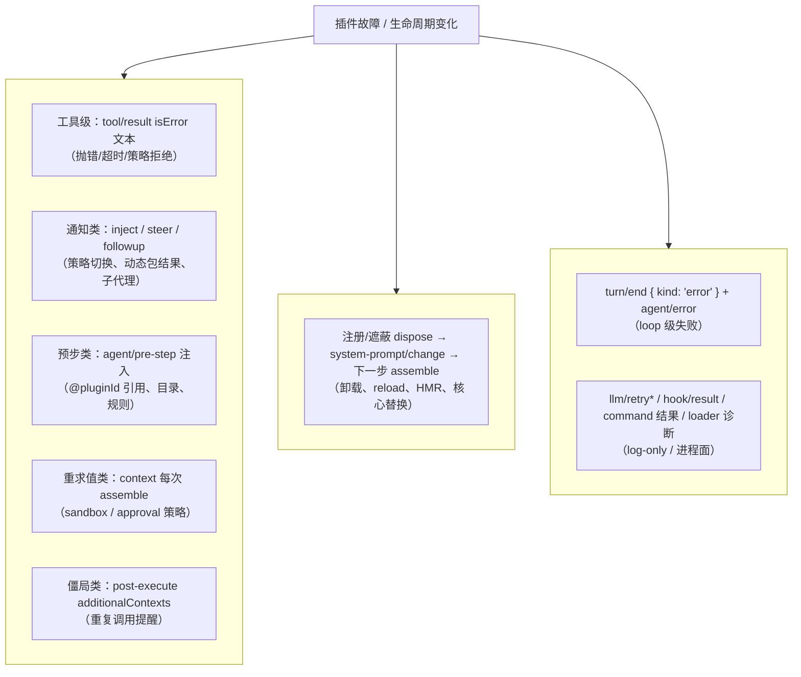

# 13 —— 插件故障与生命周期变化如何进入模型上下文

本页排查「插件出问题 / 插件生命周期变化（含核心的，如替换 agent loop）」时，模型上下文中**曝不曝光、以什么机制曝光、在哪里有指导**。结论先行：

- 模型知情只有两条通道：**历史消息**（tool 结果错误、注入通知）与**隐式重组装**（下一步 system/tools 的差异，模型只能推断）。
- **核心故障（loop 级）不生成任何模型消息**：走 `agent/error`（live）+ `turn/end { kind: 'error', error }`（durable），消费者是人类界面与遥测。
- **能力级故障对模型直接曝光**：工具抛错/超时/被策略拒绝都以 `tool/result` 的 `isError` 文本进入历史。
- **生命周期变化默认隐式**：注册随插件卸载 dispose → `system-prompt/change`（无生产监听者）→ 下一次 `assemble` 生效。只有动态插件（cordis 家族）、策略切换、循环僵局有显式的模型通知机制。

## 排查矩阵

| # | 故障/变化 | 示例 | 模型是否知情 | 机制 | 落点 |
|---|---|---|---|---|---|
| 1 | 工具执行失败 | 工具抛错、沙箱拒绝、参数校验失败 | **是** | 错误按失败形态提交 `tool/result`（`isError` + `content` 错误文本），`deriveEventMessage` 投影进历史 | `messages` 历史（tool 结果） |
| 2 | 工具超时 | `guard/timeout-policy` | **是** | `tools/execute` 包装器替换结果为 `content: "Error: tool call timed out after {n}ms"`（[`index.ts`](../../../packages/guard/timeout-policy/src/index.ts#L41)），错误码 `TOOL_TIMEOUT` 供重试/沙箱路由 | `messages` 历史（tool 结果） |
| 3 | 调度前中止 | `session-checkpoint-policy` 持久化失败 fail-closed | **是** | 合成结果 `"Error: tool call aborted before dispatch"`（[`index.ts`](../../../packages/session/session-checkpoint-policy/src/index.ts#L41)） | `messages` 历史（tool 结果） |
| 4 | 请求失败与重试 | `llm-retry`、provider 错误 | 部分 | `agent/request-error` 瀑布决定重试；`llm/retry`、`llm/retry-started` 是 **log-only** 事件（[`index.ts`](../../../packages/llm/llm-retry/src/index.ts#L150)）；重试请求内容与原请求相同 | log-only 事件；重试成功后模型无感 |
| 5 | 回合级失败（核心故障） | agent loop 插件抛错、invariant 违反、checkpoint 失败 | **否**（无解释消息） | 结构化失败写入 `turn/end { kind: 'error', error }`（LlmError 事实或 `UNKNOWN` 扁平化，[`agent.ts`](../../../packages/core/agent-loop/src/agent.ts#L309)），并发 `agent/error` live 事件（[`agent.ts`](../../../packages/core/agent-loop/src/agent.ts#L203)）；消费方是 telemetry/UI/goal-driver | `turn/end` + `agent/error`（人类/遥测面） |
| 6 | 插件卸载 / reload / HMR（注册变化） | 任一注册 section/tool/context 的插件 | **隐式** | dispose 注销注册 → `system-prompt/change`（[`index.ts`](../../../packages/core/system-prompt/src/index.ts#L349)，仓库内无生产监听者）→ 下一次 `assemble` 反映差异 | 下一步 system/tools 的差异（无说明） |
| 7 | 核心替换（agent loop / preset 组合） | preset 挂不同 loop、`complete` 段 | **隐式** | 组合层变化 → 下一步组装生效；新组合靠自己的 persona/complete 段自带说明（见 [07-persona-presets-and-skills.md](07-persona-presets-and-skills.md)） | 下一步 system/tools 的差异 |
| 8 | 动态插件被引用 | `@pluginId` 提及（tool-cordis） | **是（显式）** | `agent/pre-step` 注入 `<cordis_dynamic_plugin_context>`：插件状态 JSON + 操作指令（[`index.ts`](../../../packages/extensions/tool-cordis/src/index.ts#L508)）；**不可用**时注入明确指引——"可能已被移除/属于其他会话/进程重启丢失，告知用户，不要伪造更新"（[`index.ts`](../../../packages/extensions/tool-cordis/src/index.ts#L522)） | pre-step 注入 user 消息 |
| 9 | 动态包运行结果 | `cordis-host-runner` / `cordis-client-runner` | **是（显式）** | 运行结束把结果 `agent.steer/inject(createUserMessage(...))`（[`index.ts`](../../../packages/extensions/cordis-host-runner/src/index.ts#L1043)、[`index.ts`](../../../packages/extensions/cordis-host-runner/src/index.ts#L1153)） | inbox → user 消息 |
| 10 | 动态插件状态查询 | `cordis_inspect_self` 等工具 | **按需** | 工具结果返回插件摘要、`latestRun`、状态机（defined/awaiting-approval/client-pending/stopped/running/waiting/failed，[`index.ts`](../../../packages/extensions/tool-cordis/src/index.ts#L416)） | tool 结果 |
| 11 | 策略变化 | approval 策略切换；sandbox 模式变化 | **是（显式）** | `setPolicy` 注入通知 `The approval policy changed from "X" to "Y" (changed by the user).`（[`index.ts`](../../../packages/interaction/user-approval/src/index.ts#L230)）；sandbox/approval context 每次 `assemble` 重求值 → 快照自动更新 | inject user 消息 / runtime-context 快照 |
| 12 | 循环僵局 | 同参数重复工具调用 | **是（显式）** | `repeat-tool-reminder` 经 post-execute `additionalContexts` 注入 gentle/detailed 提醒（[`index.ts`](../../../packages/guard/repeat-tool-reminder/src/index.ts#L213)，原文见 [prompts/repeat-tool-reminder.md](prompts/repeat-tool-reminder.md)） | 工具结果之后的 user 消息 |
| 13 | 人类命令失败 | `/compact` 错误、`/feedback` | **否** | 命令结果是 human-only 文本；`command/run`/`command/done`、`feedback/record` 均为 log-only、明确不进模型表面（[command-feedback README](../../../packages/feedback/command-feedback/README.md)） | log-only |
| 14 | hooks 结果 | hook 回调输出 | **否** | `hook/invoked` / `hook/result` 是 log-only 会话事件（见 [09-injection-paths-subagents-and-hooks.md](09-injection-paths-subagents-and-hooks.md)） | log-only |
| 15 | 加载期误配置 | 非法 Config、重复段名 | **否（进程面）** | 加载即抛错（fail loud），诊断进 loader/日志，不进任何会话 | 进程/UI 面 |

## 三条曝光通道（机制总结）

核心与非核心的差异不在"是否曝光"，而在**曝光面**：loop 级故障（核心）只进人类/遥测面，模型下回合从零开始、得不到解释；能力级故障（非核心）走 `tool/result` 错误文本，模型第一手知情；注册/组合变化（含核心替换）靠模型从 system/tools 差异中推断；只有动态插件家族和策略切换有专门设计的显式通知。

## 指导在哪里

**运行期指导（模型实际读到的）**：`tool:*` 工具指引段（随工具激活注册进 system，[07-persona-presets-and-skills.md](07-persona-presets-and-skills.md) 的注册点清单）、技能目录帧（[prompts/skill-catalog.md](prompts/skill-catalog.md)）、`@pluginId` 上下文指令（含"不可用时如实告知用户"）、超时/中止错误文本、approval/sandbox 策略快照、重复调用提醒。

**设计指导（开发者写新插件时）**：

- [docs/architecture.md](../../architecture.md)：扩展点表与「Where new behavior goes」——新行为挂文档化扩展点，改 loop 本身要更新架构图；「Plugins, not loop changes」是换核心组件的纪律。
- [docs/AGENTS.md](../../AGENTS.md) 与根 AGENTS.md：「误配置 fail loud」「注册是 effects」「运行时不变式断言所有关系」——包级 invariant 伴生注册到 `ctx.invariants`，违反抛 `InvariantError`（[invariants README](../../../packages/runtime-diagnostics/invariants/README.md)），失败于操作面而非产模型文本。
- [docs/cookbook/adding-a-package.md](../../cookbook/adding-a-package.md) 第 4 步「Model Experience」：每个能力必须在 package README 写明模型可见体验——这是"某插件对模型的曝光"的契约文档位置。
- 各 package README 的边界声明是权威样例：`command-feedback` 明确"不进模型表面"、`guard/timeout-policy` 明确替换语义与错误码、`tools` README 明确 `additionalContexts` 的处理顺序。

**可复用的通知模板**（新插件要把自己的状态变化告诉模型时，按此三选一）：inject 通知（`user-approval` 的"changed from X to Y"模板）、pre-step 注入（`tool-cordis` 的 `<cordis_dynamic_plugin_context>` 模板）、context 重求值（`sandbox-policy` / `user-approval` 的每次 assemble 求值模板）。

## 动态插件（cordis 家族）的生效/失败通知通道

动态插件生命周期（define → run → 运行中 → 结算）有四条模型可见通道，全部 source 为 `{ kind: 'plugin', plugin: 'cordis-host-runner' }` 的 user 消息（经认领落 `user/message`，满足模型可见 ⟺ 已记录）：

1. **同步工具结果（模型主动发起时）**：`cordis_define` 返回新 packageId；`cordis_run` 返回即时状态——`awaiting-approval`（待审批）/ `starting`（异步启动中）/ `running`（附 host 状态 absent/running/waiting，[`tool-cordis`](../../../packages/extensions/tool-cordis/src/index.ts#L241)）；`cordis_inspect_self/list/query` 返回状态机（defined/awaiting-approval/client-pending/stopped/running/waiting/failed）与 `latestRun` 诊断。工具描述明确告诉模型："异步的成功/拒绝/技术失败经 state 与 steering 报告，工具结果不等最终结局"。
2. **激活结算通知（异步，`agent.steer` 唤醒）**：成功 → `Cordis <mode> <id> completed successfully. currentPackageId is X. Continue using the running Plugin.`；用户拒绝 → `The user rejected Cordis <mode> <id>. Do not request the same activation again unless the user asks.`；技术失败 → `Cordis <mode> <id> failed after cordis_run returned <awaiting-approval|starting>: <reason>
 currentPackageId/nextPackageId ... Inspect the failed Package, correct it on the same Plugin when needed, and retry the activation autonomously.`（[`cordis-host-runner`](../../../packages/extensions/cordis-host-runner/src/index.ts#L1030)）。用户手动运行的结算走 `agent.inject`（不唤醒），成功/失败文本含 current/next packageId（[`index.ts`](../../../packages/extensions/cordis-host-runner/src/index.ts#L1129)）。
3. **运行时失败通知（异步，steer，逐错误去重）**：Client UI Slot 渲染失败、Host handler（`host.call`）失败、Host/Client guard 拒绝运行时代码——三类文本都带 "The Plugin remains running. Inspect this Package, ... activate the new Package autonomously with cordis_run mode:'update'" 指引；`claimRuntimeFailure` 按 run + 错误消息键去重，只在 run 处于 running/waiting 时上报（[`index.ts`](../../../packages/extensions/cordis-host-runner/src/index.ts#L1095)）。
4. **`@pluginId` 引用注入（被动）**：消息提及 `@pluginId` → pre-step 注入 `<cordis_dynamic_plugin_context>`（状态 JSON + 操作指令）；插件不可用 → "removed / another Session / lost when the DSH process restarted，如实告知用户、不要伪造"（[`tool-cordis`](../../../packages/extensions/tool-cordis/src/index.ts#L508)、[`index.ts`](../../../packages/extensions/tool-cordis/src/index.ts#L522)）。

运行时抛错按位置分五档：激活期抛错 → 半成品 fiber 被 dispose（[`lifecycle.ts`](../../../packages/extensions/cordis-host-runner/src/lifecycle.ts#L22)）、结算通知 steer 给模型；激活后 guard 拒绝 / `host.call` 失败 → steer 给模型（per-run 去重）；动态插件注册的工具抛错 → 通用工具管线 `tool/result` isError，模型直接看到；动态插件自己的**异步监听器 rejection** → Cordis `emit` 不 await（[`events.ts`](../../../vendor/cordis/src/events.ts#L194)）→ 成为 unhandledRejection → `installFailLoud` 致命退出进程（[`app-boot`](../../../packages/boot/app-boot/src/index.ts)）——这是唯一"模型不知情"的档位，之后靠进程级崩溃修复（interrupted tool results）间接补口；同步监听器抛错沿瀑布上抛 → 调用方（loop）回合失败，模型无解释消息。

注意动态插件是**进程内资产**：进程重启即丢失（`@pluginId` 的不可用指引覆盖此情形），且没有专属 durable 事件——生命周期事实经上述 user 消息落日志，查询事实经 inspect 工具结果进入历史。

## 自检空白与可选做法

仓库内**没有自动自检机制**：`system-prompt/change` 无生产监听者、插件重载不产生模型通知（已核实，全仓库无 self-check/health-check 类代码）。因此现状是：更新插件后模型不知情，要么人工说一句让它查，要么等它下次调用相关工具时撞上错误才发现。模型手里现有的"自检零件"：

1. `cordis_inspect_self` / `cordis_inspect_list` / `cordis_inspect_query` —— 按需查询插件列表、状态机（running/failed/awaiting-approval…）、`latestRun`（[`tool-cordis`](../../../packages/extensions/tool-cordis/src/index.ts)）。
2. `@pluginId` 引用 —— 提到插件名，上下文自动注入其状态 JSON 与指引。
3. 下一次请求的 tools schema / system 文本 —— 模型自己就能看到"少了什么"。
4. 工具调用失败 —— `tool/result` 错误文本第一手到达模型。

把"手动检查"变成"自动检查"缺的只是**重启后推一下**，机制全部现成：hooks 桥可在 `SessionStart` 注入自检指令（需自行配置 hook）；或写一个监听 fiber 状态事件（`internal/status`）/ `system-prompt/change` 的插件，在重载完成后 `agent.inject()` 一条"以下插件刚重启，请自检"消息——即 [13 文档](13-plugin-failure-and-lifecycle-exposure.md) 总结的 inject 通知模板。

## Agent 视角：插件自管理的上下文完整度评估

以"agent 要自己查、改、管插件"为标准，把上下文信息完整度分成动态插件（cordis 家族）与静态插件（cordis.yml 树）两面：

**动态插件——闭环完整，约 8/10**。查：`cordis_inspect_list/query/self` + `cordis_runtime_inspect`（服务/事件/工具 schema/运行时清单）+ `@pluginId` 引用注入（状态 JSON）+ inspect 返回的状态机（defined/awaiting-approval/client-pending/stopped/running/waiting/failed）与 `latestRun` 诊断。改：`cordis_define` 以 immutable Package 追加。管：`cordis_run/stop/undefine` + 审批状态机 + 四条通知通道（同步工具结果 / 激活结算 steer / 运行时失败 steer（guard、host.call、Client render，带修复指令）/ 用户手动运行 inject）。每个动词的结果都回到上下文，失败带"怎么修"的指令。扣分项：动态包不跨进程重启存续（仅 `@pluginId` 不可用指引覆盖）；异步监听器 rejection 经 fail-loud 杀进程、无预警；运行中的包可影响同进程其他会话（README 明示）。

**静态插件——盲操作面，约 3/10**。查：只能经 fs 工具读 cordis.yml/bundle patch/源码（可能过时），无实时插件树、fiber 状态、加载错误、section/tool 来源的查询工具；`dsh --dump-config` 可经 shell 工具取进程外快照。改：fs 工具改配置文件/源码，HMR 拾取配置变更（fiber 级自动回滚）但**成功/失败都不通知模型**。管：无生命周期动词；需进程重启的变更没有安全通道——起不来 = fail-loud 停机，agent 自己救不了（进程已死）。三个结构缺口：① 实时树查询工具（把 `internal/status` + loader entries + fiber 态暴露为 inspect 工具）；② 变更反馈注入（`hmr/config-update-failed`、`system-prompt/change` → 用 inject 通知模板转给模型）；③ 受控重启通道（进程级 last-known-good 或外部看门狗，agent 可请求重启并拿回结果）。

结论：动态插件为"模型是操作者"设计了完整闭环；静态插件仍假设"人类是操作者"——agent 能改文件，但看不见效果、收不到反馈、无法安全重启。

信息源分两层，repo 为两层都铺好了：**运行时接口面**（"别的插件有什么接口"）由 cordis 工具回答——`cordis_inspect_*` 暴露服务公开方法签名+契约、事件 mode+监听器契约、工具 schema、Builtin、槽位树、继承的 ctx API；该目录由 `scripts/gen-cordis-api.ts` 从源码 AST 生成（[`api-catalog.ts`](../../../packages/extensions/tool-cordis/src/api-catalog.ts#L1)），与 docs/cordis-catalog 同源、不会漂移。**编写规范面**（"怎么写好的插件"）由 repo 文档+源码回答——architecture 扩展点表、cookbook（adding-a-package/tool/llm-adapter）、AGENTS.md 约定、package README 契约、Agent Notes、module-graph/event-producer-consumer 目录，全部经 fs/grep/shell 可达，且 `harness:source` 段把源码 checkout 路径写进 system prompt（[`app-boot`](../../../packages/boot/app-boot/src/index.ts#L805)）、AGENTS.md 常驻上下文。动态包的可用 API 被刻意收窄成词汇表（受限 ctx + `harness.handle/defineTool/registerTool` + 陷阱转接 fs/web/bash，[`sandbox.ts`](../../../packages/extensions/cordis-host-runner/src/sandbox.ts#L17)），签名经 `cordis_runtime_inspect` 可查；超出词汇的能力必须走常规插件开发流程。边界：inspect 暴露签名+契约而非实现逻辑（实现细节仍需读源码）；只能查当前进程的运行时状态（历史配置看文件）。

发行版对接的信息源分层（对接方视角）：① 运行中的 `cordis_inspect` 查**这一台部署实际组合出的接口**（profile/bundle/patch 组合不同，暴露面不同，可能含第三方插件）；② 机制文档随发布物自带，不需要 GitHub——docs 网站（architecture/subystems/cordis-catalog/tool-catalog 等，AST 同源、freshness-gated）、npm 包自带 README（每包契约：config/语义/限制/扩展点/Model Experience）、`lib/*.d.ts` 类型声明（精确到发布版本）；③ 内部逻辑的权威是源码：文档按仓库规范只写契约与理由、不写实现流，实现细节只有两份可读形态——npm 包里的 bundled runtime（`lib/*.js`，tsc 产物经 tsdown 打包，**未压缩、es2024 目标、标识符未混淆、注释大多保留**，[`tsdown.config.ts`](../../../tsdown.config.ts)，可直接阅读；版本钉死、随包发布）与 GitHub 对应 release tag 的 TS 源码（可读、含测试与 Agent Notes，必须钉 tag 而非 main）。inspect 目录的条目明确是"signature with its body stripped"。测试、Agent Notes、生成器脚本只存在于 repo，不随 npm 发布。

两类任务对材料的要求不同：**对接/扩展**（写使用服务的插件）契约层够用——README + `.d.ts` + docs 就是为它设计的；**重写核心实现**（agent-loop、session、system-prompt 等）必须以原始实现为准——行为细节（边界事件顺序、不变式、inbox 语义、瀑布顺序）只存在于实现与测试里，契约层不足以保证最小破坏，可验证的素材集 = GitHub release tag 的**源码 + 测试 + Agent Notes**，node_modules bundle 只是版本钉死的降级副本（缺测试、缺 Notes、无模块边界）。

## 总结：三类需求 × 三层材料

1. **改核心实现（loop/session/system-prompt 等）**：可替换，但风险极高——风险的具体形态不是"起不来"，而是"跑得通但业务跑偏"：边界事件顺序、投影规则、去重语义、不变式都是行为契约的一部分，只在实现与测试里。必须带 GitHub release tag 的**源码 + 测试 + Agent Notes** 完整看，验证靠 repo 的测试套件/快照/invariant，而不是"能跑"。
2. **简单 hook / 增补 / 边角替换**：很方便，因为所需理解面小——扩展点（瀑布、section/context/tool 注册、inject 通知模板）把契约收窄到"这一个点"。唯一需要记住的硬约束：新增**模型可见输入**必须落日志（模型可见 ⟺ 已记录），不能绕过 `user/message`/`tool/result` 直塞请求。
3. **需求涉及其他模块的内部机制或整体时序**：必须带源码完整看——文档刻意不写实现流，`cordis_inspect` 给的是"body stripped"的签名契约，两者都回答不了"什么时候、按什么顺序、为什么"。

## 相关文件

- 插入时机总表：[12-context-organization-strategy.md](12-context-organization-strategy.md)
- 全量清单：[context-inventory.md](context-inventory.md)
- 注入路径细节：[09-injection-paths-subagents-and-hooks.md](09-injection-paths-subagents-and-hooks.md)
