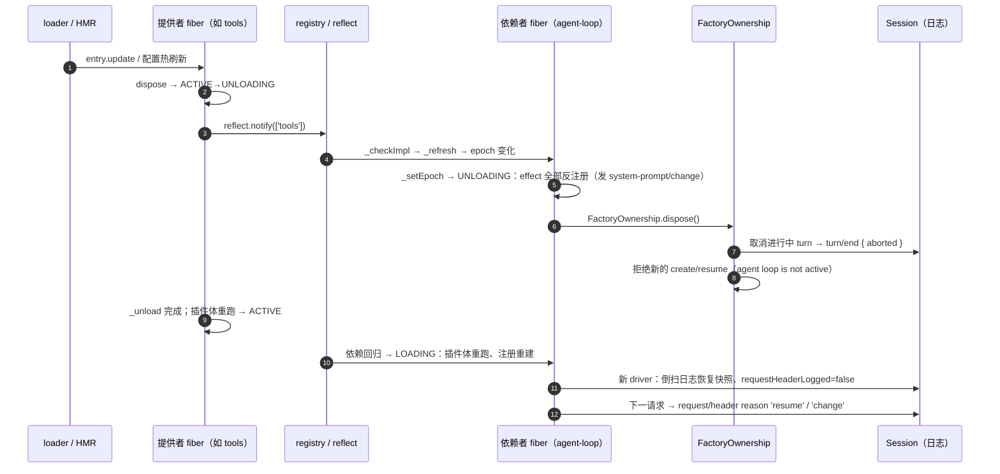

# 14 —— Cordis 依赖级联重启与 agent loop / 上下文管理的关联

本页回答：插件卸载/reload/HMR 时，Cordis 如何让**所有关联插件**随之重启，这条级联链与 agent loop 的存活、以及模型上下文（注册/日志/请求）如何衔接。故障曝光面见 [13-plugin-failure-and-lifecycle-exposure.md](13-plugin-failure-and-lifecycle-exposure.md)。

## 一、Cordis 的级联机制：fiber epoch

每个插件是一个 fiber，`inject` 声明它依赖的服务。级联不是显式的依赖图遍历，而是**epoch 字符串比较**：

1. fiber 把每个注入服务解析为提供者实现 `impl`，其 epoch = 各 `impl.fiber.uid` 的拼接（[`fiber.ts`](../../../vendor/cordis/src/fiber.ts#L611)）。uid 是该提供者 fiber 的代数：**每次重启换新 uid**。
2. 提供者 fiber 在 ACTIVE ↔ 非 ACTIVE 状态迁移时，对自己提供的每个服务调用 `reflect.notify`（[`fiber.ts`](../../../vendor/cordis/src/fiber.ts#L581)）。
3. 依赖者 fiber 收到通知后 `_checkImpl` 重新解析（[`fiber.ts`](../../../vendor/cordis/src/fiber.ts#L597)），再 `_refresh` 重算 epoch；epoch 变化 → `_setEpoch`：
   - 失去依赖（提供者卸载中）：**UNLOADING** —— 该 fiber 的全部 effect 逐个反注册（[`fiber.ts`](../../../vendor/cordis/src/fiber.ts#L675)），然后 PENDING；
   - 依赖回归（提供者重载完成）：**LOADING** —— 插件体**重新执行一遍**，所有注册重建（[`fiber.ts`](../../../vendor/cordis/src/fiber.ts#L646)）。
4. 级联传递：依赖者本身是它自己依赖者的提供者，它的重启再触发下一层。**epoch 未变的 fiber 不受影响**——"关联"严格等于"注入链可达"。
5. 触发入口：`loader` 的 entry update——仅 config 键变化走 patch，`name`/`inject`/`group` 变化则整条目 dispose + 重 start（[`entry.ts`](../../../vendor/loader/src/config/entry.ts#L141)）；HMR 与配置文件监听都汇到这条 update 路径（[`hmr/index.ts`](../../../vendor/hmr/src/index.ts#L24)）。

## 二、agent-loop 是级联链上的下游节点

`ReactLoopAgent` 的插件 `inject = ['agents', 'sessions', 'llm', 'tools', 'systemPrompt']`（[`index.ts`](../../../packages/core/agent-loop/src/index.ts#L297)）。因此：

- **这五个提供者任一重启 → loop fiber 跟着 unload + reload**。其中 `tools` 与 `systemPrompt` 正是上下文组装的两个核心服务——它们的重启（如配置更新、源码 HMR）会把 agent loop 整条链拉下去再拉起来。
- **能力插件（如 tool-fs、tool-web）重启不会拉起 loop**：它们只注入 `tools`，它们重启只影响自己注册进注册表的条目；`tools` 服务 fiber 不动，loop 的 epoch 不变。
- preset 内服务行使用 `isolate` realm（[architecture.md](../../architecture.md) 的「Give one session a different capability set」）——同一服务在 preset 作用域内独立实例，其重启级联被限制在该 realm 内，不跨出到其他 agent。

## 三、loop 卸载瞬间对会话与上下文做什么

loop fiber 进入 UNLOADING 时，`FactoryOwnership.dispose()` 依次（[`index.ts`](../../../packages/core/agent-loop/src/index.ts#L81)）：

1. `accepting = false`，此后任何 `agents.create/resume` 直接以 `agent loop is not active` 拒绝。
2. `teardown.abort(...)`：正在进行的创建/恢复被中止。
3. await 全部活 agent 的 dispose：**进行中的 turn 被取消**，落 `turn/end { kind: 'aborted' }`；agent 从 `ctx.agents` 注销。取消走 `machine.cancel({ kind: 'disposed' })`，默认 `keepInbox: false` —— **未认领的 inbox 消息被 `inbox.clear()` 清空**（[`agent.ts`](../../../packages/core/agent-loop/src/agent.ts#L143)）：inject 进去但尚未认领的潜在上下文、steer 排队中未进 step 边界的消息都会丢；已认领落日志的内容不受影响。
4. fiber 层 effect 反注册：loop 自己注册的 `{{provider}}/{{model}}/{{cwd}}` 变量、loop 监听器等全部消失；这些反注册与其他层的反注册一样发 `system-prompt/change`。

对模型上下文：重启窗口内**没有任何请求**（运行中的已被取消），所以上下文变化不会被半途截获——模型的下一份上下文要么是重启后重建的完整一致状态，要么根本看不到。

## 四、重载后上下文如何续上

重载 = 插件体重跑一遍，但**会话日志与插件生命周期是正交的**：

1. `ctx.sessions` 里的 Session 对象与 append-only 日志原样保留（若 `sessions` 本身没重启）；`deriveMessages()` 推导的历史**逐字节不变**。
2. 新 driver 重建运行时状态：`RuntimeContextProjection` 倒扫日志恢复"最近快照"（[`agent.ts`](../../../packages/core/agent-loop/src/agent.ts#L96)）；`requestHeaderLogged` 重置为 false → 下一个请求的请求头以 `reason: 'resume'` 重新记录（[`agent.ts`](../../../packages/core/agent-loop/src/agent.ts#L464)）。
3. 注册重建：loop 的变量、各插件的 section/tool/context 按注入顺序重新注册（每层都发 `system-prompt/change`）；preset 绑定与 agent 作用域链重新挂载。
4. 谁被恢复：插件体重跑时会**自动重建配置的 agent**（[`index.ts`](../../../packages/core/agent-loop/src/index.ts#L355)）——带 `resumeSessionId` 的行走恢复（[`index.ts`](../../../packages/core/agent-loop/src/index.ts#L370)），普通行走"从持久化恢复或新建"（[`index.ts`](../../../packages/core/agent-loop/src/index.ts#L357)）；运行中动态创建的 agent 不会被重建，会话保持冷状态等待重开。**重建只做"重新绑定"**：publish 路径把 driver 绑回会话、重发 `agent/session-start`、从日志重建运行时状态（[`index.ts`](../../../packages/core/agent-loop/src/index.ts#L556)），不做任何唤醒——agent 停在 idle，直到外部消息（用户输入 / `followup` / `steer` / goal 续轮等）再推它开跑；被取消的回合已在卸载时收口为 `aborted`，不会自动续跑。
5. 模型的视角：重启后第一个请求的 system/tools 与重启前一致（注册集合没变）→ `request/header` 无新增或仅 `resume`；注册集合变了 → `reason: 'change'`。**级联重启对模型上下文的全部可观察效果，就是下一个请求里的 system/tools 差异**——机制与第 6 条排查结论（[13 文档](13-plugin-failure-and-lifecycle-exposure.md)）完全一致。

## 五、级联时序图

## 六、重启知情的现有设计

重启知情分三层，前两层有完整设计，模型层为空：

**通知层（"有人知道重启发生了"）**：`internal/status`（fiber 状态机事件；生产消费方：Web UI 显示状态，[`boot.tsx`](../../../packages/client/web/src/boot.tsx)；AgentRegistry 在 UNLOADING 时关闭 initiator，[`index.ts`](../../../packages/core/agent/src/index.ts)）、`internal/plugin`、`loader/partial-dispose`（条目更新广播，[`entry.ts`](../../../vendor/loader/src/config/entry.ts#L190)）、`hmr/config-update-failed`、`agent-loop/config-start-failed`（配置型 agent 重启失败）、`system-prompt/change`（注册变化，无模型侧消费者）、`agent/session-start { source: 'startup' | 'resume' | 'clear' | 'compact' }`（**专为重启设计**的恢复来源标记，[`runtime-types.ts`](../../../packages/core/agent/src/runtime-types.ts)）、`turn/end { aborted }` 与 `request/header reason 'resume'`（重启打断回合与请求头恢复的 durable 记录）。

**恢复层（"重启后状态自动正确"，真正面向重启的设计）**：`RuntimeContextProjection` 构造时倒扫日志恢复最近快照（[`agent.ts`](../../../packages/core/agent-loop/src/agent.ts#L96)）；`requestHeaderLogged=false` → 下一请求头记 `resume`；invariant 会话伴生从 durable 事件重建基线（[invariants README](../../../packages/runtime-diagnostics/invariants/README.md)）；`tool-skill` 目录从 durable catalog 消息恢复可见摘要（`catalogHistory`，[`index.ts`](../../../packages/skill/tool-skill/src/index.ts#L361)）；`tmux-context` 扫 durable 事件恢复最近状态（[`index.ts`](../../../packages/context/tmux-context/src/index.ts#L181)）；`goal-round-driver` 监听 `agent/status` idle 重新调度目标续轮（[`index.ts`](../../../packages/goal/goal-round-driver/src/index.ts#L259)）；session 恢复修复中断回合（`interruptedTurnClosers`，[`repair.ts`](../../../packages/core/session/src/repair.ts)）；`session/end-seed` 标记；plan-mode 从日志重述叙述；agent-instructions 经 session projections 重建。

**模型层**：无。没有任何机制把"重启"这一事实本身告诉模型——模型最多从 system/tools 差异推断。要补模型层，现成挂点是 hooks 桥的 `SessionStart`（`source === 'resume'` 即可区分重启恢复）或监听 `internal/status` 后 `agent.inject()` 通知。

**驱动层（重启如何决定 context 内容）**：模型层没有"重启事件"，但 context 层有一套统一的重启知情设计——**所有"要不要注入"的状态都存在会话日志里，重启后每个贡献者先读日志再决定**。形式不是通知，而是各贡献者重启后自问"我上次注入到哪了"：

| 贡献者 | 重启后的注入决策（读日志 → 决定） | 依据 |
|---|---|---|
| runtime-context 快照 | 构造时倒扫日志恢复 `retained` → 文本相同不重注入 | [`agent.ts`](../../../packages/core/agent-loop/src/agent.ts#L96) |
| workspace 指令（AGENTS.md） | 扫 surface 找已有指令帧 → 未变化不重注入；文件变了重注入 | [`state.ts`](../../../packages/context/agent-instructions/src/state.ts#L140)、[`index.ts`](../../../packages/context/agent-instructions/src/index.ts#L52) |
| tmux 读数 | 扫 durable 事件恢复上次注入状态 → 相同不重注入 | [`index.ts`](../../../packages/context/tmux-context/src/index.ts#L181) |
| 时间读数 | 进程时间刷新间隔；重启后首步按间隔/变化判定 | [`index.ts`](../../../packages/context/time-context/src/index.ts) |
| 技能目录 | 扫 durable 目录消息恢复 `visibleDigest` → 相同不重发；集合变了发替换帧 | [`index.ts`](../../../packages/skill/tool-skill/src/index.ts#L361) |
| 批准/沙箱策略 | `effectiveApprovalPolicy(events)` / `effectiveSandboxMode(session.events)` 从 durable 事件折叠 → 快照自动恢复 | [`index.ts`](../../../packages/interaction/user-approval/src/index.ts#L112)、[`index.ts`](../../../packages/sandbox/sandbox-policy/src/index.ts#L150) |
| 计划模式叙述 | `foldPlanMode(events)` 从日志判活 → 活跃且未叙述则在 pre-step 补叙述 | [`index.ts`](../../../packages/plan/plan-mode/src/index.ts#L129) |
| 目标续轮 | 重启后 agent idle 且目标 armed → driver 自动 `followup` 续轮（唯一"自动开跑"） | [`index.ts`](../../../packages/goal/goal-round-driver/src/index.ts#L259) |
| 历史消息与请求头 | 日志原样 → `deriveMessages` 不变；header 恢复 → 下一请求记 `resume` | [`index.ts`](../../../packages/core/session/src/index.ts#L726) |
| 未认领 inbox | **清空**（负向驱动：排队中未落日志的上下文消失） | [`agent.ts`](../../../packages/core/agent-loop/src/agent.ts#L143) |
| 外部 hook 注入 | `agent/session-start { source: 'resume' }` 传给 SessionStart hook → hook 可注入重启相关上下文（唯一的外部"重启→context"通道） | [`hooks-claude-code`](../../../packages/hooks/hooks-claude-code/src/index.ts) |

这套设计的统一原则：**dedup / replace 语义与重启无关**——因为判定依据是日志不是进程内存，重启前后"注入什么、不注入什么"给出一致答案。

## 七、启动失败路径（替换掉的插件起不来）

**入口级：loader 的 update 协议自带回滚**（[`entry.ts`](../../../vendor/loader/src/config/entry.ts#L214)）：

1. **import 失败**（新版本根本加载不到）：报 `import` 错误，**旧版本没被动**，系统维持原状。
2. **dispose 旧版本失败**：配置回滚、报 `dispose`，新版本不启动。
3. **新版本 start 抛错**：**自动回滚**——配置恢复旧值 → 重新启动旧版本 → 依赖级联自动跟着重装 → 向调用方抛 `apply` 错误（HMR 转成 `hmr/config-update-failed`）。旧版本重新上线后，agent-loop 照常自动重载、配置型 agent 自动恢复。
4. **回滚也失败**：抛 `rollback`（AggregateError），**新旧版本都死**，依赖者停在 PENDING 等一个不会回来的服务。

**fiber 级**：插件体重跑抛错 → `_error` 记下、状态转 FAILED、已注册一半的 effects 全部清掉（[`fiber.ts`](../../../vendor/cordis/src/fiber.ts#L646)）；FAILED 非 ACTIVE → 它提供的服务全部消失 → 依赖它的 fiber 卸载并停在 PENDING；`fiber.await()` 把启动错误上抛（[`fiber.ts`](../../../vendor/cordis/src/fiber.ts#L656)）——这正是入口级回滚被触发的机制。

**分情形后果**：

| 情形 | 后果 | 模型上下文 |
|---|---|---|
| 替换 loop 自己、新版本起不来，回滚成功 | 回合在卸载期已收口 `aborted`；旧 loop 重启 → 配置型 agent 自动恢复（`resume`）、动态 agent 会话冷等重开 | 日志原样、下一请求记 `resume`，模型基本无感（只少了一个被取消的回合） |
| 替换 loop 的依赖（如 `systemPrompt`）、新版本起不来 | loop 卸下并 PENDING，期间没有请求可跑；回滚成功后 loop 自动重载 | 冻结期间无新请求；恢复后同上 |
| 回滚失败（新旧都死） | loop 或依赖永久 PENDING，会话冻结（日志完好），等人工修复后再次 update | 无新请求；历史/快照/策略全部由日志重建，不丢 |
| 非核心插件起不来 | 回滚或 FAILED，只影响它注册的 section/tool/context | 恢复前模型看到"少了它"（system/tools 差异），恢复后回来 |

**可见面**：模型始终没有直接通知（最坏情况是"没有新请求"）；人类面有完整信号——UI fiber 状态 FAILED、loader 错误、`agent-loop/config-start-failed`、`hmr/config-update-failed`、`turn/end aborted`。

## 八、进程级重启（非 fiber 重启）

进程重启没有内存里的旧版本可回滚，走的是**启动验收 + 磁盘恢复**：

1. **启动即验收，坏了就起不来**：`boot()` 挂载整棵树后 `await ctx.get('loader')?.await()` + `assertEntriesActivated`（[`app-boot`](../../../packages/boot/app-boot/src/index.ts#L782)）——任一条目非 ACTIVE（含 FAILED）→ 根 fiber dispose → 抛 `plugin tree failed to load`（保留最深层插件原始堆栈，[`app-boot`](../../../packages/boot/app-boot/src/index.ts#L786)）。**没有降级启动、没有回滚**：被替换的 agent-loop 起不来 = 进程拒绝启动，所有会话原样留在磁盘。也没有 last-known-good 配置回退（`cordis.snapshot.yml` 是 `$DSH_SNAPSHOT=replay` 的快照测试机制，[`app-boot`](../../../packages/boot/app-boot/src/index.ts#L61)）——进程级坏配置靠人工改回。开发期应走 HMR 的 fiber 级回滚（第七节）而不是赌进程重启。
2. **成功启动后的恢复**：配置型 agent 经 `restoreOrCreateConfigured` 从持久化恢复（`Session.fromRestore` + 种子校验）；动态会话冷等重开。
3. **崩溃尾巴修复——进程重启唯一"进入 context"的重启知情设计**：`interruptedTurnClosers` 扫描日志，给未收口的回合补口（[`repair.ts`](../../../packages/core/session/src/repair.ts#L27)）：
   - 悬挂的工具调用 → 合成错误 `tool/result`，content 是**写给模型的指令**："The tool call was interrupted after it was recorded, but no result was durably recorded. Its outcome is unknown. Decide whether to retry from the tool semantics: retry only if the operation is read-only or idempotent; if it may have side effects, first verify external state or ask the user. Do not retry blindly." / "The tool call was interrupted before the Harness recorded it as started. Retry it if it is still needed."（[`repair.ts`](../../../packages/core/session/src/repair.ts#L104)）。
   - 合成 `step/end` + `turn/end { kind: 'interrupted' }`。
   - 这些是 durable append（seq 续接、复用最后时间戳），满足"模型可见 ⟺ 已记录"——修复文本**真的进模型上下文**（tool/result 会被投影）。
4. **持久化保证**：`session-checkpoint-policy` 在模型分派前与顶层工具分派前 flush；追加即 eager drain。磁盘上始终是"有效已提交前缀 + 可能的崩溃尾巴"，由修复补口——模型永远不会看到悬挂的半回合历史。
5. **模型可见面**：重启后第一请求 = 同一历史 + 修复补的 interrupted tool results + `request/header` 记 `resume`；system/tools 来自重装后的注册；dedup/替换语义与 fiber 重启一致（见第六节驱动层表）。

## 要点

1. **级联 = 注入链可达**：一个插件重启只重启"注入链上依赖它"的 fiber；agent loop 恰好处在 `agents/sessions/llm/tools/systemPrompt` 五者的下游，所以核心组装服务的任何重启都会把 loop 一起重启。
2. **注册即效果，重启即反注册+重注册**：级联的每一步都表现为下一层 fiber 的 effect unwind + 插件体重跑，`system-prompt/change` 随之逐层广播；因此"插件变化 → 上下文变化"没有任何专门通道，就是这套通用机制。
3. **日志是重启免疫层**：会话日志独立于 fiber 生命周期，历史消息、快照状态、请求头折叠全部从日志重建；模型上下文在重启前后连续，唯一可观察差异是下一个请求的 system/tools 集合。
4. **重启窗口无请求**：运行中的 turn 被取消（aborted）、新创建被拒绝，模型不会看到"半套注册"的中间态请求。

## 相关文件

- 故障/变化曝光面：[13-plugin-failure-and-lifecycle-exposure.md](13-plugin-failure-and-lifecycle-exposure.md)
- system prompt 变化时机：[11-change-and-insertion-timing.md](11-change-and-insertion-timing.md)
- Cordis 机制原文：[`vendor/cordis/src/fiber.ts`](../../../vendor/cordis/src/fiber.ts)、[`vendor/loader/src/config/entry.ts`](../../../vendor/loader/src/config/entry.ts)
