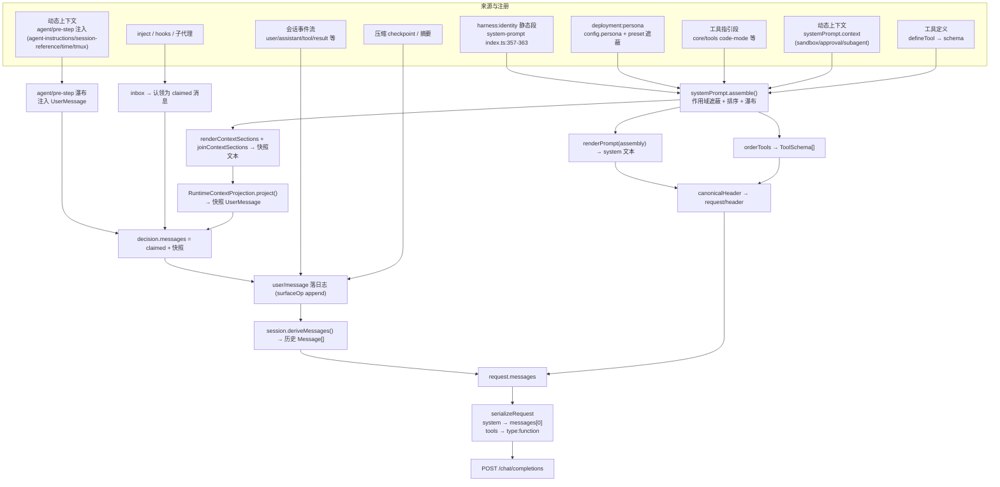
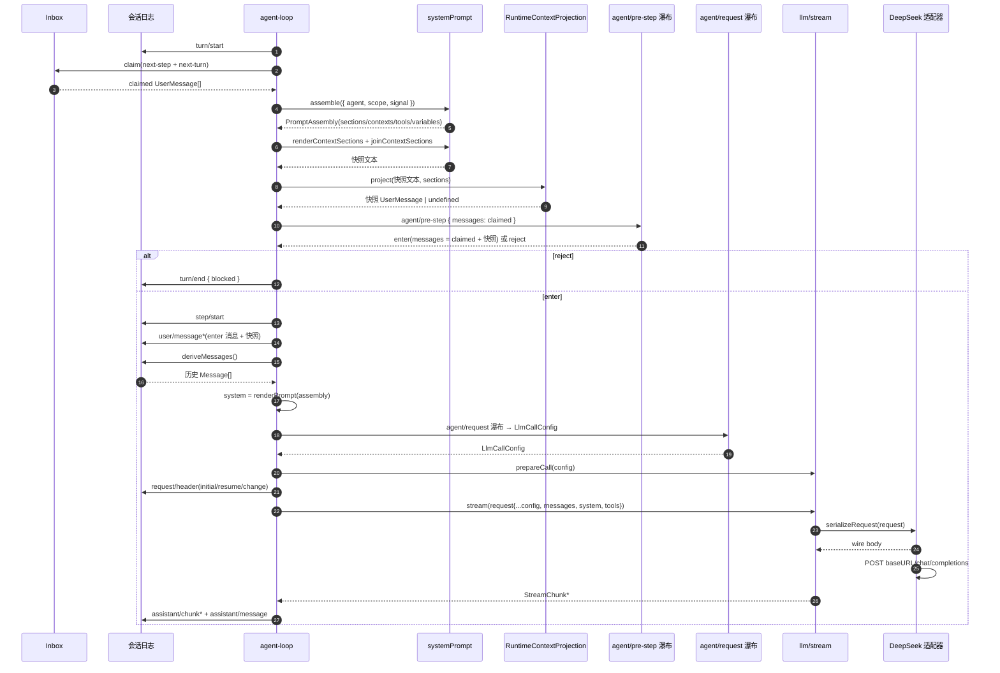

# 模型上下文拼装（Model Context Assembly）

本目录是 DeepSeek Harness「模型上下文拼装」的独立研究文档集：逐项记录**进入模型请求的每一段内容**——它的原文来源、注册/产生点、拼装时机与最终形态，并附逐字提示词原文（[prompts/](prompts/)）与逐字拼装代码摘录（[code/](code/)）。

核心原则是「**模型可见 ⟺ 已记录**」：一切进入模型请求的内容都必须能从 append-only 会话日志重建，运行时不变式在 `llm/stream` 上断言请求与日志推导逐字节一致（[`invariant.ts`](../../../packages/core/agent-loop/src/invariant.ts#L21)）。因此本目录每一节都以「来源 → 注册/产生 → 何时拼装 → 最终形态」为主线，并用流程图与时序图把这条链路画出来。

## 四种最终形态

一次模型请求由四个正交部件组成，它们在不同环节汇入 `GenerateOptions`，最后经 DeepSeek 适配器序列化成 wire 请求体：

| 部件 | 来源 | 拼装时机 | 最终形态 |
|---|---|---|---|
| system 文本 | 各 `systemPrompt.section`（identity / persona / 工具指引等） | `step()` 内 `renderPrompt(assembly)` | `request.system` → wire `messages[0]` 的 `role:system` |
| messages 历史 | 会话 surface 节点（`user/message` / `assistant/message` / `tool/result` / 快照） | `buildRequest` 内 `session.deriveMessages()` | `request.messages` → wire `messages` |
| runtime-context 快照 | 动态上下文贡献者（走 `systemPrompt.context` 的 sandbox/approval/subagent，或走 `agent/pre-step` 注入的 context 包） | `preStep` 内 `project()` 生成快照 user 消息 | 一条 user 消息，追加在历史尾部 |
| tools 参数 | 各工具 `defineTool` → `systemPrompt.tools` provider | `assemble` 收集并 `orderTools` 排序 | `request.tools` → wire `tools`（`type:function`） |

## 文档地图

主文档按拼装管线分片，每篇自带 Mermaid 图；[context-inventory.md](context-inventory.md) 是跨切片的全量清单。

| 文档 | 内容 |
|---|---|
| [01-system-prompt-registry.md](01-system-prompt-registry.md) | `core/system-prompt` 注册表：section/context/tools/variable 五种注册、作用域遮蔽、`assemble()` 全流程、严格插值 |
| [02-step-and-request-construction.md](02-step-and-request-construction.md) | `core/agent-loop` 每步请求的拼装时机：认领、assemble、历史推导、快照插入、请求头折叠、进入 `llm/stream` |
| [03-session-log-and-history-derivation.md](03-session-log-and-history-derivation.md) | 会话日志到 `Message[]` 的 `deriveMessages` 投影、surface 替换、请求头纪元 |
| [04-tool-schema-assembly.md](04-tool-schema-assembly.md) | 工具 `name/description/parameters` 的生成、`knownNames`/`toolOrder` 校验、作用域、code-mode |
| [05-dynamic-context-contributors.md](05-dynamic-context-contributors.md) | `packages/context/*` 四个贡献者与 `systemPrompt.context` 真实贡献者清单 |
| [06-compaction.md](06-compaction.md) | 压缩：checkpoint 落日志、投影跳过被压缩区域、摘要提示词与修剪 |
| [07-persona-presets-and-skills.md](07-persona-presets-and-skills.md) | 部署人设遮蔽、agent preset 组合、SKILL.md 指令进入路径 |
| [08-llm-adapter-and-wire-format.md](08-llm-adapter-and-wire-format.md) | Message 词汇、DeepSeek 适配器最终 wire 请求体 |
| [09-injection-paths-subagents-and-hooks.md](09-injection-paths-subagents-and-hooks.md) | `agent.inject()`、hooks 桥、子代理上下文组装与报告回流 |
| [10-invariants-and-reconstruction.md](10-invariants-and-reconstruction.md) | 四大不变式、请求重建、ignorable 信封与 `SESSION_FORMAT_VERSION` |
| [11-change-and-insertion-timing.md](11-change-and-insertion-timing.md) | system prompt 的变化时机（四类触发源 + `request/header` 记录时点）；合成 user 消息的四类插入时机（pre-step 瀑布 / inbox / 工具结果后 / 压缩替换）与批次内位置规则；13 项机制索引 |
| [12-context-organization-strategy.md](12-context-organization-strategy.md) | 按业务类别的上下文组织核心策略：A–H 八类业务的插入方式/时机/位置/更新语义矩阵、一个 step 时间线的插入点全景图、核心策略五条 |
| [13-plugin-failure-and-lifecycle-exposure.md](13-plugin-failure-and-lifecycle-exposure.md) | 插件故障与生命周期变化如何进入模型上下文：15 项排查矩阵、三条曝光通道、运行期/设计期指导落点、可复用的通知模板 |
| [14-cordis-restart-cascade-and-context.md](14-cordis-restart-cascade-and-context.md) | Cordis 依赖级联重启（fiber epoch）与 agent loop / 上下文管理的关联：级联机制、loop 的下游位置与卸载语义、重载后的日志恢复、级联时序图 |
| [15-change-triggers-and-reload-scope.md](15-change-triggers-and-reload-scope.md) | 修改触发面与重载范围：六条修改通道的重启范围矩阵（externals/HMR 部分重载/配置热重载/客户端 HMR/动态包）、动态插件不能覆盖静态声明的框架级约束、UI 变更的 slots 通道 |
| [context-inventory.md](context-inventory.md) | 全量清单表：内容 → 原文来源 → 注册/产生点 → 拼装时机 → 最终形态；含技能目录/`/name` 手势、目标续轮、工具延迟上下文（`deferContext`）与 post-execute `additionalContexts` |

原文与代码摘录：

- [prompts/](prompts/) —— 逐字提示词原文：harness identity、persona 默认、四类动态上下文模板、compaction 摘要指令、技能目录帧、目标续轮/收尾指令、重复调用提醒、会话标题生成指令。
- [code/](code/) —— 逐字拼装代码摘录（agent-loop 请求、session 推导、compaction、llm 组装）。

## 两条关键的事实纠正

调研中纠正了两个容易误读的点，合读各分片前先记下：

- **`packages/context/*` 不经过 `systemPrompt.context()`**。agent-instructions / session-reference / time-context / tmux-context 通过 `agent/pre-step` 监听器或宿主 `prepare()` 直接注入带来源的 `UserMessage`；真正走 `systemPrompt.context()` 的是 sandbox:policy、approval:policy、subagent:delegation。详见 [05-dynamic-context-contributors.md](05-dynamic-context-contributors.md#结论先行四个贡献者不走-systempromptcontext)。
- **render intent（含 `locations`）是 UI 卡片形态，不进模型上下文**。模型看到的工具结果文本只来自 `output.render` 返回的 `ContentBlock[]`。详见 [04-tool-schema-assembly.md](04-tool-schema-assembly.md)。

## 端到端流程图

## 端到端时序图

## 源码入口速查

拼装链路的关键函数都在这些位置：

- `systemPrompt.assemble`：[`packages/core/system-prompt/src/index.ts`](../../../packages/core/system-prompt/src/index.ts#L467)
- `agent-loop` 每步请求装配：[`packages/core/agent-loop/src/agent.ts`](../../../packages/core/agent-loop/src/agent.ts)（`preStep` L225、`step` L332、`buildRequest` L407）
- 日志投影 `deriveMessages`：[`packages/core/session/src/index.ts`](../../../packages/core/session/src/index.ts#L726)；节点投影 `deriveEventMessage`：[`packages/core/session/src/surface.ts`](../../../packages/core/session/src/surface.ts#L83)
- 快照投影 `RuntimeContextProjection.project`：[`packages/core/agent-loop/src/runtime-context.ts`](../../../packages/core/agent-loop/src/runtime-context.ts#L64)
- 请求线格式 `serializeRequest`：[`packages/llm/llm-deepseek/src/serialize.ts`](../../../packages/llm/llm-deepseek/src/serialize.ts)
- 请求重建不变式：[`packages/core/agent-loop/src/invariant.ts`](../../../packages/core/agent-loop/src/invariant.ts#L21)
