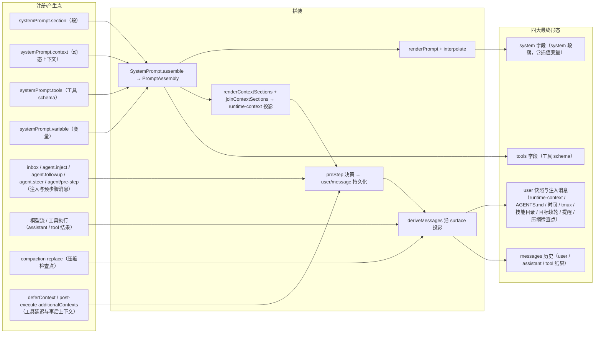

# 全量模型上下文内容清单（model-context inventory）

本页是「所有进入模型上下文的内容」逐项清单：内容、原文来源、注册/产生点、拼装时机、最终形态。它覆盖对 `packages/` 的 grep 收集到的全部注册与产生点（`systemPrompt.section` / `systemPrompt.context` / `systemPrompt.tools` / `systemPrompt.variable` / `systemPrompt.suppressRuntimeContext` / persona 配置 / 动态 runtime-context / `agent.inject` / `agent.followup` / `agent.steer` / 压缩与检查点 / `agent/pre-step` 消息 / 技能目录与 `/name` 手势 / 目标续轮 / 工具延迟上下文 `deferContext` / post-execute `additionalContexts`），不遗漏。拼装主流程在 [`agent.ts`](../../../packages/core/agent-loop/src/agent.ts)：`preStep` 组装与投影（[`agent.ts`](../../../packages/core/agent-loop/src/agent.ts#L225)）、`step` 渲染与请求构建（[`agent.ts`](../../../packages/core/agent-loop/src/agent.ts#L332)）、`buildRequest` 冻结请求（[`agent.ts`](../../../packages/core/agent-loop/src/agent.ts#L407)）。注册表机制见 [01-system-prompt-registry.md](01-system-prompt-registry.md)；「模型可见 ⟺ 已记录」的可执行断言见 [10-invariants-and-reconstruction.md](10-invariants-and-reconstruction.md)。

最终形态有四类，即模型请求 `GenerateOptions` 的承载面：`system` 字段（system 段落）、`messages` 数组（user 快照与历史消息）、`tools` 字段（工具 schema）、以及 tool 结果（`messages` 里的 tool-role 结果消息）。`llm/stream` 的线格式序列化把 `system` 压成 wire 首条 `role: system` 消息、`tools` 压成 `function` 工具、每条历史消息逐条映射（[`serialize.ts`](../../../packages/llm/llm-deepseek/src/serialize.ts#L151)）。

## system 段落（systemPrompt.section）

段按 `order` 升序拼接（[`index.ts`](../../../packages/core/system-prompt/src/index.ts#L504)），经 `renderPrompt` 渲染（[`index.ts`](../../../packages/core/system-prompt/src/index.ts#L212)）成为请求的 `system` 文本。约定序带：`-100` harness 身份、`0` 部署人设、工具指引用 `100–199`（[`index.ts`](../../../packages/core/system-prompt/src/index.ts#L57)）。以下每行一个注册点。

| 内容 | 原文来源（文件/配置，含行号） | 注册/产生点（API 或事件，含行号） | 拼装时机 | 最终形态 |
|---|---|---|---|---|
| harness 身份段 `harness:identity`（order `-100`，文本 `You are an AI agent powered by DeepSeek Harness.`） | [`index.ts`](../../../packages/core/system-prompt/src/index.ts#L361) 内联文本 | [`SystemPrompt` 构造器 `this.section(...)`](../../../packages/core/system-prompt/src/index.ts#L357) | 服务构造期（`config.includeHarnessIdentity ?? true` 时注册） | system 段落 |
| harness 源码位置段 `harness:source`（order `-99`） | [`app-boot/src/index.ts`](../../../packages/boot/app-boot/src/index.ts#L805) 常量 + 引导传入的 sourceRoot | [`addHarnessSourceSection` → `systemPrompt.section(...)`](../../../packages/boot/app-boot/src/index.ts#L824) | 应用引导后一次性注册 | system 段落 |
| Web 应用面段 `app:web-surface`（order `-98`） | [`web-app/src/index.ts`](../../../packages/bundle/web-app/src/index.ts#L143) | `ctx.inject(['systemPrompt'])` 内 `promptCtx.systemPrompt.section(...)`（[`index.ts`](../../../packages/bundle/web-app/src/index.ts#L141)） | 服务注入回调注册 | system 段落 |
| 部署人设段 `deployment:persona`（order `0`） | `config.persona`（schema 默认 `''`，[`index.ts`](../../../packages/core/system-prompt/src/index.ts#L342)） | [`SystemPrompt` 构造器 `this.section(...)`](../../../packages/core/system-prompt/src/index.ts#L364) | 服务构造期无条件注册 | system 段落 |
| 作用域人设行（preset/persona 行，同 `deployment:persona` 名字遮蔽部署人设） | 插件 `Config.text`（[`index.ts`](../../../packages/preset/persona/src/index.ts#L35)） | [`ctx.systemPrompt.section({ name: PERSONA_SECTION, ... })`](../../../packages/preset/persona/src/index.ts#L61) | preset 挂载时经 `ctx.effect` 注册 | system 段落 |
| 子代理子代人设（同 `deployment:persona` 名字） | `ChildComposition.persona`（[`child-agent.ts`](../../../packages/subagent/subagent/src/child-agent.ts#L125)） | [`childCtx.systemPrompt.section({ name: 'deployment:persona', order: 0, text: composition.persona })`](../../../packages/subagent/subagent/src/child-agent.ts#L172) | 子代理创建窗口（`applyChildComposition`） | system 段落 |
| 计划策略段 `plan:policy`（order `50`） | `this.section` 常量文本（[`index.ts`](../../../packages/plan/plan-mode/src/index.ts#L231)） | [`ctx.systemPrompt.section({ name: 'plan:policy', order: 50, text: ... })`](../../../packages/plan/plan-mode/src/index.ts#L225) | plan-mode 服务构造期 | system 段落 |
| 工具指引段 `tool:read`（order `100`） | [`read.ts`](../../../packages/fs/tool-fs/src/read.ts#L70) | `ctx.systemPrompt.section(...)`（[`read.ts`](../../../packages/fs/tool-fs/src/read.ts#L70)） | 工具插件激活时 | system 段落 |
| 工具指引段 `tool:write`（order `101`） | [`write.ts`](../../../packages/fs/tool-fs/src/write.ts#L63) | `ctx.systemPrompt.section(...)`（[`write.ts`](../../../packages/fs/tool-fs/src/write.ts#L63)） | 工具插件激活时 | system 段落 |
| 工具指引段 `tool:edit`（order `102`） | [`edit.ts`](../../../packages/fs/tool-fs/src/edit.ts#L77) | `ctx.systemPrompt.section(...)`（[`edit.ts`](../../../packages/fs/tool-fs/src/edit.ts#L77)） | 工具插件激活时 | system 段落 |
| 工具指引段 `tool:glob`（order `103`） | [`glob.ts`](../../../packages/fs/tool-fs-search/src/glob.ts#L301) | `ctx.systemPrompt.section(...)`（[`glob.ts`](../../../packages/fs/tool-fs-search/src/glob.ts#L301)） | 工具插件激活时 | system 段落 |
| 工具指引段 `tool:grep`（order `104`） | [`grep.ts`](../../../packages/fs/tool-fs-search/src/grep.ts#L276) | `ctx.systemPrompt.section(...)`（[`grep.ts`](../../../packages/fs/tool-fs-search/src/grep.ts#L276)） | 工具插件激活时 | system 段落 |
| 工具指引段 `tool:bash`（order `105`） | [`index.ts`](../../../packages/shell/tool-bash/src/index.ts#L236) | `ctx.systemPrompt.section(...)`（[`index.ts`](../../../packages/shell/tool-bash/src/index.ts#L236)） | 工具插件激活时 | system 段落 |
| 工具指引段 `tool:pwsh`（order `105`） | [`index.ts`](../../../packages/shell/tool-pwsh/src/index.ts#L245) | `ctx.systemPrompt.section(...)`（[`index.ts`](../../../packages/shell/tool-pwsh/src/index.ts#L245)） | 工具插件激活时 | system 段落 |
| 工具指引段 `tool:jobs`（order `106`） | [`index.ts`](../../../packages/jobs/tool-jobs/src/index.ts#L263) | `ctx.systemPrompt.section(...)`（[`index.ts`](../../../packages/jobs/tool-jobs/src/index.ts#L263)） | 工具插件激活时 | system 段落 |
| 工具指引段 `tool:pty`（order `106`） | [`index.ts`](../../../packages/terminal/tool-terminal/src/index.ts#L156) | `ctx.systemPrompt.section(...)`（[`index.ts`](../../../packages/terminal/tool-terminal/src/index.ts#L156)） | 工具插件激活时 | system 段落 |
| 工具指引段 `tool:web_search`（order `110`） | [`search.ts`](../../../packages/web/tool-web/src/search.ts#L216) | `ctx.systemPrompt.section(...)`（[`search.ts`](../../../packages/web/tool-web/src/search.ts#L216)） | 工具插件激活时 | system 段落 |
| 工具指引段 `tool:web_fetch`（order `111`） | [`fetch.ts`](../../../packages/web/tool-web/src/fetch.ts#L430) | `ctx.systemPrompt.section(...)`（[`fetch.ts`](../../../packages/web/tool-web/src/fetch.ts#L430)） | 工具插件激活时 | system 段落 |
| 工具指引段 `tool:lsp`（order `112`） | [`index.ts`](../../../packages/lsp/tool-lsp/src/index.ts#L104)（`LSP_PROMPT_TEXT`） | `ctx.systemPrompt.section({ name: 'tool:lsp', order: 112, ... })`（[`index.ts`](../../../packages/lsp/tool-lsp/src/index.ts#L104)） | 工具插件激活时 | system 段落 |
| 工具指引段 `tool:session-query`（order `113`） | [`index.ts`](../../../packages/session-query/tool-session-query/src/index.ts#L60) | `ctx.systemPrompt.section(...)`（[`index.ts`](../../../packages/session-query/tool-session-query/src/index.ts#L60)） | 工具插件激活时 | system 段落 |
| 工具指引段 `tool:goal`（order `114`） | [`index.ts`](../../../packages/goal/tool-goal/src/index.ts#L189) | `ctx.systemPrompt.section(...)`（[`index.ts`](../../../packages/goal/tool-goal/src/index.ts#L189)） | 工具插件激活时 | system 段落 |
| 工具指引段 `tool:cordis`（order `115`） | [`index.ts`](../../../packages/extensions/tool-cordis/src/index.ts#L36)（`CORDIS_SYSTEM_PROMPT`） | `ctx.systemPrompt.section({ name: 'tool:cordis', order: 115, ... })`（[`index.ts`](../../../packages/extensions/tool-cordis/src/index.ts#L36)） | 工具插件激活时 | system 段落 |
| 工具指引段 `tool:workflow`（order `115`，按工具名 `tool:${toolName}`） | [`index.ts`](../../../packages/workflow/tool-workflow/src/index.ts#L212) | `ctx.systemPrompt.section(...)`（[`index.ts`](../../../packages/workflow/tool-workflow/src/index.ts#L212)） | 工具插件激活时 | system 段落 |
| 工具指引段 `tool:ralph`（order `116`） | [`index.ts`](../../../packages/workflow/tool-ralph/src/index.ts#L407) | `ctx.systemPrompt.section(...)`（[`index.ts`](../../../packages/workflow/tool-ralph/src/index.ts#L407)） | 工具插件激活时 | system 段落 |
| 工具指引段 `tool:report`（order `REPORT_SECTION_ORDER`） | [`index.ts`](../../../packages/subagent/tool-subagent-report/src/index.ts#L54) | `childCtx.systemPrompt.section(...)`（[`index.ts`](../../../packages/subagent/tool-subagent-report/src/index.ts#L54)） | 子代理创建时 | system 段落 |
| 工具指引段 `tool:subagent`（order `SUBAGENT_SECTION_ORDER`，按 `tool:${toolName}`） | [`index.ts`](../../../packages/subagent/tool-subagent/src/index.ts#L459) | `ctx.systemPrompt.section(...)`（[`index.ts`](../../../packages/subagent/tool-subagent/src/index.ts#L459)） | 工具插件激活时 | system 段落 |
| 工具指引段 `tool:${STRUCTURED_OUTPUT_TOOL}`（order `190`） | [`structured.ts`](../../../packages/subagent/subagent-in-process-driver/src/structured.ts#L99) | `childCtx.systemPrompt.section(...)`（[`structured.ts`](../../../packages/subagent/subagent-in-process-driver/src/structured.ts#L99)） | 结构化子代理创建时 | system 段落 |
| 交付物引用段 `ui:deliverable-file-references`（order `190`） | [`index.ts`](../../../packages/client/ui-deliverables/src/index.ts#L23) | `ctx.systemPrompt.section(...)`（[`index.ts`](../../../packages/client/ui-deliverables/src/index.ts#L23)） | UI 插件激活时 | system 段落 |
| 代码模式折叠段 `tools:code-only`（order `99`） | [`index.ts`](../../../packages/core/tools/src/index.ts#L855)（`CODE_ONLY_INSTRUCTION`） | `ctx.systemPrompt.section(this.collapseSection())`（[`index.ts`](../../../packages/core/tools/src/index.ts#L834)，作用域变体 [`index.ts`](../../../packages/core/tools/src/index.ts#L968)） | 非 native 模式构造期 / `presentAs` 作用域切换 | system 段落 |
| 生成式 SDK 段 `tools:sdk`（order `150`） | [`index.ts`](../../../packages/core/tools/src/index.ts#L875)（`SDK_RENDERERS` 按语言渲染） | `ctx.systemPrompt.section(this.sdkSection())`（[`index.ts`](../../../packages/core/tools/src/index.ts#L835)，作用域变体 [`index.ts`](../../../packages/core/tools/src/index.ts#L969)） | 非 native 模式构造期 / `presentAs` 作用域切换 | system 段落 |

## 动态运行时上下文（systemPrompt.context → user 快照）

context 按 `order` 升序拼接（[`index.ts`](../../../packages/core/system-prompt/src/index.ts#L523)），`renderContextSections` 渲染命名条目、`joinContextSections` 加前缀 `Current runtime context. This snapshot supersedes earlier runtime-context snapshots.`（[`index.ts`](../../../packages/core/system-prompt/src/index.ts#L224)）。`preStep` 里 `runtimeContext.project(...)` 把渲染结果投影为带 `source: { plugin: '@deepseek-ai/dsh-system-prompt', form: 'snapshot', sections }` 的 user 消息（[`runtime-context.ts`](../../../packages/core/agent-loop/src/runtime-context.ts#L64)），值不变时跳过、清空时写 `Current runtime context: none. ...`（[`runtime-context.ts`](../../../packages/core/agent-loop/src/runtime-context.ts#L13)），随后作为 `user/message` 持久化（[`agent.ts`](../../../packages/core/agent-loop/src/agent.ts#L282)）。

| 内容 | 原文来源（文件/配置，含行号） | 注册/产生点（API 或事件，含行号） | 拼装时机 | 最终形态 |
|---|---|---|---|---|
| `sandbox:policy`（order `110`，沙箱执行策略句） | `SandboxPolicyService.resolve`（[`index.ts`](../../../packages/sandbox/sandbox-policy/src/index.ts#L135)）、`effectiveSandboxMode` 读 `sandbox/mode` 事件 | [`scope.systemPrompt.context({ name: 'sandbox:policy', order: 110, ... })`](../../../packages/sandbox/sandbox-policy/src/index.ts#L113)，经 `ctx.inject(['systemPrompt'])` | 每次 `assemble` 求值 text provider | user 快照（messages 历史） |
| `approval:policy`（order `115`，批准策略句：`ask`/`never`） | `ASK_SENTENCE` / `NEVER_SENTENCE` 常量 + `effectivePolicy(agent.session)`（[`index.ts`](../../../packages/interaction/user-approval/src/index.ts#L200)） | [`scope.systemPrompt.context({ name: 'approval:policy', order: 115, ... })`](../../../packages/interaction/user-approval/src/index.ts#L205)，经 `ctx.inject(['systemPrompt'])` | 每次 `assemble` 求值 text provider | user 快照（messages 历史） |
| `subagent:delegation`（order `120`，委派范围陈述，仅子代理会话） | `SUBAGENT_DELEGATION_CONTEXT` 常量（[`child-agent.ts`](../../../packages/subagent/subagent/src/child-agent.ts#L135)） | [`childCtx.systemPrompt.context({ name: 'subagent:delegation', order: 120, ... })`](../../../packages/subagent/subagent/src/child-agent.ts#L170) | 子代理创建窗口（`applyChildComposition`） | user 快照（messages 历史） |

抑制开关：`config.includeRuntimeContext`（schema 默认 `true`）为假时构造期调用 `this.suppressRuntimeContext()`（[`index.ts`](../../../packages/core/system-prompt/src/index.ts#L370)）；persona 行的 `includeRuntimeContext: false` 走同一抑制（[`index.ts`](../../../packages/preset/persona/src/index.ts#L67)）。`assemble` 见全局或作用域链上有抑制器即把 `contexts` 置空（[`index.ts`](../../../packages/core/system-prompt/src/index.ts#L470)）。

## 提示变量（systemPrompt.variable）

变量在渲染期被 `interpolate` 严格替换进 section/context 文本（[`index.ts`](../../../packages/core/system-prompt/src/index.ts#L258)），因此最终形态仍是 system 段落或 user 快照，不单独成面。

| 内容 | 原文来源（文件/配置，含行号） | 注册/产生点（API 或事件，含行号） | 拼装时机 | 最终形态 |
|---|---|---|---|---|
| `{{provider}}` | `agent.options.provider`（[`index.ts`](../../../packages/core/agent-loop/src/index.ts#L351)） | `ctx.systemPrompt.variable('provider', ...)`（[`index.ts`](../../../packages/core/agent-loop/src/index.ts#L351)） | 每次 `assemble` 求值 | 插值进 system 段落 / user 快照 |
| `{{model}}` | `agent.options.model`（[`index.ts`](../../../packages/core/agent-loop/src/index.ts#L352)） | `ctx.systemPrompt.variable('model', ...)`（[`index.ts`](../../../packages/core/agent-loop/src/index.ts#L352)） | 每次 `assemble` 求值 | 插值进 system 段落 / user 快照 |
| `{{cwd}}` | `agent.session.header.cwd`（[`index.ts`](../../../packages/core/agent-loop/src/index.ts#L353)） | `ctx.systemPrompt.variable('cwd', ...)`（[`index.ts`](../../../packages/core/agent-loop/src/index.ts#L353)） | 每次 `assemble` 求值 | 插值进 system 段落 / user 快照 |

per-agent 模型选择缝隙会覆写这两个变量：`installModelSelection` 在 agent 作用域的 `system-prompt/assemble` 瀑布里把 `provider`/`model` 变量替换为显式选择值，并在 `agent/request` 上同步请求配置（[`model-selection.ts`](../../../packages/core/agent/src/model-selection.ts#L39)）；当前仓库内该 API 的调用点是测试（[`model-selection.spec.ts`](../../../packages/core/agent/tests/model-selection.spec.ts#L6)），运行入口按需挂接。

## 工具 schema（systemPrompt.tools）

| 内容 | 原文来源（文件/配置，含行号） | 注册/产生点（API 或事件，含行号） | 拼装时机 | 最终形态 |
|---|---|---|---|---|
| 全部已注册工具的 schema | `ctx.tools` 注册表（`defineContentToolFixture` 等注册 API） | [`ctx.systemPrompt.tools(context => this.wireSchemas(context.scope))`](../../../packages/core/tools/src/index.ts#L832) | 每次 `assemble` 求值 provider，`parameters` 经 `structuredClone` 剥离（[`index.ts`](../../../packages/core/system-prompt/src/index.ts#L495)）、`orderTools` 排序（[`index.ts`](../../../packages/core/system-prompt/src/index.ts#L529)） | tools 参数（`GenerateOptions.tools`） |

工具 schema 随 `assemble` 收集，进入 `PromptAssembly.tools`（[`index.ts`](../../../packages/core/system-prompt/src/index.ts#L519)），`step` 把它与渲染后的 system 一起传给 `buildRequest`（[`agent.ts`](../../../packages/core/agent-loop/src/agent.ts#L341)），最终成为请求的 `tools` 字段与 `request/header` 快照的 `tools`（[`agent.ts`](../../../packages/core/agent-loop/src/agent.ts#L462)）。

## 历史消息与 tool 结果（messages 历史）

`Session.deriveMessages` 沿 surface 节点投影（[`index.ts`](../../../packages/core/session/src/index.ts#L726)），投影规则见 [`surface.ts`](../../../packages/core/session/src/surface.ts#L83)。三类 surface 事件产生消息：

| 内容 | 原文来源 | 注册/产生点 | 拼装时机 | 最终形态 |
|---|---|---|---|---|
| 用户消息（人类提示词） | 外部输入经 `Agent.followup`/`steer`/`send` 入 inbox | `session.append('user/message', ...)`（[`agent.ts`](../../../packages/core/agent-loop/src/agent.ts#L283)） | `turn()` 在 step/start 后逐条持久化 `decision.messages` | messages 历史 |
| assistant 消息 | 模型流经 `BlockAssembler` 组装 | `session.append('assistant/message', ...)`（[`agent.ts`](../../../packages/core/agent-loop/src/agent.ts#L381)） | `step()` 流结束后 | messages 历史 |
| assistant 原始 chunk | 模型流逐 chunk | `session.append('assistant/chunk', ...)`（[`agent.ts`](../../../packages/core/agent-loop/src/agent.ts#L349)） | `step()` 流消费中（不投影，仅回放保真） | 无（日志内部） |
| tool 结果 | 工具执行返回 | `session.append('tool/result', ...)`（[`tool-calls.ts`](../../../packages/core/agent-loop/src/tool-calls.ts#L281)） | `executeToolCalls` 执行完一个调用 | messages 历史（tool-role 结果消息） |

## 注入内容与预步骤消息（agent.inject / agent/pre-step → user 消息）

`agent.inject(message)` 走 `send(input, 'next-step', false)`（[`agent.ts`](../../../packages/core/agent-loop/src/agent.ts#L130)），消息留在 inbox 直到下一步 pre-step 被领取，然后作为 `user/message` 持久化并进入该步请求（[`agent.ts`](../../../packages/core/agent-loop/src/agent.ts#L282)）。`agent/pre-step` 瀑布的 listener 可以在 `enter` 决策里追加或改写消息（[`agent.ts`](../../../packages/core/agent-loop/src/agent.ts#L234)），追加的消息同样被持久化。

| 内容 | 原文来源 | 注册/产生点 | 拼装时机 | 最终形态 |
|---|---|---|---|---|
| 批准策略切换通知 | 文案在 [`index.ts`](../../../packages/interaction/user-approval/src/index.ts#L230) | [`agent.inject(createUserMessage(...))`](../../../packages/interaction/user-approval/src/index.ts#L230)（`setPolicy`） | 策略变化时注入，下一步领取 | user 消息（messages 历史） |
| 计划模式叙述 | `this.narration(agent.session, ...)`（[`index.ts`](../../../packages/plan/plan-mode/src/index.ts#L212)） | [`agent.inject(narration)`](../../../packages/plan/plan-mode/src/index.ts#L443)；另有 pre-step 追加路径（[`index.ts`](../../../packages/plan/plan-mode/src/index.ts#L221)） | 计划模式边界 | user 消息（messages 历史） |
| 任务完成通知 | 后台任务结果 | [`owner.inject(message)`](../../../packages/jobs/tool-jobs/src/index.ts#L299) | 任务结束时注入 | user 消息（messages 历史） |
| 子代理结果回传 | 子代理产出 | [`parent.followup(message)` / `parent.inject(message)`](../../../packages/subagent/subagent/src/continuation.ts#L684)（quiet relay）、[`parent.followup` / `parent.steer`](../../../packages/subagent/subagent/src/continuation.ts#L1440) | 子代理结束时按 relay 模式（wakeup/quiet）回传 | user 消息（messages 历史） |
| Hook 注入的上下文 | 外部 hook 输出 | SessionStart/SubagentStart 走 [`agent.inject(context)`](../../../packages/hooks/hooks-claude-code/src/index.ts#L210) / [`child.inject(context)`](../../../packages/hooks/hooks-claude-code/src/index.ts#L287) / [`agent.inject(context)`](../../../packages/hooks/hooks-codex/src/index.ts#L192)；`Stop` 走 [`agent.steer(...)`](../../../packages/hooks/hooks-claude-code/src/index.ts#L275)；UserPromptSubmit 的 `additionalContext` 在 pre-step 瀑布后追加到 enter 消息尾部（[`index.ts`](../../../packages/hooks/hooks-claude-code/src/index.ts#L230)，codex 同构）；PostToolUse 的 additionalContexts 见下方「工具延迟上下文与 post-execute 上下文」 | hook 回调 | user 消息（messages 历史） |
| Cordis 主机运行注入 | 动态包运行结果 | [`agent.steer(createUserMessage(...))`](../../../packages/extensions/cordis-host-runner/src/index.ts#L1043) / [`agent.inject(createUserMessage(...))`](../../../packages/extensions/cordis-host-runner/src/index.ts#L1153) | 运行结束 | user 消息（messages 历史） |
| 工作区指令（AGENTS.md） | `AGENTS.md` 文件内容渲染（`workspaceContextMessage`/`reconcileInstructionContext`） | pre-step 决策追加 `createUserMessage({ source: { kind: 'agent-instructions', form: 'instructions', ... } })`（[`index.ts`](../../../packages/context/agent-instructions/src/index.ts#L174)、[`index.ts`](../../../packages/context/agent-instructions/src/index.ts#L212)） | `agent/pre-step` 求值 | user 消息（messages 历史） |
| 时间上下文 | `Intl.DateTimeFormat` 格式化当前时间（[`index.ts`](../../../packages/context/time-context/src/index.ts#L110)） | pre-step 决策追加 `createUserMessage({ source: { kind: 'plugin', plugin: name, form: 'snapshot', ... } })`（[`index.ts`](../../../packages/context/time-context/src/index.ts#L170)） | `agent/pre-step`（prepend） | user 消息（messages 历史） |
| tmux 位置读数 | `tmux display-message` 八个字段 + 本进程 tty 校验（[`index.ts`](../../../packages/context/tmux-context/src/index.ts#L107)） | pre-step 决策头部 prepend `createUserMessage({ source: { kind: 'plugin', plugin: 'tmux-context', form: 'snapshot' } })`（[`index.ts`](../../../packages/context/tmux-context/src/index.ts#L218)） | `agent/pre-step`（prepend，每 turn 首个 step，状态变化时） | user 消息（messages 历史） |
| 会话技能目录（`<available_skills>`） | 目录帧原文见 [prompts/skill-catalog.md](prompts/skill-catalog.md)（[`index.ts`](../../../packages/skill/tool-skill/src/index.ts#L254)） | pre-step 决策追加/替换 catalog user 消息，source `{ kind: 'skill-catalog', form: 'catalog' }`（[`index.ts`](../../../packages/skill/tool-skill/src/index.ts#L213)） | `agent/pre-step`（仅当 agent 可见本插件的 `skill` 工具精确定义；sha256 摘要驱动重发布） | user 消息（messages 历史） |
| `/name` 手势技能指令（`<skill_content>`） | `renderSkillContent(skill)` 渲染 SKILL.md 正文（[`index.ts`](../../../packages/skill/tool-skill/src/index.ts#L196)） | pre-step 决策末尾追加 `createUserMessage({ source: { kind: 'skill-invocation', name, form: 'instructions' } })`（[`index.ts`](../../../packages/skill/tool-skill/src/index.ts#L177)） | `agent/pre-step`（仅扫描 `source.kind === 'user'` 消息；user-invocable 技能） | user 消息（messages 历史） |
| 目标续轮提示（`<goal_round>`） | 原文见 [prompts/goal-round.md](prompts/goal-round.md)（[`prompt.ts`](../../../packages/goal/goal-round-driver/src/prompt.ts#L12)） | [`agent.followup(createUserMessage({ source: { kind: 'goal', goalId, revision, round } }))`](../../../packages/goal/goal-round-driver/src/index.ts#L192) | agent 空闲且目标 armed 时自动调度（round = roundsStarted + 1） | user 消息（messages 历史） |
| `@pluginId` 引用上下文 | `renderReference(reference)` / `renderUnavailableReference(id)`（[`index.ts`](../../../packages/extensions/tool-cordis/src/index.ts#L387)） | pre-step 决策末尾追加 `createUserMessage({ source: { kind: 'plugin', plugin: 'tool-cordis', form: 'instructions' } })`（[`index.ts`](../../../packages/extensions/tool-cordis/src/index.ts#L381)） | `agent/pre-step`（消息中出现 `@pluginId` 令牌时） | user 消息（messages 历史） |

跨会话引用快照（session-reference）是无生产宿主的能力缝隙：`ctx.sessionReferenceResolver.prepare(...)` 返回 `{ content, additionalContext }`（[`index.ts`](../../../packages/context/session-reference/src/index.ts#L169)），由支持跨会话 mention 的宿主在空闲时安装一次性 `agent/pre-step` 包装、运行时 `inject()` + `steer()`；本仓库当前没有生产宿主挂接（仅测试引用）。其渲染原文见 [prompts/session-reference.md](prompts/session-reference.md)。

## 工具延迟上下文与 post-execute 上下文（deferContext / additionalContexts）

两类上下文都在**工具执行完成后**才进入历史：`ToolRunContext.deferContext(context)` 把一条带来源的 `UserMessage` 推迟到该工具最终结果抵达循环时，循环在工具结果之后按 FIFO 追加（工具结果携带的上下文在 [`tool-calls.ts`](../../../packages/core/agent-loop/src/tool-calls.ts#L156) 被 acceptContext 缓冲）；`tools/post-execute` 决策的 `additionalContexts` 同样在本步工具结果之后被缓冲并追加。两者最终都以注入的 `user/message` 落日志、进入下一步或本步余下的模型请求。此外 `dsh-spill-policy` 是同一瀑布上的**内容投影**变换：它把工具结果的 `content` 裁剪到预算内（[`index.ts`](../../../packages/spill/spill-policy/src/index.ts#L2)），改写的是既有工具结果文本而非新增来源。

| 内容 | 原文来源 | 注册/产生点 | 拼装时机 | 最终形态 |
|---|---|---|---|---|
| 目标收尾指令（`<goal_complete>` / `<goal_blocked>`） | 原文见 [prompts/goal-wrapup.md](prompts/goal-wrapup.md)（[`wrapup.ts`](../../../packages/goal/tool-goal/src/wrapup.ts#L17)） | [`exec.deferContext(createUserMessage({ source: { kind: 'plugin', plugin: 'tool-goal', form: 'notice' } }))`](../../../packages/goal/tool-goal/src/index.ts#L314)（仅自动目标轮的 complete/blocked） | 工具结果之后追加 | user 消息（messages 历史） |
| 嵌套图片读取结果 | `imageReadContent(value)`（defer 点 [`read-image.ts`](../../../packages/fs/tool-fs/src/read-image.ts#L213)） | `exec.deferContext(createUserMessage({ source: { kind: 'plugin', plugin: 'tool-fs' } }))`（仅 `exec.parent !== undefined` 的嵌套调用） | 外层组合工具结果之后追加 | user 消息（messages 历史） |
| 重复调用提醒（gentle/detailed） | 原文见 [prompts/repeat-tool-reminder.md](prompts/repeat-tool-reminder.md)（[`index.ts`](../../../packages/guard/repeat-tool-reminder/src/index.ts#L63)） | `tools/post-execute` 决策 `additionalContexts` 头部（[`index.ts`](../../../packages/guard/repeat-tool-reminder/src/index.ts#L213)），source `{ kind: 'plugin', plugin: 'repeat-tool-reminder', form: 'notice' }` | 工具结果之后追加 | user 消息（messages 历史） |
| Hook PostToolUse 的 additionalContexts | 外部 hook 输出 | `tools/post-execute` 决策 `additionalContexts`（[`index.ts`](../../../packages/hooks/hooks-claude-code/src/index.ts#L247)，codex 同构） | 工具结果之后追加 | user 消息（messages 历史） |

## 压缩摘要与检查点（compaction）

压缩把被阴影的表面区间替换为一条带 `<compacted-summary>` 框架的 user 消息（`surfaceOp: { op: 'replace' }`），摘要内容与调用事实记录在 `compaction/summary` 事件（log-only）。

| 内容 | 原文来源 | 注册/产生点 | 拼装时机 | 最终形态 |
|---|---|---|---|---|
| 压缩检查点消息（`CHECKPOINT_PREAMBLE` + `<compacted-summary>` 包裹的摘要） | 摘要文本来自 summarizer LLM 输出（[`summarizer.ts`](../../../packages/compaction/compaction-basic/src/summarizer.ts#L189)），框架常量在 [`summarizer.ts`](../../../packages/compaction/compaction-basic/src/summarizer.ts#L68) | [`session.append('user/message', checkpointMessage, { surfaceOp: { op: 'replace', ... }, sourceEventSeqs })`](../../../packages/compaction/compaction-basic/src/region.ts#L462)（`commitCompactionBody`） | `compactSurfaceRegion` 提交阶段 | user 消息（messages 历史，替换阴影区间） |
| 压缩开始/摘要/结束/prune 记录 | `compactionId`、摘要、`shadowedSeqs`、token 数、provider/model（[`types.ts`](../../../packages/compaction/compaction/src/types.ts#L23)） | `session.append('compaction/start'/'summary'/'end'/'prune', ...)`（[`region.ts`](../../../packages/compaction/compaction-basic/src/region.ts#L189)、[`region.ts`](../../../packages/compaction/compaction-basic/src/region.ts#L447)、[`region.ts`](../../../packages/compaction/compaction-basic/src/region.ts#L215)） | 压缩事务生命周期 | 无（log-only，不投影） |

压缩的 summarization 调用本身是辅助 LLM 调用：`summarizeWithLlm` 重放被压缩区间 + 追加 `COMPACTION_INSTRUCTION` 作最后一条 user 消息，携带 `purpose: 'compaction'`（[`summarizer.ts`](../../../packages/compaction/compaction-basic/src/summarizer.ts#L146)）。

## 辅助 LLM 调用（非 loop 请求）

除 agent-loop 主请求外，还有两类模型可见的辅助调用，它们不经过 `markAgentLoopRequest`，由各自事件记录其请求事实：

| 内容 | 原文来源 | 注册/产生点 | 拼装时机 | 最终形态 |
|---|---|---|---|---|
| 会话标题生成调用 | 标题消息由 `collectSessionTitleMessages` 收集（[`index.ts`](../../../packages/session/session-title/src/index.ts#L560)）；system 指令与 JSON 帧逐字原文见 [prompts/session-title.md](prompts/session-title.md)（[`index.ts`](../../../packages/session/session-title-llm/src/index.ts#L186)），请求事实记录于 `session/title-llm-request` 事件（[`index.ts`](../../../packages/session/session-title-llm/src/index.ts#L262)） | `ctx.on('llm/stream', options => this.onMainRequest(options))` 判定后调度（[`index.ts`](../../../packages/session/session-title/src/index.ts#L331)） | 主请求经 `llm/stream` 后、空闲时非阻塞调度 | 辅助调用（标题文本，经 `session/title` 事件） |
| DeepSeek 搜索 LLM 调用 | 解析后的端点、版本与脱敏请求体 | 搜索工具发请求前追加 `web/deepseek-search-llm-request` 事件（[`provider.ts`](../../../packages/web/web-search-deepseek/src/provider.ts#L83)） | 工具执行时 | 辅助调用（log-only 事件记录请求体） |

## Mermaid —— 清单表四大最终形态的分流

## 相关文件

- 注册表机制：[01-system-prompt-registry.md](01-system-prompt-registry.md)
- 不变式与重建：[10-invariants-and-reconstruction.md](10-invariants-and-reconstruction.md)
- 逐字提示文本：[prompts/harness-identity.md](prompts/harness-identity.md)、[prompts/deployment-persona-slot.md](prompts/deployment-persona-slot.md)、[prompts/skill-catalog.md](prompts/skill-catalog.md)、[prompts/goal-round.md](prompts/goal-round.md)、[prompts/goal-wrapup.md](prompts/goal-wrapup.md)、[prompts/repeat-tool-reminder.md](prompts/repeat-tool-reminder.md)、[prompts/session-title.md](prompts/session-title.md)
- 请求线格式：[code/llm-assembler.md](code/llm-assembler.md)
