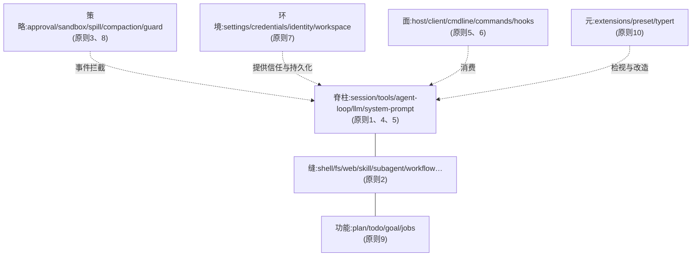

# Agent Framework 设计意图:从使用代码反推业务设计逻辑

> 承接 [cordis-core-model.md](cordis-core-model.md)(机制)与 [cordis-business-usage.md](business-usage.md)(使用)。本笔记回答「为什么这么设计」:从 base bundle 行、tool-todo、plan-mode、agent-loop、extensions 等使用代码反推十条设计原则,以及插件的存在意义、价值与相互关系。
>
> 本笔记是官方文档的**反向推导伴侣**,不是权威:每条原则末尾的「官方依据」链接到它的原始出处(Agent Notes 与架构文档),不一致时以官方为准。

## 原则 1:会话日志是唯一事实源,一切模型可见的东西都必须可回放

- 代码事实:`tool-todo` 不保存 todo 状态对象,而是 `session.append('todo/write', {todos})`;agent-loop 把 `turn/start`、`step/start`、`user/message`、`turn/end` 全落日志;plan-mode 的「是否在 plan 模式」由 `foldPlanMode(events)` 从 `plan/mode` 事件折叠
- 为什么:agent 的世界必须能从日志重建——断点续跑、子 agent fork 继承历史、UI 渲染、快照测试,全部消费同一份日志
- 价值:日志是唯一「既成事实」平面;UI、投影、标题、goal、plan 全是日志的投影,不是第二份状态
- 官方依据:[event-sourced-sessions](../../../.agents/notes/implemented/architecture/2026-06-11-event-sourced-sessions.md)、[reconstructable-requests](../../../.agents/notes/implemented/architecture/2026-07-05-reconstructable-requests.md),以及 AGENTS.md 的「模型可见 ⟺ 可回放」规则

## 原则 2:能力缝三段式的本质——三个不同变化频率的关注点被拆开

- 代码事实:shell 组 = `shell`(Definition)+ `bash-local`/`pwsh-local`(Provider)+ `tool-bash`/`tool-pwsh`(Consumer);llm 组同理
- Consumer(模型面)随产品 UX 演化:工具描述、schema、渲染意图是「和模型的产品契约」
- Provider(实现面)随环境演化:本机 bash、Windows pwsh、E2B 沙箱
- Definition(契约)拥有 `ctx.<key>` 和词汇表类型,是 Cordis Service(从不是 TS interface),同时约束 Provider 与 Consumer
- 拆包不预先做:官方规则是 Don't split preemptively——llm 缝把 Definition+Consumer 折进 `dsh-llm`(它的 Consumer 是循环本身,不是可换的 schema 面);一个 Provider、一个 Consumer 的能力留一个包,第二个出现再拆
- 价值:一个 Provider 服务多个 Consumer;换 Provider 不动 Consumer;平台差异靠 `disabled` 行切换而不是代码 fork
- 官方依据:[capability-seams Agent Note](../../../.agents/notes/implemented/architecture/2026-06-13-capability-seams.md)、[capability-seams 文档](../../capability-seams.md)

## 原则 3:策略是插件(事件监听),不是工具里的 if

> 一句话抽象:策略 = 执行时间轴各时刻上挂载的、对调用轨迹的改写器集合。deny 是把调用改写成「被否决」,ask 是改写成「待批准」,wrap 是改写成「换路径执行」,block 是改写成「isError」。改写器本身是插件,叠加方式决定策略。

- 代码事实:`sandbox-policy`、`user-approval`、`permission-presets`、`spill-policy`、`repeat-tool-reminder`、`tool-call-timeout-policy`、`fs-observation-policy` 全是独立行,全部监听 `tools/execute` 等分发点
- 为什么:策略是部署选择(read-only / workspace-write / danger-full-access),且横切所有工具;写进工具代码 = 每个部署差异都要 fork;横切逻辑放任何一个工具里都错
- 价值:权限档位是配置行;新策略不动工具代码;guard 组(循环卫生)同理——新增卫生规则不碰 agent-loop
- 官方依据:[microkernel-event-taxonomy](../../../.agents/notes/implemented/architecture/2026-06-11-microkernel-event-taxonomy.md) 的 listener 映射,[sandbox](../../subsystems/sandbox.md) 与 [approval](../../subsystems/approval.md) 子系统页

## 原则 4:注册表 + 作用域 = 按 agent 组合能力

- 代码事实:所有工具往 `ctx.tools` 注册;`core/scope` 提供 scoped-registration 原语;子 agent 工具集是继承后裁剪的;`report` 工具只装在 continuable 子作用域
- 为什么:agent 能力不是全局的,是按 agent 组合的;注册表让「谁有什么」成为数据,作用域让「给谁什么」成为运行时决策
- 价值:subagent 层级、preset、模式切换全部零循环改动;plan 模式换提示词但工具目录不变(request-cache 稳定)
- 官方依据:[agent-scope-contexts](../../../.agents/notes/implemented/architecture/2026-07-08-agent-scope-contexts.md)、[agent-scope-runtime-design](../../../.agents/notes/implemented/architecture/2026-07-12-agent-scope-runtime-design.md)、[scope 子系统页](../../subsystems/scope.md)

## 原则 5:循环本身是插件,扩展点是事件,绝不改循环

- 代码事实:agent-loop 是 base 里的一行;`agent/pre-step` waterfall(可 reject/改写 enter)、`agent/request` waterfall(可换 provider/model)、`agent/turn-stopping` serial;plan mode 完全由提示词段 + 工具 + 命令 + 投影拼成,循环一行没改;`goal-round-driver` 是另一个循环驱动器
- 为什么:循环是产品心脏,但每个表面要的循环不一样(headless 一次性 vs web 交互 vs goal 轮次);心脏不可改,但必须处处可插
- 分发模式有官方语义:waterfall=变换/短路/恢复/包装(`agent/pre-step`、`agent/request`、`tools/execute`、`llm/stream`);serial=有序检查点(`agent/turn-stopping`);parallel=独立扇出(`session/flush` 持久化检查点);emit=通知(inbox 迁移、生命周期、错误)。`dsh-agent-loop` 是唯一具体循环,外面任何包不得依赖它
- 价值:plan mode、goal、guard 全是插件;换循环驱动器不用动任何 feature
- 官方依据:[microkernel-event-taxonomy Agent Note](../../../.agents/notes/implemented/architecture/2026-06-11-microkernel-event-taxonomy.md)

## 原则 6:「组合决定存在,设置决定运行」——安装与配置分离

- 代码事实:`llm-pi-ai` 挂载时零路由,settings.yaml 出现 `llm-pi-ai:` 段才 live 注册,清空即摘;telemetry 挂载但默认 DISABLED;session-query 挂载但 `openAt: never`
- 为什么:装什么是技术决策(bundle 补丁),跑什么是用户决策(settings 文档,hot-reload);非技术用户改设置永不碰 cordis.yml
- 价值:一份安装,无数运行时形态;重功能默认休眠;改设置不重启
- 官方依据:[config-plane-boundaries](../../../.agents/notes/implemented/architecture/2026-07-30-config-plane-boundaries.md)、[user-settings-seam](../../../.agents/notes/implemented/architecture/2026-07-28-user-settings-seam.md)、[twin-llm-adapters](../../../.agents/notes/implemented/architecture/2026-06-13-twin-llm-adapters.md)

## 原则 7:环境面与 agent 面分离——信任边界独立成层

- 代码事实:credentials(env 覆盖 `.credentials.yaml`,按请求解析,永不物化进进程环境)、identity(匿名 id)、settings、workspace、sandbox 各自成组
- 为什么:模型绝不能看到凭据;审批绑定权限档位;workspace 钉住 cwd;这些都是信任与持久化边界,不是 agent 功能
- 价值:安全不变量集中在一层,部署方独占信任决策,模型面保持最小
- 官方依据:[credential-boundaries-and-atomic-registration](../../../.agents/notes/implemented/architecture/2026-07-30-credential-boundaries-and-atomic-registration.md)、[credentials 子系统页](../../subsystems/credentials.md)

## 原则 8:请求组装是预算策略链——上下文经济独立成层

- 代码事实:`system-prompt`(带 order 的段)+ `token-meter` + `compaction-basic` + `spill-local`/`spill-policy` + `tool-result-pruner` + `workspaceContext.maxBytes`
- 为什么:上下文窗口是唯一稀缺资源,每个预算策略是独立权衡;它们是请求组装阶段的一串可插拔预算层
- 价值:新预算策略独立上线;每层独立 config 可被补丁覆盖
- 官方依据:[tool-result-retention-library](../../../.agents/notes/implemented/architecture/2026-07-06-tool-result-retention-library.md)、[tool-output-spill-files](../../../.agents/notes/implemented/architecture/2026-07-08-tool-output-spill-files.md)、[compaction](../../subsystems/compaction.md) 与 [spill](../../subsystems/spill.md) 子系统页

## 原则 9:产品功能 = 会话事件 + 投影 + 提示词段 + 工具 + 命令的组合

| 功能 | 会话事件 | 投影 | 提示词段 | 工具 | 命令 |
|---|---|---|---|---|---|
| plan mode | `plan/mode` | plan unit | `plan:policy` | `exit_plan_mode` | `/plan` |
| todo | `todo/write` | todos unit | — | `todo_write` | — |
| goal | goal 事件 | goal domain | — | `tool-goal` | `/goal` |

- 为什么:一个产品功能天然横跨五个平面——持久事实(事件)、查询视图(投影)、模型引导(提示词)、模型动作(工具)、人类动作(命令);每个平面有自己的扩展点
- 价值:功能可独立装卸;每平面演进互不阻塞;循环永远无特判
- 官方依据:[extension-cookbook 的 feature → mechanism map](../../cookbook/extension-cookbook.md)、[plan 子系统页](../../subsystems/plan.md)

## 原则 10:运行时自我修改——framework 把自己的运行时当数据

- 代码事实:extensions 组把 `cordis_inspect_list/query`、`cordis_define/run/stop/remove` 暴露成模型工具;preset 按会话组合;HMR 热重载
- 为什么:研究平台的元能力——agent 应能检视并修改自己的插件树;能成立的前提是前面全部原则:注册全是 effect(可撤销)、组合是数据(cordis.yml)、契约是类型(typert 可检视)
- 价值:agent 自扩展、运行时即产品面——「agent framework」区别于「带插件系统的应用」的分水岭
- 官方依据:[self-referential-cordis-toolset](../../../.agents/notes/implemented/feature/2026-07-08-self-referential-cordis-toolset.md)、[extensions 子系统页](../../subsystems/extensions.md)

## 插件间关系全景

## 关键源码锚点

| 原则 | 依据位置 |
|---|---|
| 1 日志唯一事实源 | `packages/todo/tool-todo/src/index.ts`(todo/write)、`packages/core/agent-loop/src/agent.ts`(turn/step 落日志) |
| 2 能力缝三段式 | `packages/shell/`、`packages/llm/`、`docs/capability-seams.md` |
| 3 策略即插件 | `packages/bundle/base/cordis.patch.yml`(sandbox-policy、approval、guard 行) |
| 4 注册表+作用域 | `packages/core/tools`、`packages/core/scope` |
| 5 循环即插件 | `packages/core/agent-loop/src/agent.ts`(agent/* 分发点)、`packages/plan/plan-mode` |
| 6 组合与设置分离 | `packages/bundle/base/cordis.patch.yml`(llm-pi-ai 休眠挂载)、`packages/settings` |
| 7 环境面分离 | `packages/credentials`、`packages/identity`、`packages/workspace` |
| 8 预算策略链 | `packages/compaction`、`packages/spill`、`packages/core/system-prompt` |
| 9 功能五平面 | `packages/plan/plan-mode`、`packages/todo/tool-todo`、`packages/goal` |
| 10 运行时自修改 | `packages/extensions/tool-cordis/src/index.ts`、`packages/preset` |
