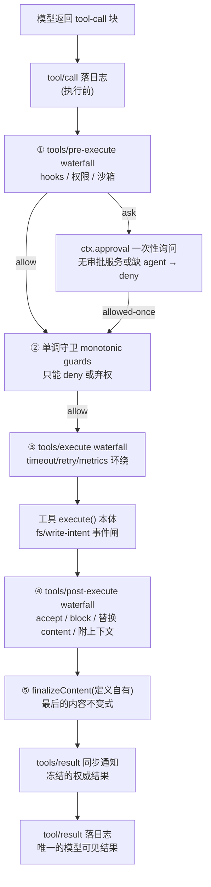
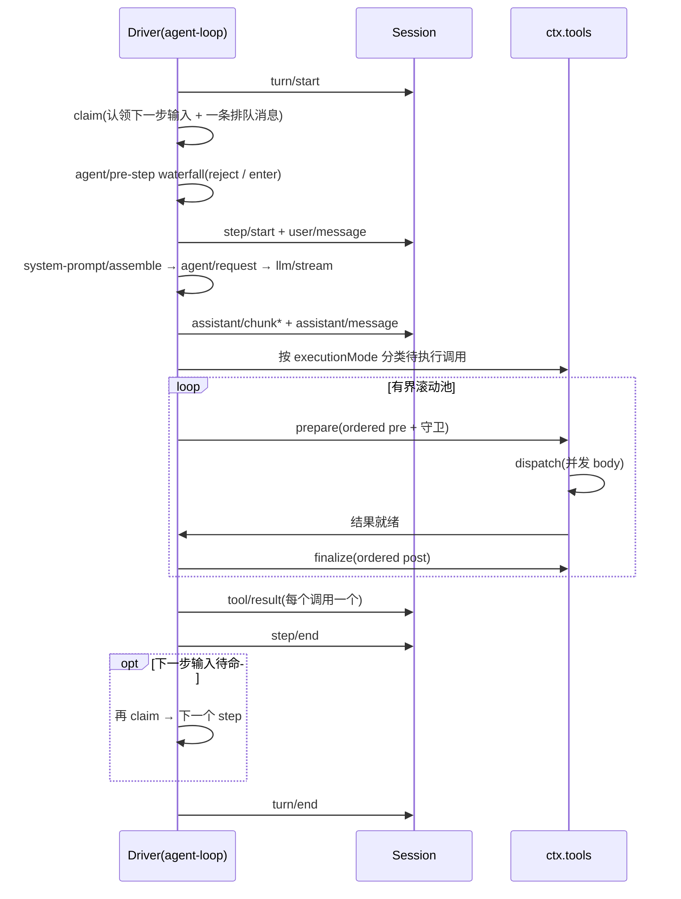

# Cordis 运行时管线:工具执行与 turn flow

> 承接 [cordis-core-model.md](cordis-core-model.md)(机制)、[cordis-business-usage.md](business-usage.md)(使用)、[cordis-design-rationale.md](design-rationale.md)(意图)。本笔记回答「拼好之后,数据在机器里怎么流」:一次工具调用经过哪几道门、为什么这么分、循环如何驱动。官方出处:[tool-execution-pipeline](../../tool-execution-pipeline.md)、[agent-lifecycle](../../agent-lifecycle.md)、`packages/core/tools/src/index.ts`。

## 一、一次工具调用的五道门



权力递减:

| 阶段 | 谁能参与 | 能做什么 | 不能做什么 |
|---|---|---|---|
| ① pre-execute | 任何插件(waterfall) | 改写这次调用、allow/ask/deny | — |
| ② 单调守卫 | 注册的守卫 | 只能 deny 或弃权 | 不能改写调用、不能 allow |
| ③ execute | 任何插件(around) | 超时、重试、metrics 环绕 | — |
| ④ post-execute | 任何插件(waterfall) | accept / block 成 isError / 换 content / 附 additionalContexts | — |
| ⑤ finalizeContent | 只有工具定义自己 | 最后的内容级不变式 | 看不到其他 result 字段 |
| ⑥ tools/result | 任何插件(emit) | 观察冻结结果 | 不能改结果(exec 已 freeze,观察者抛错只记日志) |

## 二、为什么分这六层(与设计原则的对应)

统一抽象:管线的每个时刻(pre / 守卫 / execute / post / result)都是「轨迹改写器」的挂载点;deny、ask、wrap、block、替换 content 都是对调用既定轨迹的改写,各层差别只在改写能力的大小。六层的划分,就是按「改写能力」和「参与资格」切出来的。

- ① 与 ② 分离 = 原则 3(策略即插件)的精确化。waterfall 监听器有顺序、可改写、可互相包装;审批语义要求与顺序无关且身份受保护。需要「改调用、问用户」→ pre waterfall;需要「无条件否决权」→ 注册单调守卫(deny-only)。permission-presets 三档挂在守卫机制上
- ③ 环绕分发 = 原则 8(预算策略链):超时、重试、指标都包住本体,`tools/execute` 的 `next()` 就是工具本体
- ④ post 的 block = 事后纠正:结果已产生,策略决定不给模型看,替换成 isError + 纠正性 feedback
- ⑤ finalizeContent 只归定义所有:工具与内容格式的私有契约,策略不得插手
- ⑥ 冻结 + emit:观察者(遥测、UI、钩子桥)可以看,没有渠道把错误或篡改塞回结果

## 三、调度器:循环驱动,分阶段执行

pre/post 有序、body 并发:

```text
loop 对一批 tool call:
  ordered pre-execute(模型顺序逐个)   ← prepare()
  单调守卫
  并发 dispatch(有界滚动池)          ← dispatch()
  ordered post-execute(结果就绪序)    ← finalize()
```

策略阶段保持模型顺序(可预期),执行阶段并发(吞吐)。调度器接口 `ToolRuntimeScheduler` 明确不是插件扩展点——扩展只能走事件。

## 四、四个横切细节

1. **审批缝是机会式的**:`ctx.get('approval')`,没挂审批服务或缺 agent → 直接 deny(原则:可选缝用 get 探测,缺了降级)
2. **每次分发带作用域定向**:`scopeTarget(this, exec.agent)`——子 agent 作用域的监听器只收到子 agent 的调用(原则 4 在管线里的落地)
3. **取消从不丢弃 body**:`ABORTED_BEFORE_DISPATCH`(body 未启动)vs `ABORTED`(body 已启动,先跑到静止再判);caller 信号与 timeout wrapper 信号用 `fuseToolSignals` 融合
4. **结果必须无损 JSON**:每个阶段产物过 `snapshotJsonValue`,不可无损表示 → `INVALID_TOOL_OUTPUT`(原则 1:tool/result 要落会话日志,日志只装得下 JSON)

## 五、turn flow 精简时序



循环不碰工具逻辑,只认领输入、发事件、消费日志;工具怎么执行是 registry 的调度器;调度器又不许插件碰,扩展全走五个事件层。

## 关键源码锚点

| 概念 | 位置 |
|---|---|
| 五个事件声明(`tools/*`,带 @mode) | `packages/core/tools/src/index.ts:150-163` |
| 调度器接口(非扩展点) | `packages/core/tools/src/index.ts:445-460` |
| prepare(pre + 守卫) | `packages/core/tools/src/index.ts:1463-1507` |
| dispatch(execute 环绕 + body) | `packages/core/tools/src/index.ts:1569-1599` |
| finalize(post + 内容定稿 + 通知) | `packages/core/tools/src/index.ts:1609-1654` |
| tools/result 冻结与观察者隔离 | `packages/core/tools/src/index.ts:1656-1676` |
| 审批机会式探测 | `packages/core/tools/src/index.ts:1689-1729` |
| 取消语义(body 静止) | `packages/core/tools/src/index.ts:1527-1560` |
| turn flow 官方时序 | `docs/agent-lifecycle.md`(+ zh) |
| 管线官方图 | `docs/tool-execution-pipeline.md`(+ zh) |
